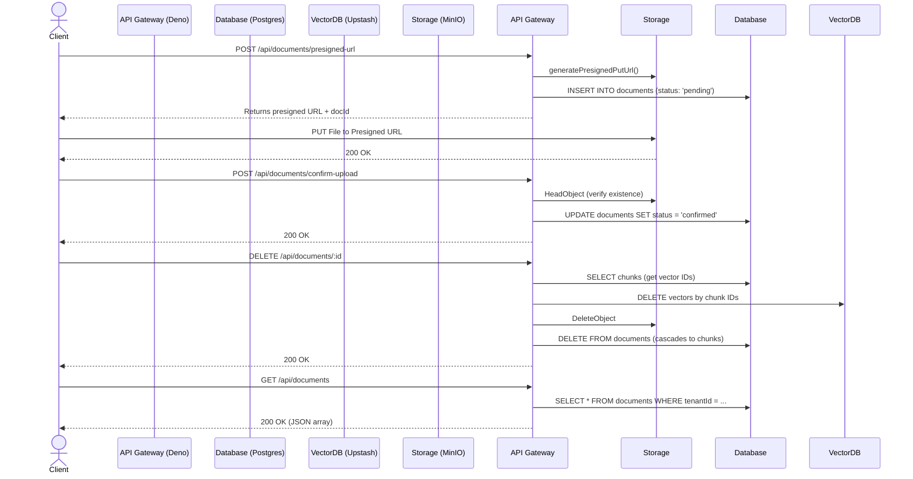

# Document Upload & Management

## Core Logic
This feature encompasses the entire lifecycle of a knowledge document within the RAG pipeline. It facilitates direct client-to-storage file uploads to bypass server memory limits, guarantees database consistency upon upload confirmation, and provides safe, cascading deletion to purge data across the relational database, object storage, and vector index.

Key capabilities:
- **Presigned URLs**: Grants secure, temporary (15-min) PUT access for the client to upload files directly to MinIO (S3-compatible storage), registering the file as `pending` in the DB.
- **Upload Confirmation**: Transitions a `pending` document to `confirmed` after verifying the object physically exists in S3.
- **List Documents**: A `GET` endpoint that retrieves all documents belonging to a tenant, designed specifically to supply the SvelteKit frontend load function for client-side table rendering (TanStack Table).
- **Comprehensive Deletion**: A single `DELETE` endpoint that purges the document and cleanly orchestrates the deletion of its embedded chunks in Upstash Vector, its binary file in MinIO, and its Postgres records (with `CASCADE` cleanup).

## Flow Diagram

## Completion Timestamp
**Date:** 2026-06-30
**Time:** 15:10 (UTC+7)

## File Mapping
- `apps/backend/src/modules/documents/documents.service.ts`: Implemented `createPresignedUrl`, `confirmUpload`, `deleteDocument`, and `listDocuments`.
- `apps/backend/src/modules/documents/documents.controller.ts`: Added request handlers bridging Zod validation to the service layer.
- `apps/backend/src/modules/documents/documents.routes.ts`: OpenAPI schemas for all Document CRUD operations.
- `apps/backend/src/modules/documents/documents.schema.ts`: Standardized Zod I/O validation.
- `apps/backend/src/shared/utils/s3.util.ts`: Added `deleteObject` using AWS SDK.
- `api-collections/Documents/05_Delete Document.bru`: Updated Bruno API collection.
- `api-collections/Documents/03_List Documents.bru`: Verified Bruno API collection for listing documents.

## Connections
- **Client (Frontend):** Uploads files to MinIO directly using the returned Presigned URL, offloading network bandwidth from Deno Deploy.
- **Deno API (Backend):** Manages the authorization, orchestration, and cleanup of external systems.
- **PostgreSQL (Database):** Uses `ON DELETE CASCADE` on `documentChunks` to ensure no orphaned relational records remain when a document is deleted.
- **Upstash Vector:** The backend intercepts chunk IDs prior to DB deletion to purge the vectors via the Upstash SDK `vectorIndex.delete()`.
- **MinIO (S3):** Stores the raw `.pdf` files. Cleaned up upon document deletion using `DeleteObjectCommand`.

## Architectural Decisions
1. **Direct-to-S3 Uploads**: Prevents the Deno Edge Worker from hitting memory or timeout constraints when processing large PDF files by eliminating the need to buffer uploads in RAM.
2. **Order of Deletion Operations**: The backend extracts `chunkIds` *before* hitting Postgres, deletes from Vector, then S3, then finally Postgres. This ensures that if the process dies halfway, we don't have orphaned data in external stores without a DB record to track them.
3. **Tenant-Level Isolation**: All document database queries (`SELECT`, `UPDATE`, `DELETE`) enforce an explicit `and(eq(documents.tenantId, params.tenantId))` constraint, strictly preventing IDOR vulnerabilities.
4. **Client-Side Data Processing**: For listing documents, the backend sends the entire tenant's document list in one JSON response. The SvelteKit frontend utilizes TanStack Table to handle sorting, filtering, and pagination exclusively on the client side, ensuring rapid UI responsiveness without needing multiple backend endpoints for small-to-medium scale document libraries.
