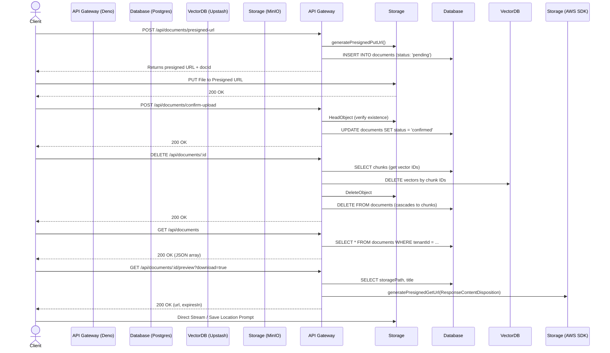

# Document Upload & Management

## Core Logic
This feature encompasses the entire lifecycle of a knowledge document within the RAG pipeline. It facilitates direct client-to-storage file uploads to bypass server memory limits, guarantees database consistency upon upload confirmation, provides safe, cascading deletion to purge data across the relational database, object storage, and vector index, and handles document previews and direct browser downloads.

Key capabilities:
- **Presigned URLs**: Grants secure, temporary (15-min) PUT access for the client to upload files directly to MinIO (S3-compatible storage), registering the file as `pending` in the DB.
- **Upload Confirmation**: Transitions a `pending` document to `confirmed` after verifying the object physically exists in S3.
- **List Documents**: A `GET` endpoint that retrieves all documents belonging to a tenant, designed specifically to supply the SvelteKit frontend load function for client-side table rendering (TanStack Table).
- **Document Preview & Download**: A `GET` endpoint (`/api/documents/:id/preview`) that securely generates a short-lived Presigned GET URL (12 hours). Passing `download=true` sets `Content-Disposition: attachment; filename="..."` so the browser directly prompts the user for a download location rather than rendering inline in a new tab.
- **Comprehensive Deletion**: A single `DELETE` endpoint that purges the document and cleanly orchestrates the deletion of its embedded chunks in Upstash Vector, its binary file in MinIO, and its Postgres records (with `CASCADE` cleanup).

## Flow Diagram

## Completion Timestamp
**Date:** 2026-07-23
**Time:** 20:14 (UTC+7)

## File Mapping
- `apps/backend/src/modules/documents/documents.service.ts`: Implemented `createPresignedUrl`, `confirmUpload`, `deleteDocument`, `listDocuments`, and `getDocumentPreview` (with attachment disposition).
- `apps/backend/src/modules/documents/documents.controller.ts`: Added request handlers bridging Zod validation and query parameter extraction to the service layer.
- `apps/backend/src/modules/documents/documents.routes.ts`: OpenAPI schemas for all Document CRUD operations, preview, and download.
- `apps/backend/src/modules/documents/documents.schema.ts`: Standardized Zod I/O and query validation.
- `apps/backend/src/shared/utils/s3.util.ts`: Extended `generatePresignedGetUrl` with `ResponseContentDisposition` support.
- `apps/frontend/src/routes/app/documents/+page.ts`: Client-side loader fetching tenant documents via `apiRequest`.
- `apps/frontend/src/routes/app/documents/+page.svelte`: Frontend document table view with Sonner toast feedback and dynamic preview/download handlers.
- `apps/frontend/src/routes/app/documents/data.ts`: Document TypeScript interface.
- `apps/frontend/src/routes/app/documents/document-card-actions.svelte`: Dropdown menu for document preview, download, and deletion.
- `api-collections/Documents/06_Get Document Preview.bru`: Updated Bruno API collection with `download` query param.

## Connections
- **Client (Frontend):** Fetches document lists, previews PDF inline using `@embedpdf/svelte-pdf-viewer`, and triggers stream-to-disk downloads via S3 attachment presigned URLs with `svelte-sonner` toast notifications.
- **Deno API (Backend):** Manages authorization, orchestration, OpenAPI contract, and S3 URL signing.
- **PostgreSQL (Database):** Uses `ON DELETE CASCADE` on `documentChunks` to ensure no orphaned relational records remain when a document is deleted.
- **Upstash Vector:** Purges vectors via the Upstash SDK `vectorIndex.delete()`.
- **MinIO (S3):** Stores raw files securely with private access.

## Architectural Decisions
1. **Direct-to-S3 Uploads**: Prevents the Deno Edge Worker from hitting memory or timeout constraints when processing large PDF files by eliminating the need to buffer uploads in RAM.
2. **Order of Deletion Operations**: The backend extracts `chunkIds` *before* hitting Postgres, deletes from Vector, then S3, then finally Postgres. This ensures that if the process dies halfway, we don't have orphaned data in external stores without a DB record to track them.
3. **Tenant-Level Isolation**: All document database queries (`SELECT`, `UPDATE`, `DELETE`) enforce an explicit `and(eq(documents.tenantId, params.tenantId))` constraint, strictly preventing IDOR vulnerabilities.
4. **Client-Side Data Processing**: For listing documents, the backend sends the entire tenant's document list in one JSON response. The SvelteKit frontend utilizes TanStack Table to handle sorting, filtering, and pagination exclusively on the client side, ensuring rapid UI responsiveness without needing multiple backend endpoints for small-to-medium scale document libraries.
5. **Secure Previews**: The MinIO bucket is kept strictly private. Previews are generated dynamically via `getDocumentPreview` using AWS SDK's `GetObjectCommand`, yielding a 12-hour Presigned GET URL. This prevents hotlinking and data leakage while still allowing rich client-side rendering.
6. **Direct Attachment Presigned URLs for Downloads**: Passing `ResponseContentDisposition` during S3 presigned GET URL creation instructs the browser to stream the file straight to disk and prompt for a save location, bypassing JS memory buffers and eliminating the need for a separate server download endpoint.
