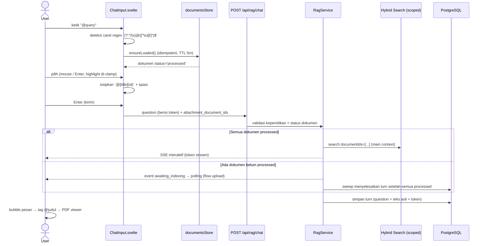

# Document Mention — "Second Brain" `@` (Main Context)

## Core Logic

Fitur ini memungkinkan user **menyebut dokumen yang sudah dimiliki** sebagai **main context** percakapan chat — cukup ketik `@` di kolom input, pilih dokumen dari snippet list, dan retrieval RAG untuk turn tersebut di-scope **hanya** ke dokumen yang dipilih. Ini **bukan** indexing baru dan **bukan** upload: dokumen sudah ter-index (`status='processed'`) dan langsung dijawab interaktif via SSE tanpa menunggu apa pun.

Mekanisme kunci:

- **Token inline** — dokumen yang dipilih disisipkan langsung ke teks pertanyaan sebagai token `@[title](id_doc)` (markdown-link style), diikuti otomatis 1 spasi. Token tersimpan **verbatim** di `conversation_turns.question` — tidak ada kolom/chip terpisah.
- **Rendering dua lapis** — di kolom input, token tampil sebagai badge pill (teknik textarea transparan + overlay); di bubble pesan user, token tampil sebagai tag klik yang membuka PDF viewer (`openCitationPreview`).
- **Scoping retrieval** — id token di-parse client-side saat kirim, digabung dengan id file attachment, dikirim sebagai `attachment_document_ids`. Backend menjawab **interaktif** bila semua dokumen sudah `processed`; dokumen yang masih diingest tetap lewat jalur `awaiting_indexing` (flow upload).
- **Cache dokumen** — daftar `{id, title, status}` tenant di-cache di `documentsStore` (TTL 5 menit, invalidate setelah upload) sehingga popover terbuka instan tanpa spinner.

## Flow Diagram



## 1. Token Format & Parsing

Format token: `@[judul](uuid)` — persis seperti markdown link dengan prefix `@`.

- **`mentionToken(title, id)`** (`lib/utils/doc-mentions.ts`) membangun token dengan **sanitasi judul**: `]` di-strip karena satu-satunya karakter yang merusak format (regex parser tidak akan mengenali `@[a]b](id)` → render jadi teks mentah). `)`, `(`, `[` aman.
- **`parseMentionIds(text)`** mengekstrak id unik (urutan kemunculan) untuk scoping retrieval.
- **`splitMentionSegments(text)`** memecah teks menjadi segmen `text` / `mention` untuk rendering badge (input overlay + bubble pesan). Karena parsing dilakukan client-side dari teks tersimpan, pesan yang dimuat ulang dari history tetap ter-render dengan benar.

## 2. Frontend — Input UX (ChatInput.svelte)

**Trigger popover:** `updateMentionState()` dijalankan pada `oninput`/`onfocus` — regex `(?:^|\s)@([^\s@]*)$` terhadap teks **sebelum caret**. Guard: caret tepat setelah token yang sudah ada (query dimulai `[`) tidak membuka popover lagi.

**Kandidat:** hanya dokumen `status='processed'` (satu-satunya yang siap jadi main context), belum di-mention (id token yang sudah ada di teks dikecualikan), filter case-insensitive per ketikan, urut alfabetis, maks 30.

**Keyboard navigation:**
- `↑`/`↓` memutar highlight; `Enter` memilih; `Esc` menutup; `Enter` saat popover terbuka **tidak** mengirim pesan.
- **`effectiveHighlight`** — derived yang meng-clamp indeks ke panjang daftar. Tanpa clamp, indeks bisa basi saat ketikan mempersempit daftar (mis. `↓` lalu ketik huruf filter) → Enter dapat `undefined` → popover menutup diam-diam tanpa menyisipkan (bug yang pernah terjadi).
- `scrollIntoView({block:'nearest'})` pada item highlight → posisi UI mengikuti navigasi keyboard.
- **Guard loading:** Enter saat daftar masih kosong karena store sedang fetch tidak menutup popover — tetap terbuka sampai kandidat tiba.

**Penyisipan:** token menggantikan `@query` di posisi caret, lalu **auto-spasi 1** — kata berikutnya tidak menempel ke token dan deteksi `@` berikutnya tetap akurat. Penghapusan = backspace biasa (teks polos).

## 3. Badge Overlay di Input (Teknik Textarea Transparan)

`<textarea>` tidak bisa merender styled span, jadi badge ditampilkan lewat **overlay**:

- Textarea asli tetap editor (caret, selection, paste, edit native) dengan teks transparan — dipaksa via **inline style** `color: transparent` (tidak bisa dikalahkan class-merge/CSS apa pun), `caret-white`, `selection:bg-white/15`.
- Overlay `pointer-events-none absolute inset-0` di belakang textarea merender isi yang sama via `splitMentionSegments` — token menjadi pill, teks biasa menjadi teks.
- **Keselarasan wajib** (badge harus duduk persis di posisi token): padding sama (`px-2.5 py-1.5` — mengikuti base class komponen Textarea), font sama (`text-base md:text-sm`), wrapping sama (`break-words whitespace-pre-wrap`), scrollTop di-mirror ke overlay (via `$effect` + `onscroll`).
- Placeholder tetap milik textarea; warna teks mode `transparent` (landing page) dipertahankan lewat `group-focus-within` di overlay.
- Style pill monokrom selaras tema Dokyudo: `border-white/15 bg-white/10 text-white/80`, icon `text-white/60` — sama seperti chip citation.

## 4. Storage & Payload

- **Penyimpanan:** `question` dikirim apa adanya (termasuk token) → tersimpan verbatim di `conversation_turns.question`. Tidak ada perubahan backend untuk storage.
- **Payload:** `streamChatTurn` men-parse id token (`parseMentionIds(questionText)`) dan menggabungkannya dengan id file upload (yang tetap di-upload dulu) → `attachment_document_ids`. Mention **tidak** masuk ke metadata `attachments` pesan (chip) — pesan hanya menampilkan chip untuk file upload sungguhan; mention dirender sebagai tag inline.
- **Retry/edit:** id mention di-parse ulang dari teks question — retry memakai question asli, edit memakai teks hasil edit → scoping otomatis mengikuti teks.
- **Landing → Detail:** token berada di dalam `initialQuestion` (navigation state) — detail page mem-parse-nya sendiri; hanya file upload yang lewat `attachmentDocuments` state.

## 5. Message Bubble (Tag Klik → PDF Viewer)

`splitMentionSegments(msg.content)` di bubble pesan user: segmen mention dirender sebagai `<button>` pill monokrom (`border-white/15 bg-white/10`, hover `hover:bg-white/20`) yang memanggil `openCitationPreview(id, title, [])` — membuka panel PDF viewer yang sama dengan citation assistant. Pesan lama yang dimuat dari DB tetap ter-render karena parsing berbasis teks.

## 6. Backend — Semantik "Main Context" (needsAwaiting)

`rag.service.ts` `streamChat` — pre-flight memvalidasi attachment (kepemilikan tenant → 404, status terminal `failed`/`failed_vectorizing`/`quota_exhausted` → 400), lalu:

```ts
const hasAttachments = attachmentDocuments.length > 0;
const needsAwaiting =
    hasAttachments &&
    attachmentDocuments.some((doc) => doc.status !== "processed");
```

- **Semua `processed`** → turn di-insert `status='processing'` → jalur interaktif: gatekeeper, rewrite, hybrid search **di-scope** (`documentIds = attachmentDocumentIds`), SSE token stream, `finalizeTurn`. Kuota QA terpakai di jalur interaktif.
- **Ada yang belum `processed`** (`pending`/`confirmed`) → turn `awaiting_indexing` + reservasi QA saat submit + stream pendek + diselesaikan `sweepAwaitingTurns` (Deno.cron) setelah semua dokumen `processed` — flow upload file baru, tidak berubah.
- Detail state machine: `docs/backend/rag-turn-status-and-edit-mode.md`.

## 7. Cache Dokumen (documentsStore)

`lib/state/documents.store.svelte.ts` — pola sama dengan `conversationsStore`:
- `ensureLoaded()` idempotent: fetch `GET /api/documents` sekali per sesi, revalidasi bila > 5 menit (TTL).
- `invalidate()` memaksa refetch berikutnya — dipanggil setelah upload file sukses di kedua halaman chat (dokumen baru langsung bisa di-mention setelah `processed`).
- Kedua halaman memanggil `ensureLoaded()` di `onMount`; popover juga memanggilnya saat pertama terbuka (belt-and-braces).

## Completion Timestamp

**Date:** 2026-08-10

## File Mapping

- `apps/frontend/src/lib/utils/doc-mentions.ts`: `mentionToken` (sanitasi judul), `parseMentionIds`, `splitMentionSegments`.
- `apps/frontend/src/lib/state/documents.store.svelte.ts`: cache dokumen tenant (TTL + invalidate).
- `apps/frontend/src/lib/api/documents.ts`: `getDocuments()` + tipe `DocumentItem`.
- `apps/frontend/src/lib/components/chat/ChatInput.svelte`: popover mention (deteksi caret, keyboard nav dengan highlight clamp, scroll-into-view, guard loading), penyisipan token + auto-spasi, badge overlay (textarea transparan + overlay scroll-sync), style pill monokrom.
- `apps/frontend/src/routes/app/chat/[id]/+page.svelte`: `parseMentionIds` → `attachment_document_ids`, rendering tag di bubble pesan → `openCitationPreview`, invalidate store setelah upload.
- `apps/frontend/src/routes/app/chat/+page.svelte`: `ensureLoaded` + invalidate; token mengalir via `initialQuestion`.
- `apps/backend/src/modules/rag/rag.service.ts`: `needsAwaiting` — attachment `processed` → jalur interaktif (main context).
- `apps/backend/src/modules/rag/rag.schema.ts`: komentar `attachment_document_ids` (semantik main context).
- `apps/backend/src/modules/rag/rag.service.test.ts`: test "already-processed attachments answer interactively as main context".

## Connections

- **Client (Frontend):** `ChatInput.svelte` + kedua halaman chat — token inline, rendering tag, scoping payload.
- **Deno API (Backend):** `streamChat` memvalidasi attachment dan memutuskan jalur interaktif vs awaiting berdasarkan status dokumen; retrieval di-scope ke `documentIds`.
- **PostgreSQL (Database):** `conversation_turns.question` menyimpan token verbatim; `documents.status` (`pending → confirmed → processed | failed*`) menentukan jalur.

## Related

- `docs/backend/rag-turn-status-and-edit-mode.md` — state machine turn, `awaiting_indexing` vs `processing` (attachment main-context).
- `docs/features/rag-conversation.md` — percakapan RAG, citation, edit/retry/branch.
- `docs/backend/confirm-upload-metadata.md` — siklus status dokumen (`confirmed` ≠ siap retrieval).

## Architectural Decisions

1. **Token inline, bukan chip/struktur terpisah:** token `@[title](id)` hidup di teks question — tersimpan di DB tanpa kolom baru, survive retry/edit, dan rendering hanya urusan client-side. Chip (konsep attach) ditolak karena user eksplisit ingin mention sebagai bagian prompt, bukan lampiran.
2. **Scoping via `attachment_document_ids` yang sudah ada, bukan field baru:** perilaku "main context" diputuskan backend berdasarkan status dokumen (`needsAwaiting`) — zero API surface baru.
3. **`processed` = satu-satunya status siap mention:** `confirmed` hanya berarti upload dikonfirmasi, belum ter-index; menawarkannya akan memicu tunggu-indexing yang kontradiktif dengan semantik "dokumen yang sudah dimiliki".
4. **Badge overlay (textarea transparan) daripada contenteditable:** semua perilaku editing native (caret, selection, paste, maxlength) tetap milik textarea; contenteditable butuh caret management manual yang rawan bug.
5. **Transparansi via inline style:** `color: transparent` di elemen — kebal terhadap class-merge (twMerge), spesifisitas, dan cache bundle.
6. **Highlight di-clamp (derived), bukan di-mutasi:** `mentionHighlight` adalah indeks mentah; `effectiveHighlight` derived yang di-clamp — Enter tidak pernah jatuh ke item yang sudah tidak ada di daftar filter.
