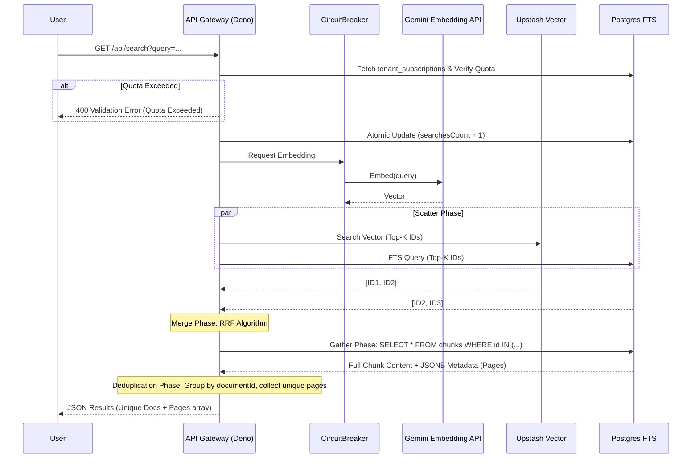

# Hybrid Search (dky-014)

**Completed At:** 2026-07-01 16:58
**Status:** Completed & Refactored (Clean Code, Metadata Extraction, Deduplication, Tier Quotas)

## Core Logic
The Search endpoint (`/api/search`) receives a plain text query from the user. It splits the work into two parallel paths:
1. **FTS (Full Text Search)**: Queries Postgres `documentChunks` table directly.
2. **Semantic Search**: Calls the LLM Embedding API to convert the query into a vector, then queries Upstash Vector.

Before executing the search, the system validates the tenant's tier subscription. If the tenant's `searchesCount` exceeds their monthly tier limit (`maxSearchesPerMonth`), the request is rejected with a 400 validation error. If valid, the counter is atomically incremented.

The IDs returned from both sources are scored using the **Reciprocal Rank Fusion (RRF)** algorithm in the Deno memory layer. We fetch the actual text content and JSONB `metadata` (containing page numbers) via a single lazy hydration query. Finally, the chunks are grouped and deduplicated by their parent `documentId`, mapping all referenced pages and surfacing only the single most relevant chunk content per document to the frontend.

## Flow Diagram

## Architectural Decisions
1. **Application-Layer RRF**: We do the RRF in Deno, not Postgres, to decouple the vector store from the relational database and save DB CPU.
2. **Circuit Breaker**: The LLM API call is protected by a Redis-backed Circuit Breaker (`infra/circuit-breaker.ts`). If the LLM goes down, the system gracefully degrades to FTS-only without crashing.
3. **Tenant Isolation**: Both FTS and Vector queries strictly enforce `tenant_id` filtering at the scatter phase.
4. **Clean Code Architecture**: Controller logic relies on `ContextExtractor` for tenant verification. `SearchService` operates as a static OOP class accepting single strongly-typed `params` objects inferred from Zod. Guard Clauses are employed outside `try/catch` to ensure error purity.
5. **Robust Mock Testing**: `search.service.test.ts` strictly mocks external integrations (LLM & Vector index) via `jsr:@std/testing/mock` stubs, isolating the DB behavior and RRF scoring algorithms. `search.routes.test.ts` validates the end-to-end integration path.
6. **Chunk Deduplication (UX Driven)**: Multiple chunks often map to the same `documentId`. To prevent frontend spam, the search API groups them by document, aggregating all `metadata.pages` into a clean array and returning the highest scoring chunk's content as a preview.
7. **Page Tracking via JSONB**: The STB Extraction worker parses documents page-by-page via PyMuPDF, inserting page coordinates into a JSONB `metadata` column in `documentChunks`.
8. **Tier Quota Protection**: To prevent free-tier users from exhausting the LLM Embedding API limit, an atomic SQL increment and lookup on `tenant_subscriptions` is done right before executing the embedding. If the limit is reached, it throws a 400 Error.

## File Mapping
- **Routes & Controller**: `apps/backend/src/modules/search/search.routes.ts`, `search.controller.ts`
- **Service logic**: `apps/backend/src/modules/search/search.service.ts`
- **Circuit Breaker**: `apps/backend/src/infra/circuit_breaker.infra.ts`
- **Config**: `apps/backend/src/config/vector.ts`
- **Testing**: `apps/backend/src/modules/search/search.service.test.ts`, `search.routes.test.ts`
