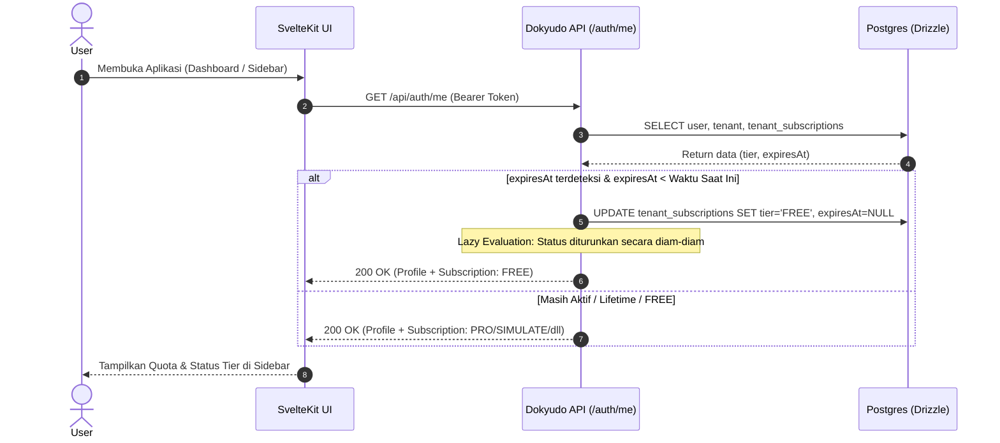

# Lazy Evaluation Profile Endpoint (`/api/auth/me`)

**Completion Timestamp**: 2026-07-01T15:27:00+07:00 (WIB)

## Core Logic
Dokyudo menggunakan pola arsitektur **Lazy Evaluation** untuk menangani *downgrade* tier langganan yang sudah melewati masa tenggang (*expired*). 

Alih-alih menggunakan *Cron Job* yang berjalan secara berkala di latar belakang (yang dapat menghabiskan biaya komputasi *idle* pada *serverless runtime*), sistem akan mengevaluasi dan meresolusi status langganan secara dinamis setiap kali *Frontend* memuat status profil pengguna (melalui `GET /api/auth/me`).

## Flow Diagram

## File Mapping

- **Auth Service** (`apps/backend/src/modules/auth/auth.service.ts`):
  - Mengimplementasikan `AuthService.getProfile()` yang mengekstrak informasi dasar `users`, `tenants`, dan meresolusi *Lazy Evaluation* pada `tenantSubscriptions`.
- **Auth Controller & Routes** (`apps/backend/src/modules/auth/auth.controller.ts` & `auth.routes.ts`):
  - Mendaftarkan rute `GET /api/auth/me` yang dilindungi oleh `authMiddleware`.
- **Auth Schema** (`apps/backend/src/modules/auth/auth.schema.ts`):
  - Memvalidasi bentuk respons (`ProfileResponseSchema`) untuk OpenAPI dan *Type Safety* Frontend.

## Connections
- **Frontend Sidebar**: `+layout.server.ts` (SvelteKit) akan memanggil endpoint ini sekali saat inisialisasi aplikasi untuk memuat Sidebar.
- **Database**: Drizzle ORM langsung memeriksa tabel `tenant_subscriptions` pada saat `SELECT`.

## Architectural Decisions
1. **Zero-Cost Cron Replacement**: Pola *Lazy Evaluation* menghilangkan kebutuhan untuk menjadwalkan *worker* pengecekan waktu setiap jam/hari (Pola Serverless). Data dianggap statis hingga akhirnya dibaca ulang.
2. **Silent Downgrade**: Saat langganan kedaluwarsa, *Backend* tidak merespons dengan 401 atau *Error*, melainkan memodifikasi DB ke `FREE` lalu mengembalikan objek dengan tier `FREE`, sehingga aliran UI/UX di klien tetap *seamless* (tidak *crash*, hanya mengupdate indikator tier di layar).
3. **Persisted Changes**: *Downgrade* bukan sekadar perhitungan di memori (*calculated field*), melainkan secara nyata di-`UPDATE` ke Postgres. Hal ini penting agar *middleware* validasi kuota (seperti di modul *Documents* atau *RAG*) di masa mendatang bisa melihat tier yang benar di DB tanpa harus menjalankan fungsi sinkronisasi yang sama secara redundan.
