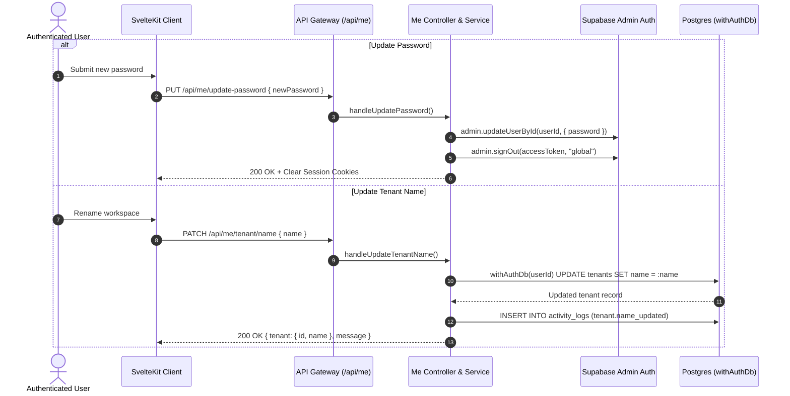

# Dedicated Me Module (`/api/me`) Endpoints Documentation

**Completion Timestamp**: 2026-08-19T13:45:34+07:00

## Core Logic

The `me` module (`apps/backend/src/modules/me/`) serves as the single self-service account and tenant management domain for authenticated users. Mounted under `/api/me`, it encapsulates the following operations:

1. **`GET /api/me`**: Returns essential user identity (`id`, `email`, `profilePictureUrl`), tenant workspace info (`id`, `name`), and subscription tier status (`tier`, `expiresAt`). Automatically performs lazy auto-downgrade if the subscription expired.
2. **`GET /api/me/usage`**: Returns realtime tenant usage statistics (`uploadsCount`, `searchesCount`, `qaCount`, `storageUsedBytes`, `expiresAt`) using `withAuthDb` for multi-tenant data isolation.
3. **`DELETE /api/me/account`**: Enqueues asynchronous account and tenant deletion, sets state to `deletion_pending`, revokes sessions, and clears session cookies immediately (202 Accepted).
4. **`PUT /api/me/update-password`**: Updates the user's password via Supabase Admin API, revokes active sessions globally, and clears session cookies to enforce re-login.
5. **`PATCH /api/me/tenant/name`**: Updates the display name of the tenant workspace inside a `withAuthDb` transaction and logs `tenant.name_updated` to `activity_logs`.

---

## Flow Diagram

---

## File Mapping

| File | Purpose / Changes |
|---|---|
| `apps/backend/src/modules/me/me.schema.ts` | Zod schemas for `ProfileResponseSchema`, `UsageResponseSchema`, `DeleteAccountResponseSchema`, `UpdatePasswordBodySchema`, `UpdatePasswordResponseSchema`, `UpdateTenantNameBodySchema`, and `UpdateTenantNameResponseSchema`. |
| `apps/backend/src/modules/me/me.service.ts` | Implemented `getProfile`, `getUsage`, `requestAccountDeletion`, `updatePassword`, and `updateTenantName`. |
| `apps/backend/src/modules/me/me.controller.ts` | HTTP controller handlers for all `/api/me/*` endpoints using `ContextExtractor`. |
| `apps/backend/src/modules/me/me.routes.ts` | OpenAPI route definitions for `GET /`, `GET /usage`, `DELETE /account`, `PUT /update-password`, and `PATCH /tenant/name`. |
| `apps/backend/src/modules/me/mod.ts` | Module re-exports for routes, service, and schemas. |
| `apps/backend/src/modules/me/me.routes.test.ts` | BDD route integration tests covering authentication and input validation for all `/api/me` endpoints. |
| `apps/backend/src/modules/me/me.service.test.ts` | Isolated unit tests for profile, usage, tenant update, and password update logic. |
| `apps/backend/src/modules/auth/auth.routes.ts` | Removed `/update-password` and `/tenant/name` from `auth` module. |
| `apps/backend/src/modules/auth/auth.service.ts` | Removed `updatePassword` and `updateTenantName` from `AuthService`. |
| `apps/backend/src/modules/auth/auth.controller.ts` | Removed handlers for password and tenant name updates from `auth` controller. |
| `apps/backend/src/modules/auth/auth.schema.ts` | Cleaned up unused password/tenant update schemas. |
| `apps/frontend/src/lib/api/me.ts` | Added `updatePassword` and `updateTenantName` API client functions. |
| `apps/frontend/src/lib/api/auth.ts` | Re-exported `updatePassword as authUpdatePassword` and `updateTenantName as authUpdateTenantName` for backwards compatibility. |
| `apps/frontend/src/lib/components/app/AccountPanelDialog.svelte` | Account panel settings dialog consuming `/api/me/*` endpoints. |
| `api-collections/Me/04_Update Password.bru` | Bruno request for `PUT {{baseUrl}}/api/me/update-password`. |
| `api-collections/Me/05_Update Tenant Name.bru` | Bruno request for `PATCH {{baseUrl}}/api/me/tenant/name`. |

---

## Connections

- **Multi-Tenancy Isolation**: All tenant-modifying operations use `withAuthDb(userId)` or enforce explicit `tenantId` checking to guarantee tenant data isolation.
- **Global Invalidation**: When a user changes their password via `PUT /api/me/update-password`, `adminSupabase.auth.admin.signOut(token, 'global')` revokes all issued tokens across devices, while `clearSessionCookies(c)` clears the caller's local cookies.
- **Audit Logging**: Successful mutations (`tenant.name_updated`, `auth.password_reset`) emit structured activity log events with client IP and User-Agent.

---

## Architectural Decisions

1. **Self-Service Encapsulation in `me` Module**: Consolidating user profile (`GET /api/me`), usage stats (`GET /api/me/usage`), account deletion (`DELETE /api/me/account`), password changes (`PUT /api/me/update-password`), and tenant workspace renaming (`PATCH /api/me/tenant/name`) under `/api/me` leaves `/api/auth` focused solely on initial authentication lifecycle (login, register, logout, OTP password recovery, email verification).
2. **Backwards-Compatible Frontend Exports**: `apps/frontend/src/lib/api/auth.ts` re-exports `authUpdatePassword` and `authUpdateTenantName` from `./me.ts` so existing components function smoothly without breaking changes.
3. **Session Invalidation on Password Mutation**: Immediate server-side global session revocation prevents unauthorized continued access on leaked credentials or stale sessions.
