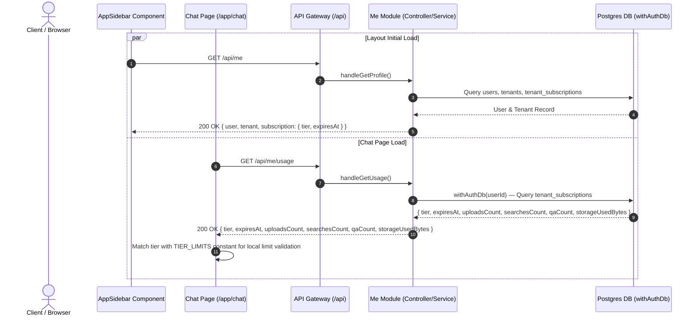

# Dedicated Me & Usage Endpoints Documentation

**Completion Timestamp**: 2026-08-03T09:36:00+07:00 (WIB)

## Core Logic

The user profile endpoint (`GET /api/auth/me`) has been refactored and moved to a dedicated backend module `me` mounted at `GET /api/me`. To optimize P95 latency and adhere to the Single Responsibility Principle, usage statistics (`uploadsCount`, `searchesCount`, `qaCount`, `storageUsedBytes`) were extracted into a separate endpoint `GET /api/me/usage`.

- **`GET /api/me`**: Returns essential user identity, tenant workspace info, and subscription tier status. Automatically handles lazy evaluation to auto-downgrade expired subscriptions to `FREE`.
- **`GET /api/me/usage`**: Returns realtime usage statistics (`uploadsCount`, `searchesCount`, `qaCount`, `storageUsedBytes`) for the authenticated tenant using `withAuthDb` for multi-tenant data isolation. Sejak 2026-08-12 response juga menyertakan **`expiresAt`** (ISO string atau `null`) yang dibaca langsung dari kolom `tenant_subscriptions.expires_at` — dipakai UI Billing untuk menampilkan masa akses tier berbayar (FREE/plan permanen → `null`).
- **Frontend Tier Limits**: Hardcoded in `$lib/constants/tiers.constant.ts` matching backend `TIER_LIMITS`. The Chat page (`/app/chat`) fetches `/api/me/usage` on mount to populate realtime counters, looking up limits locally without extra server payload.

---

## Flow Diagram

---

## File Mapping

| File | Purpose / Changes |
|---|---|
| `apps/backend/src/modules/me/me.schema.ts` | Created `ProfileResponseSchema` and `UsageResponseSchema`; `UsageResponseSchema` menyertakan `expiresAt` (nullable). |
| `apps/backend/src/modules/me/me.service.ts` | Implemented `MeService.getProfile()` and `MeService.getUsage()` with `withAuthDb`; `getUsage` select + serialize `expiresAt` dari `tenant_subscriptions.expires_at`. |
| `apps/backend/src/modules/me/me.controller.ts` | Implemented `handleGetProfile` and `handleGetUsage` with `ContextExtractor`. |
| `apps/backend/src/modules/me/me.routes.ts` | Defined OpenAPI routes `GET /` and `GET /usage` under `/api/me`. |
| `apps/backend/src/modules/me/mod.ts` | Re-exported `meRoutes`, `MeService`, and `MeSchema`. |
| `apps/backend/src/api/router.ts` | Mounted `meRoutes` at `/me`. |
| `apps/backend/src/modules/me/me.service.test.ts` | Isolated service unit tests for `getProfile` and `getUsage`. |
| `apps/backend/src/modules/me/me.routes.test.ts` | BDD route integration tests for `GET /api/me` and `GET /api/me/usage`. |
| `apps/frontend/src/lib/constants/tiers.constant.ts` | Created frontend `TIER_LIMITS` matching backend configuration. |
| `apps/frontend/src/lib/api/me.ts` | Created `getMe()` and `getMeUsage()` client functions. |
| `apps/frontend/src/lib/types/auth.types.ts` | Updated `UserProfileResponse` and `UserUsageResponse`. |
| `apps/frontend/src/lib/components/app/AppSidebar.svelte` | Updated to call `getMe()` from `$lib/api/me`. |
| `apps/frontend/src/routes/app/chat/+page.svelte` | Calls `getMeUsage()` on mount and calculates tier constraints via `TIER_LIMITS`. |
| `api-collections/Me/01_Get Profile.bru` | Updated request URL to `GET {{baseUrl}}/api/me`. |
| `api-collections/Me/02_Get Realtime Usage.bru` | Added request file for `GET {{baseUrl}}/api/me/usage`. |
| `tests-report/unit-test.md` | Updated with test suite execution results for the `Me` module. |

---

## Connections

- **Database Isolation**: `MeService.getUsage` wraps Drizzle queries inside `withAuthDb(userId)` to enforce Supabase RLS and tenant data isolation.
- **Server Gateway**: `router.ts` mounts `meRoutes` at `/me`. Authentication is automatically enforced by global `authMiddleware`.
- **Frontend Integration**: Layout/Sidebar fetches light profile data from `/api/me`, while `/app/chat` fetches realtime counts from `/api/me/usage` and evaluates limit thresholds using local `$lib/constants/tiers.constant.ts`.

---

## Architectural Decisions

1. **Endpoint Separation for P95 Performance**: Separating general profile information from realtime usage counts prevents unnecessary database payload transfers when rendering global layout elements like the sidebar.
2. **Local Tier Limits Constant**: Keeping `TIER_LIMITS` in `$lib/constants/tiers.constant.ts` allows instantaneous client-side file upload and storage validation without needing redundant network calls for static limit thresholds.
3. **Module Independence**: Extracted all profile and usage operations into a dedicated `me` module (`apps/backend/src/modules/me/`) out of `auth`, maintaining clean domain boundaries.
4. **expiresAt pada usage**: kolom `expires_at` di `tenant_subscriptions` sudah ada (dipakai lazy auto-downgrade di `getProfile`); `getUsage` kini juga men-serialize-nya agar UI Billing bisa menampilkan masa akses tanpa panggilan tambahan.
