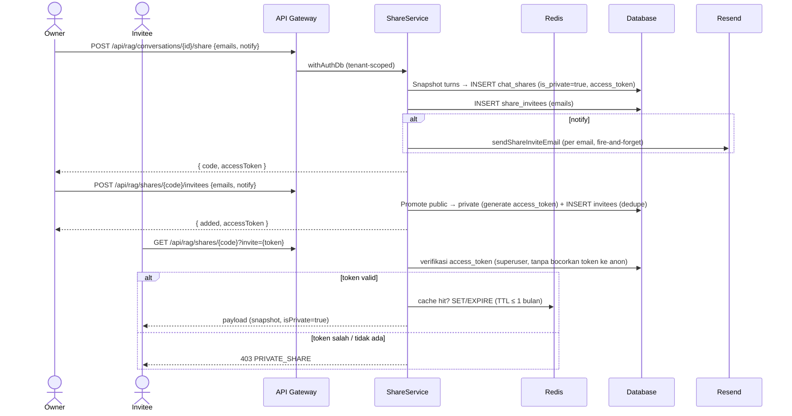

# Public & Private Share Chat (Read-Only)

## Core Logic

Fitur untuk membagikan percakapan sebagai **link read-only**. Ada dua mode akses:

- **Public:** siapa pun dengan link bisa membaca.
- **Private:** link digated oleh **access token**; hanya email yang diundang (disimpan di `share_invitees`) yang menerima link ber-token via email, dan tanpa token yang benar pembaca mendapat `403 PRIVATE_SHARE`.

Konten yang dishare adalah **snapshot immutable** dari percakapan sampai turn terakhir **saat link dibuat** — turn baru atau edit turn setelahnya tidak pernah bocor ke tampilan publik. Viewer publik hanya bisa membaca + menyalin prompt/response; seluruh interaksi (edit, retry, feedback, delete, preview dokumen) tidak tersedia. Viewer yang login dapat **melanjutkan chat** — membuat conversation baru miliknya yang disalin dari snapshot link (tanpa penanda branch).

Key capabilities:

- **Snapshot Immutable (bukan pointer):** Isi link terkunci saat share dibuat. Share menyalin turns ke kolom `snapshot` (jsonb) di tabel share itu sendiri — edit turn, hapus turn, atau hapus conversation tidak mengubah konten publik (kecuali conversation dihapus → share ikut cascade).
- **Kode Base62 acak (64-bit, ~11 char):** `crypto.getRandomValues` → base62, bukan sequence — link tidak bisa di-enumerate berurutan.
- **Custom URL & checking:** User bisa memilih kode sendiri (4-32 char `[a-zA-Z0-9_-]`). **Unique index PK adalah satu-satunya otoritas** — collision auto-code di-retry (≤3x), custom code collision → `catch 23505` → `409 CODE_TAKEN`. Frontend hanya menyimpan **set in-memory kode yang pernah ditolak 409** (hilang saat refresh) sebagai hint non-blocking.
- **Expiry link:** `expires_at` nullable (null = tidak expire). **Default UI sekarang "No expiry"** untuk public maupun private. Row expired di-lazy-delete saat dibaca.
- **Private share & access token:** saat ada invitee (saat create via `emails`, atau via endpoint `POST /shares/{code}/invitees`), share di-mark `is_private=true` dan diberi `access_token` (32 hex, `crypto.randomUUID` tanpa dash). Token ini **tidak pernah** terekspos ke role anon DB maupun payload publik; verifikasi dilakukan via koneksi superuser. Link yang dikirim ke invitee: `{FRONTEND_URL}/s/{code}?invite={access_token}`.
- **Undangan email (Resend):** `sendShareInviteEmail` di `email.util.ts` — sender `Dokyudo <team@dokyudo.my.id>`, subject `{sharer} shared a conversation with you on Dokyudo`, tombol "View Conversation" + info judul & expiry. Pengiriman **fire-and-forget** (gagal tidak membatalkan share), idempotency key `share-invite/{code}/{email}`, dan `share_invitees.notified_at` di-stamp hanya saat Resend menerima.
- **Validasi email (backend authoritative):** normalisasi lowercase + trim, dedupe case-insensitive, format `^[^\s@]+@[^\s@]+\.[^\s@]+$`, max 100 per panggilan, dan **menolak email sharer sendiri** (dicek ke `users.email`).
- **Redis sebagai cache baca, bukan source of truth:** key `share:v1:{code}` berisi payload respons publik; TTL = sisa waktu sampai `expires_at`, dan **maksimal 1 bulan** untuk semua kasus (termasuk no-expiry). **Sliding renewal:** setiap GET sukses hitung ulang TTL lalu `redis.expire`. Cache di-purge pada delete share / stop-all / delete conversation. Verifikasi token private dilakukan **setiap request** (payload cache tidak berisi token).
- **Continue Chat berbasis snapshot:** `POST /api/rag/shares/{code}/continue` membangun conversation baru dari `snapshot` (bukan dari conversation asli) — `boundary_turn_id` sudah **dihapus** karena tidak pernah dipakai; snapshot array adalah satu-satunya sumber kebenaran. Conversation hasil continue memakai judul asli tanpa prefix `Branched - ` dan **tanpa** `branchOfId`/`branchedFromTurnId`.
- **UI publik identik dengan chat page:** user pill, prose assistant, status pills, Source References, inline citation chips, code block preview — dengan komponen shared (`renderMarkdown`, `TurnStatusBadge`, `SourceReferences`). Copy response **menghapus citation tags** (`/\s*\[Doc [^\]]+\]/gi`).
- **Attachment dokumen di snapshot (judul saja):** turn yang punya attachment membawa `attachmentDocumentIds` + `attachments: [{documentId, title}]` di snapshot — judul dibekukan saat share dibuat (anon role tidak bisa membaca tabel `documents`). Halaman publik menampilkan chip judul **statis** (tidak bisa diklik); dokumen tidak bisa dibuka karena endpoint preview butuh auth + kepemilikan tenant. `continueShare` me-restore `attachmentDocumentIds` agar turn hasil continue mempertahankan scoping RAG yang sama.
- **Open Graph + preview:** halaman `s/[code]` di-SSR (`+page.server.ts`) agar crawler mendapat `og:title`/`og:image`; OG image SVG (1200×630) di-render server-side di `/s/{code}/opengraph-image.svg` memakai background + ornament tema Dokyudo, judul dinamis, author (tenant name), dan tanggal publish. Untuk private share, token `?invite=` diteruskan ke backend agar preview tetap bisa dirender.
- **Header responsive:** mobile = capsule (logo "okyudo" kiri + title tengah + tombol share-copy link); desktop = gradient bar. Floating bottom bar ala composer berisi info share + tombol "Continue chat".
- **Bahasa UI publik seluruhnya English.**
- **Manajemen link di akun:** indikator share per-conversation di sidebar **dihapus**; daftar semua link aktif dipindah ke dialog **Shared Links** di menu profile footer (Settings/Billing/Shared links/Log out) — search client-side, pagination 10/page, copy/open (link private otomatis menyertakan token), revoke per link, dan "Delete all" (tenant-wide).
- **Login redirect:** halaman publik mengarah `?redirect=/s/{code}` ke `/login` dengan **open-redirect guard**.

## Flow Diagram



## Endpoints

| Method | Path | Auth | Deskripsi |
|---|---|---|---|
| POST | `/api/rag/conversations/{id}/share` | ✅ | Buat share. Body: `expires_in_hours?`, `custom_code?`, `emails?[]`, `notify?` → `{ code, accessToken }` |
| GET | `/api/rag/shares/{code}` | ❌ (publik) | Baca share; query `?invite=` wajib untuk private. Bypass auth **hanya untuk GET** |
| POST | `/api/rag/shares/{code}/invitees` | ✅ | Tambah invitee + opsi kirim email → `{ added, accessToken }` |
| POST | `/api/rag/shares/{code}/continue` | ✅ | Lanjutkan chat: conversation baru dari snapshot → `{ id, title }` |
| DELETE | `/api/rag/shares/{code}` | ✅ | Revoke satu share + purge cache |
| DELETE | `/api/rag/conversations/{id}/shares` | ✅ | Hentikan semua share satu conversation |
| GET | `/api/rag/shares` | ✅ | List **semua** share aktif tenant (dialog Shared Links) |
| DELETE | `/api/rag/shares` | ✅ | Revoke **semua** share tenant (Delete all) |

`GET /api/rag/conversations/{id}/shares` **dihapus** — tidak dipakai setelah manajemen link pindah ke dialog account-level (`GET /api/rag/shares`).

Bypass auth di `apps/backend/src/api/router.ts`:
```ts
const isPublicShareRead =
    c.req.method === "GET" &&
    /^\/api\/rag\/shares\/[^/]+$/.test(c.req.path);
```
`POST .../continue`, `POST .../invitees`, dan `DELETE` tetap lewat `authMiddleware`.

## Database (Migration `0024` → `0025` → `0026`)

### `chat_shares`

| kolom | tipe | catatan |
|---|---|---|
| `code` | varchar(32) **PK** | base62 (auto) atau custom |
| `tenant_id` | uuid FK → tenants (cascade) | ownership |
| `created_by` | uuid FK → users (set null) | pembuat share |
| `conversation_id` | uuid FK → conversations (cascade) | sumber |
| `title` | text | judul snapshot |
| `snapshot` | jsonb | salinan turns: question, answer, modelUsed, status, contextReferences, createdAt |
| `is_custom` | boolean | custom vs auto code |
| `is_private` | boolean (0025) | true saat ada ≥1 invitee |
| `access_token` | varchar(64) nullable (0025) | kredensial view private — **tidak pernah** di-grant ke anon |
| `expires_at` | timestamptz nullable | null = tidak expire |
| `created_at` / `updated_at` | timestamptz | |

`boundary_turn_id` **dihapus** di migration `0026` — tidak pernah dikonsumsi kode (continue-chat murni dari `snapshot`).

### `share_invitees` (baru, migration `0025`)

| kolom | tipe | catatan |
|---|---|---|
| `code` | varchar(32) FK → chat_shares (cascade) | bagian dari PK `(code, email)` |
| `email` | varchar(255) | bagian dari PK; index `idx_share_invitees_email` |
| `notified_at` | timestamptz nullable | di-stamp saat email undangan terkirim |
| `created_at` | timestamptz | |

### RLS & grants

- `chat_shares` (0024): `authenticated` CRUD tenant-scoped; `anon` SELECT non-expired dengan **column grant** `(code, title, snapshot, is_private, expires_at, conversation_id, created_at)` — `is_private` ditambahkan di 0025, `access_token` **di-revoke** dari anon (0025), `boundary_turn_id` otomatis hilang dari grant saat kolom di-drop (0026).
- `share_invitees` (0025): `ENABLE RLS`; `authenticated` CRUD dengan policy `EXISTS (SELECT 1 FROM chat_shares cs WHERE cs.code = share_invitees.code AND cs.tenant_id = <user tenant>)`; **`REVOKE ALL FROM anon`** — email/token invitee tidak pernah terbaca role anon (verifikasi token lewat koneksi superuser).
- Semua migration idempotent (`IF NOT EXISTS`, `DO $$` guard, `DROP POLICY IF EXISTS`).

## Redis

- `share:v1:{code}` — payload respons publik (JSON, **tanpa** `access_token`). TTL: `min(sisa sampai expires_at, 30 hari)`; no-expiry → 30 hari. Sliding renewal via `redis.expire` setiap GET sukses.
- Di-purge pada `deleteShare`, `deleteAllShares` (per conversation & tenant-wide), dan `RagService.deleteConversation`.
- Verifikasi token private tetap query DB setiap request (cache tidak pernah menyimpan kredensial).

## Email (Resend)

- `sendShareInviteEmail` di `apps/backend/src/shared/utils/email.util.ts`.
- `from: "Dokyudo <team@dokyudo.my.id>"`, link `{FRONTEND_URL}/s/{code}?invite={token}` (FRONTEND_URL dari `getEnv`).
- Idempotency key `share-invite/{code}/{email}`; `notified_at` di-update setelah sukses.
- Konfigurasi: `RESEND_API_KEY` (required env). Gagal kirim **tidak** membatalkan pembuatan share (logged).

## Frontend

### Dialog share — `ShareConversationDialog.svelte`
- Toggle **Public / Private**; default expiry **No expiry** (keduanya).
- Input custom link + preview; hint amber in-memory jika kode pernah ditolak 409.
- **Private — multi-invite:** daftar invitee berbasis list (bukan chips) dengan hapus per baris, tombol `Add`, Enter/koma untuk tambah, badge `N invited`. Validasi frontend: format email, **duplikat** (`X is already invited.`), dan **email sendiri** (dicek ke `/api/me` — backend juga authoritative).
- **`Send invite` tanpa link:** otomatis membuat share dengan random code + expiry terpilih, lalu mengirim undangan dalam satu panggilan `createShare` dengan `emails` + `notify`. Jika link sudah ada → `POST /shares/{code}/invitees`.
- URL hasil selalu menyertakan `?invite=` untuk private; preview OG ikut token; baris link di-clamp ke lebar dialog (`min-w-0` + `truncate`).
- Social sharing (X/Facebook/Reddit/LinkedIn) hanya di mode public. Tombol socmed berupa elemen `<a>` dengan **href share URL terpasang langsung** (`socialShareUrl(network)`), bukan `window.open` di handler — link dijamin ikut terkirim ke form share Facebook/LinkedIn; state disabled saat link belum dibuat (`aria-disabled` + `pointer-events-none opacity-35` + `tabindex=-1`). SVG Reddit diganti ikon flat (viewBox 256) dengan `fill-current` agar warnanya konsisten dengan socmed lain.

### Sidebar — `AppSidebar.svelte`
- Indikator `Share` amber **dihapus**; aksi "Stop sharing" di context menu **dihapus** (pin indicator tetap).
- Menu profile footer: Settings / Billing / **Shared links** / Log out → membuka `SharedLinksDialog`.

### Dialog Shared Links — `SharedLinksDialog.svelte`
- `GET /api/rag/shares` (semua link aktif tenant), search client-side (title/code).
- **Group by conversation** (`conversationId` dari list response): tiap group menampilkan judul conversation, jumlah link, dan tombol **Delete** yang memanggil `DELETE /api/rag/conversations/{id}/shares` (revoke semua link group). Pagination 10 **group**/page.
- Per baris: badge `Private`, open/copy (private otomatis `?invite={accessToken}`), revoke per link.
- `Delete all` → `DELETE /api/rag/shares`; Refresh.

### Halaman publik — `src/routes/s/[code]/+page.svelte`
- SSR load (`+page.server.ts`) meneruskan `?invite=`; client `loadShare` juga — `403 PRIVATE_SHARE` → state "This link is private".
- Badge "Read-only share" vs **"Private share"**; meta OG/twitter lengkap dengan URL + OG image ber-token.
- 404 state "Link is invalid or has expired"; continue-chat flow dengan login redirect.
- Tombol share-copy link (mobile & desktop header) menampilkan **toast "Share link copied to clipboard"** setelah sukses menyalin URL (`copyShareLink`).
- User pill menampilkan chip attachment **statis** dari `turn.attachments` (ikon dokumen + judul, tanpa handler klik) — judul terlihat, dokumen tidak bisa dibuka, tanpa error.

## Security Notes

- Viewer publik **tidak pernah** menyentuh `conversations`/`conversation_turns`/`documents` — hanya baris share (snapshot self-contained). Snapshot hanya membawa **judul** attachment (id dokumen + judul juga sudah publik via `contextReferences`); konten dokumen tetap tak terjangkau karena endpoint preview bersifat auth-only + tenant-scoped.
- Column-level grants mencegah anon membaca `tenant_id`/`created_by`/`access_token`/invitee emails.
- Link private = **token di URL** (pola shared-link): siapa pun yang memegang token bisa membaca. Untuk gating per-email yang lebih ketat (magic link) bisa jadi follow-up.
- Link public "unlisted by obscurity" (base62 acak 2^64) — konten harus dianggap publik.
- Crypto puzzle + rate limiter global tetap berlaku untuk endpoint publik.

## Completion Timestamp
**Date:** 2026-08-09 (diperbarui: private share, invitees, email, OG preview, boundary_turn_id removal; UI: tombol socmed → `<a href>` + Reddit SVG flat, toast copy link)

## File Mapping

- `apps/backend/src/shared/models/db.model.ts`: `chat_shares` (is_private, access_token) + `shareInvitees`.
- `apps/backend/drizzle/migrations/0024_nebulous_kid_colt.sql`, `0025_share_invitees.sql`, `0026_drop_boundary_turn_id.sql`.
- `apps/backend/src/modules/rag/share.service.ts` (+ `.test.ts`): `createShare` (emails/notify), `addShareInvitees`, `getPublicShare` (invite token + 403), `verifyPrivateAccess`, `continueShare`, `deleteShare`, `deleteAllShares`, `listShares`, `listAllShares`, `deleteAllTenantShares`, `lookupSharerEmail/Name`, `deliverInviteEmails`, `normalizeEmails`.
- `apps/backend/src/modules/rag/rag.schema.ts`: body create/invitees, `ShareReadQuerySchema`, response private fields.
- `apps/backend/src/modules/rag/rag.controller.ts` / `rag.routes.ts`: 9 endpoint + OpenAPI.
- `apps/backend/src/shared/utils/email.util.ts`: `sendShareInviteEmail`.
- `apps/backend/src/shared/utils/errors.util.ts`: `ErrorCode` + `PRIVATE_SHARE`.
- `apps/backend/src/api/router.ts`: bypass auth GET publik.
- `apps/frontend/src/lib/types/rag.types.ts` / `lib/api/rag.ts`: tipe + `addShareInvitees`/`listAllShares`/`deleteAllTenantShares`/`getPublicShare(code, invite?)`.
- `apps/frontend/src/lib/components/app/ShareConversationDialog.svelte`: dialog create/invite.
- `apps/frontend/src/lib/components/app/SharedLinksDialog.svelte`: daftar link aktif.
- `apps/frontend/src/lib/components/app/AppSidebar.svelte`: menu profile → Shared Links.
- `apps/frontend/src/routes/s/[code]/+page.svelte` / `+page.server.ts` / `opengraph-image.svg/+server.ts`: halaman publik + OG.
- `api-collections/Search & RAG/10-17_*.bru`: koleksi Bruno endpoint share.

## Connections

- **Client (Frontend):** `createShare`, `addShareInvitees`, `getPublicShare(code, invite?)`, `continueShare`, `deleteShare`, `deleteAllShares`, `listShares`, `listAllShares`, `deleteAllTenantShares` di `lib/api/rag.ts`.
- **Deno API (Backend):** `ShareService` + auth bypass GET; Zod OpenAPI; multi-tenancy via `withAuthDb`; baca publik via `withAnonDb`; verifikasi token via superuser.
- **Resend (Email):** undangan private.
- **Redis (Upstash):** cache payload + TTL sliding; purge pada revoke.
- **PostgreSQL (Database):** `chat_shares` + `share_invitees` + RLS/grant.

## Architectural Decisions

1. **Snapshot vs pointer:** snapshot dipilih karena chat punya edit turn — pointer + boundary membuat edit turn mengubah konten publik, dan viewer publik tidak perlu akses ke tabel conversation (privacy by construction).
2. **`boundary_turn_id` dihapus (0026):** continue-chat murni dari `snapshot`; kolom hanya di-carry-through tanpa fungsi. Drop mengurangi payload API dan permukaan schema.
3. **Access token per share, bukan per invitee:** satu kredensial view untuk semua undangan — cukup untuk pola shared-link; per-invitee token bisa ditambahkan jika perlu revoke individual.
4. **Token tidak pernah masuk cache/anon:** verifikasi selalu via koneksi superuser → tidak ada jalur bocor ke role anon/Redis.
5. **Email fire-and-forget:** kegagalan Resend tidak membatalkan share (invitee tetap tercatat); `notified_at` mencatat status pengiriman.
6. **DB unique index sebagai otoritas custom code:** tanpa pre-check Redis; browser in-memory rejected-set hanya hint UX.
7. **Redis TTL max 1 bulan + sliding renewal:** no-expiry link tidak pernah kehilangan cache selama diakses.
8. **REVOKE ALL + column grant anon:** menutup kebocoran `tenant_id`/`created_by`/`access_token`/invitee dari default privilege Supabase.
9. **Bypass auth hanya GET:** semua mutasi (continue, invitees, delete) butuh autentikasi.
10. **DrizzleQueryError wrapping:** SQLSTATE 23505 berada di `err.cause.code` — helper `isUniqueViolation` mengecek keduanya.
