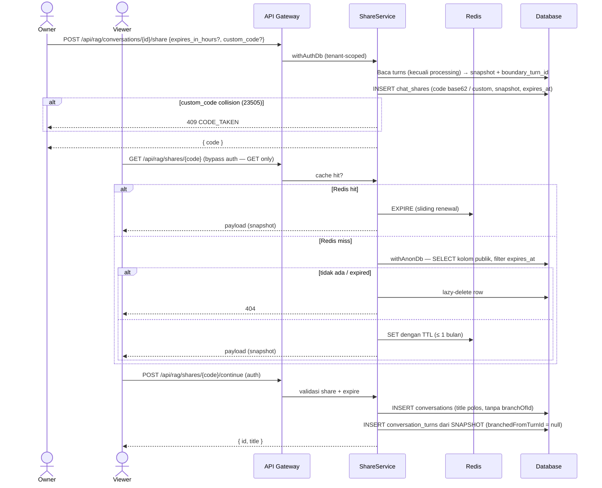

# Public Share Chat (Read-Only)

## Core Logic
Fitur untuk membagikan percakapan ke publik sebagai **link read-only**. Konten yang dishare adalah **snapshot immutable** dari percakapan sampai turn terakhir **saat link dibuat** — turn baru atau edit turn setelahnya tidak pernah bocor ke tampilan publik. Viewer publik hanya bisa membaca + menyalin prompt/response; seluruh interaksi (edit, retry, feedback, delete, preview dokumen) tidak tersedia. Viewer yang login dapat **melanjutkan chat** — membuat conversation baru miliknya yang disalin dari snapshot link (tanpa penanda branch).

Key capabilities:
- **Snapshot Immutable (bukan pointer):** Isi link terkunci saat share dibuat. Berbeda dengan branch yang menyalin dari conversation, share menyalin turns ke kolom `snapshot` (jsonb) di tabel share itu sendiri — edit turn, hapus turn, atau hapus conversation tidak mengubah konten publik (kecuali conversation dihapus → share ikut cascade).
- **Kode Base62 acak (64-bit, ~11 char):** `crypto.getRandomValues` → base62, bukan sequence — link publik tidak bisa di-enumerate berurutan.
- **Custom URL & checking:** User bisa memilih kode sendiri (4-32 char `[a-zA-Z0-9_-]`). **Unique index PK adalah satu-satunya otoritas** — collision auto-code di-retry (≤3x), custom code collision → `catch 23505` → `409 CODE_TAKEN`. Tidak ada pre-check Redis (menghindari stale marker saat link dihapus). Frontend hanya menyimpan **set in-memory kode yang pernah ditolak 409** (hilang saat refresh) sebagai hint non-blocking.
- **Expiry link:** `expires_at` nullable (null = tidak expire). Preset UI: 1 jam / 1 hari / 1 minggu / 1 bulan / tanpa batas. Row expired di-lazy-delete saat dibaca.
- **Redis sebagai cache baca, bukan source of truth:** key `share:v1:{code}` berisi payload respons publik; TTL = sisa waktu sampai `expires_at`, dan **maksimal 1 bulan** untuk semua kasus (termasuk no-expiry). **Sliding renewal:** setiap GET sukses hitung ulang TTL lalu `redis.expire`. Cache di-purge pada delete share / stop-all / delete conversation.
- **Continue Chat berbasis snapshot:** `POST /api/rag/shares/{code}/continue` membangun conversation baru dari `snapshot` (bukan dari conversation asli) — desain ini sudah siap untuk rencana fitur "pilih beberapa turn saja untuk di-share". Conversation hasil continue memakai judul asli tanpa prefix `Branched - ` dan **tanpa** `branchOfId`/`branchedFromTurnId` — tidak pernah menampilkan divider "Branched from".
- **Tidak ada DB sharding:** pola base62+sharding overkill di skala ini; Postgres hash partition bisa ditambahkan belakangan tanpa ubah kode aplikasi.
- **UI publik identik dengan chat page:** user pill, prose assistant, status pills, Source References, inline citation chips, code block preview — dengan komponen shared (`renderMarkdown`, `TurnStatusBadge`, `SourceReferences`). Copy response **menghapus citation tags** (`/\s*\[Doc [^\]]+\]/gi`) — sama seperti chat page.
- **Header responsive:** mobile = capsule ala halaman documents (logo "okyudo" kiri + title tengah + tombol share-copy link); desktop = gradient bar (brand kiri, title tengah, tombol share-copy link). Floating bottom bar ala composer berisi info share + tombol "Continue chat".
- **Bahasa UI publik seluruhnya English.**
- **Sidebar indicator:** `GET /api/rag/conversations` mengembalikan `hasActiveShare` (via `EXISTS` subquery, tanpa N+1) — ikon `Share` amber di item conversation + aksi "Stop sharing" (hapus semua share) dari context menu.
- **Login redirect:** halaman publik mengarah `?redirect=/s/{code}` ke `/login` dengan **open-redirect guard** (hanya path internal).

## Flow Diagram



## Endpoints

| Method | Path | Auth | Deskripsi |
|---|---|---|---|
| POST | `/api/rag/conversations/{id}/share` | ✅ | Buat share (snapshot sampai turn terakhir). Body: `expires_in_hours?`, `custom_code?` → `{ code }` |
| GET | `/api/rag/shares/{code}` | ❌ (publik) | Baca share. Bypass auth **hanya untuk GET**; puzzle + rate limit tetap berlaku |
| POST | `/api/rag/shares/{code}/continue` | ✅ | Lanjutkan chat: conversation baru dari snapshot → `{ id, title }` |
| DELETE | `/api/rag/shares/{code}` | ✅ | Revoke satu share + purge cache |
| DELETE | `/api/rag/conversations/{id}/shares` | ✅ | Hentikan semua share conversation (sidebar) |
| GET | `/api/rag/conversations/{id}/shares` | ✅ | List share aktif (dialog manage) |

Bypass auth di `apps/backend/src/api/router.ts`:
```ts
const isPublicShareRead =
    c.req.method === "GET" &&
    /^\/api\/rag\/shares\/[^/]+$/.test(c.req.path);
```
`POST .../continue` dan `DELETE` tetap lewat `authMiddleware`.

## Database (Migration `0024_nebulous_kid_colt.sql`)

Tabel `chat_shares`:

| kolom | tipe | catatan |
|---|---|---|
| `code` | varchar(32) **PK** | base62 (auto) atau custom |
| `tenant_id` | uuid FK → tenants (cascade) | ownership |
| `created_by` | uuid FK → users (set null) | pembuat share |
| `conversation_id` | uuid FK → conversations (cascade) | sumber + lineage continue |
| `boundary_turn_id` | uuid **tanpa FK** | turn terakhir di snapshot (continue boundary) |
| `title` | text | judul snapshot |
| `snapshot` | jsonb | salinan turns: question, answer, modelUsed, status, contextReferences, createdAt |
| `is_custom` | boolean | custom vs auto code |
| `expires_at` | timestamptz nullable | null = tidak expire |
| `created_at` / `updated_at` | timestamptz | |

**RLS & grants (keamanan multi-tenant):**
- `ENABLE ROW LEVEL SECURITY`.
- `authenticated`: SELECT/INSERT/UPDATE/DELETE hanya baris tenant sendiri — policy `tenant_id = (SELECT tenant_id FROM public.users WHERE id = auth.uid())` (pola sama dengan tabel existing, `withAuthDb`).
- `anon`: SELECT hanya baris `expires_at IS NULL OR expires_at > now()`.
- **`REVOKE ALL ... FROM anon`** lalu `GRANT SELECT (code, title, snapshot, expires_at, conversation_id, boundary_turn_id, created_at)` — penting karena Supabase default memberi `ALL` ke anon; tanpa REVOKE, `tenant_id`/`created_by` bocor ke viewer anon.
- Migration **idempotent** (`IF NOT EXISTS`, `DO $$` block untuk constraint — Postgres tidak mendukung `ADD CONSTRAINT IF NOT EXISTS`, `DROP POLICY IF EXISTS`) — konvensi project: DB lokal memakai SQL manual dengan guard, staging/prod pakai `drizzle-kit migrate`.

## Redis

- `share:v1:{code}` — payload respons publik (JSON). TTL: `min(sisa sampai expires_at, 30 hari)`; no-expiry → 30 hari. Sliding renewal via `redis.expire` setiap GET sukses.
- Di-purge pada `deleteShare`, `deleteAllShares`, dan `RagService.deleteConversation` (cascade DB menghapus row tapi cache harus dibersihkan eksplisit — bug yang ditemukan saat review).
- Tidak ada key pre-check custom code (lihat Core Logic).

## Frontend

### Dialog share — `ShareConversationDialog.svelte`
- Preset expiry: 1 jam / 1 hari / 1 minggu / 1 bulan / tidak ada batas.
- Input custom link + preview URL; hint amber in-memory jika kode pernah ditolak 409 di sesi ini (hilang saat refresh; submit tetap aktif — server yang memutuskan).
- Hasil create → tampilkan link + tombol salin; daftar share aktif + revoke per link + "Hentikan semua".
- Tombol `Share2` di chat page **disabled** saat streaming (`isGenerating`).

### Sidebar — `AppSidebar.svelte`
- Indikator `Share` amber di item conversation dengan `hasActiveShare` (selalu terlihat, pola `MenuAction` pin).
- Context menu: "Share" (buka dialog) + "Stop sharing" (jika aktif) → `deleteAllShares` + optimistic update store.

### Halaman publik — `src/routes/s/[code]/+page.svelte`
- Layout & komponen **identik** chat page: user pill kanan, assistant `prose` flat tanpa avatar, status pills (`TurnStatusBadge`), section Source References (`SourceReferences`, statis tanpa preview dokumen), inline citation chips statis (`renderMarkdown(..., false)`), code block preview (`CodeBlockPreview`).
- Copy prompt/response menghapus citation tags + `toast.success('Copied to clipboard')`.
- Header mobile: capsule ala documents (`inset-x-4 top-4`, logo "okyudo" kiri, **title tengah**, tombol share-copy link). Header desktop: gradient bar `h-28` grid 3 kolom. Floating bottom bar ala composer: "Shared read-only via Dokyudo." + tombol "Continue chat".
- 404 state: "Link is invalid or has expired". Semua teks English.
- Continue: `sessionStore` kosong → `/login?redirect=/s/{code}`; token basi (401) → redirect login; sukses → `/app/chat/{id}`.

### Reusable components (dipakai chat + share)
- `src/lib/utils/markdown.ts` — `renderMarkdown(text, refs, interactive)` + `formatPageNumbers`; chip interaktif (data-doc-id + hover, untuk CitationTooltip chat) vs statis (publik).
- `src/lib/components/chat/TurnStatusBadge.svelte` — pill stopped/failed/blocked; `detailed` untuk copy chat.
- `src/lib/components/chat/SourceReferences.svelte` — section references; `interactive` + `onPreview` untuk chat, statis untuk publik.

## Security Notes
- Viewer publik **tidak pernah** menyentuh `conversations`/`conversation_turns`/`documents` — hanya satu baris tabel share (snapshot self-contained). Tidak ada join yang bisa bocor lintas-tenant.
- Column-level grants mencegah anon membaca `tenant_id`/`created_by` (terverifikasi: `SELECT tenant_id` sebagai anon → `permission denied`).
- Link publik bersifat "unlisted by obscurity" (base62 acak 2^64) — bukan enkripsi; konten harus dianggap publik.
- Crypto puzzle + rate limiter global tetap berlaku untuk endpoint publik.

## Completion Timestamp
**Date:** 2026-08-09

## File Mapping
- `apps/backend/src/shared/models/db.model.ts`: tabel `chat_shares`.
- `apps/backend/drizzle/migrations/0024_nebulous_kid_colt.sql`: migration + RLS/grant idempotent.
- `apps/backend/src/shared/utils/base62.util.ts` (+ `.test.ts`): `toBase62`, `generateShareCode`.
- `apps/backend/src/shared/constants/redis_keys.constant.ts`: `shareCache`.
- `apps/backend/src/modules/rag/share.service.ts` (+ `.test.ts`): `createShare`, `getPublicShare`, `continueShare`, `deleteShare`, `deleteAllShares`, `listShares`; `isUniqueViolation` (cek `err.cause.code` — DrizzleQueryError).
- `apps/backend/src/modules/rag/rag.schema.ts`: schemas share + `hasActiveShare`.
- `apps/backend/src/modules/rag/rag.controller.ts` / `rag.routes.ts`: 6 endpoint + OpenAPI.
- `apps/backend/src/modules/rag/rag.service.ts`: `hasActiveShare` di `listConversations`; purge cache di `deleteConversation`.
- `apps/backend/src/api/router.ts`: bypass auth GET publik.
- `apps/backend/src/shared/utils/errors.util.ts`: `ErrorCode` + `CODE_TAKEN`.
- `apps/frontend/src/lib/types/rag.types.ts` / `lib/api/rag.ts` / `lib/state/conversations.store.svelte.ts`: tipe + helper share.
- `apps/frontend/src/lib/components/app/ShareConversationDialog.svelte`: dialog create/manage.
- `apps/frontend/src/lib/components/app/AppSidebar.svelte`: indikator + stop sharing.
- `apps/frontend/src/routes/app/chat/[id]/+page.svelte`: tombol share → dialog; komponen shared.
- `apps/frontend/src/routes/s/[code]/+page.svelte`: halaman publik.
- `apps/frontend/src/routes/(auth)/login/+page.svelte`: redirect param + open-redirect guard.
- `apps/frontend/src/lib/utils/markdown.ts`, `lib/components/chat/TurnStatusBadge.svelte`, `lib/components/chat/SourceReferences.svelte`: komponen shared.
- `api-collections/Search & RAG/10-15_*.bru`: koleksi Bruno endpoint share.

## Connections
- **Client (Frontend):** `createShare`/`getPublicShare`/`continueShare`/`deleteShare`/`deleteAllShares`/`listShares` di `lib/api/rag.ts`; halaman publik `s/[code]`; dialog + sidebar.
- **Deno API (Backend):** `ShareService` + auth bypass GET; Zod OpenAPI; multi-tenancy via `withAuthDb`; baca publik via `withAnonDb`.
- **Redis (Upstash):** cache payload + TTL sliding; purge pada revoke.
- **PostgreSQL (Database):** `chat_shares` + RLS/grant; snapshot jsonb.

## Architectural Decisions
1. **Snapshot vs pointer:** Snapshot dipilih karena chat punya edit turn — pointer + boundary membuat edit turn mengubah konten publik (melanggar "read-only share"), dan viewer publik tidak perlu akses ke tabel conversation sama sekali (privacy by construction).
2. **Tidak menyimpan URL lengkap:** cukup `code`; URL direkonstruksi dari origin frontend (tahan ganti domain).
3. **DB unique index sebagai otoritas custom code:** tanpa pre-check Redis — pre-check menciptakan stale state (code yang sudah dihapus pemiliknya tetap "terkunci" sampai TTL); browser in-memory rejected-set hanya hint UX.
4. **Continue berbasis snapshot:** siap untuk fitur subset share; conversation hasil continue tanpa marker branch (title polos, `branchOfId`/`branchedFromTurnId` null) sesuai permintaan UI.
5. **Redis TTL max 1 bulan + sliding renewal:** no-expiry link tidak pernah kehilangan cache selama masih diakses; expired link mati sendiri dari cache karena TTL ≤ sisa waktu.
6. **REVOKE ALL + column grant anon:** menutup kebocoran `tenant_id`/`created_by` dari default privilege Supabase.
7. **DrizzleQueryError wrapping:** SQLSTATE 23505 berada di `err.cause.code`, bukan `err.code` — helper `isUniqueViolation` mengecek keduanya.
8. **Bypass auth hanya GET:** `POST .../continue` dan `DELETE` tetap butuh autentikasi.
