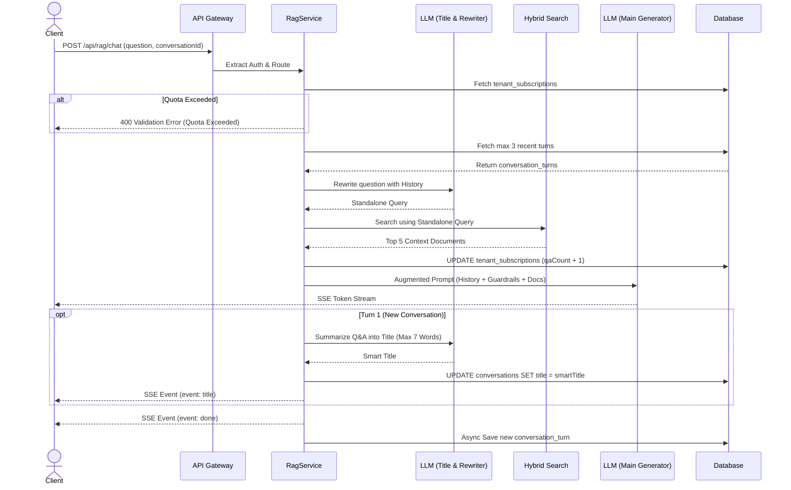

# RAG Conversation Management

## Core Logic
This feature encompasses the conversational memory capabilities and management of the Retrieval-Augmented Generation (RAG) system. It enables the AI to "remember" past interactions during a chat session without suffering from context bloat. Additionally, it provides users with full control over their data by allowing them to rename conversation titles and permanently delete chat histories. 

Key capabilities:
- **Conversation Memory (Sliding Window):** Automatically fetches up to 3 of the most recent conversation turns when a `conversationId` is provided.
- **Smart Title Generation (Turn 1 Only):** Automatically generates a concise 1-sentence title (max 7 words) using `gemini-3.1-flash-lite` upon completion of the initial turn.
- **Real-Time SSE Title Event:** Emits `event: title` over the active SSE stream so the client updates header title and sidebar in real-time with an animated `<Skeleton>` loading state.
- **Zero-Latency Document Title Hydration:** Joins `documents` table during hybrid search chunk hydration to include original filename `title` without extra DB queries.
- **Document-Level Unique Indexing:** Maps search results by unique `documentId` to `[Doc 1..M]`, preventing chunk-index hallucination mismatches.
- **Single-Pass In-Context Sentence Citations:** Prompts LLM to append `[Doc N: Hlm. X]` tags to factual sentences, rendered as truncated filename badge buttons (`📄 Lapor... • Hlm. 148`) in frontend markdown.
- **Cited Pages Filtering:** Filters `Source References` pages on SSE completion so page lists strictly match only the pages actually cited in the response text.
- **Clean Clipboard Copying:** Automatically strips `[Doc N: Hlm. X]` citation tags when user clicks Copy button.
- **Conditional SSE Reference Emission:** Emits `event: references` only when relevant context documents match. Omits the event completely if no documents are relevant, keeping the frontend UI clean.
- **Standalone Query Rewriting:** Uses a high-speed LLM (Gemini Flash Lite) to rewrite follow-up questions contextually, ensuring hybrid searches remain highly accurate and do not match against vague pronouns.
- **Prompt Guardrails:** Protects against document-based prompt injection by isolating the context documents inside the augmented prompt.
- **Tier Quota Validation (Soft Lock):** Enforces monthly Q&A limits based on the tenant's subscription tier. Blocks requests with HTTP 400 if limits are exceeded.
- **Conversation CRUD:** Endpoints to safely update conversation titles and delete histories, scoped by `tenantId` to ensure multi-tenant data isolation.

## Flow Diagram

## Completion Timestamp
**Date:** 2026-08-03
**Time:** 11:23 (UTC+7)

## File Mapping
- `apps/backend/src/modules/rag/rag.service.ts`: Implemented `isNewConversation` detection, `gemini.generateText` smart title generation (max 7 words), and `event: title` SSE emission.
- `apps/frontend/src/routes/app/chat/[id]/+page.svelte`: Built dark background UI, SSE stream block parser (`event: title`), and animated `<Skeleton>` header title loader.
- `apps/frontend/src/lib/state/conversations.store.svelte.ts`: Created reactive Svelte 5 conversation store for real-time sidebar synchronization.
- `apps/frontend/src/lib/components/app/AppSidebar.svelte`: Connected recent chats list to `conversationsStore` for instant live updates.

## Connections
- **Client (Frontend):** Sends `conversation_id` in subsequent chat requests to maintain memory. Can send HTTP requests to rename or remove chats.
- **Deno API (Backend):** Manages the logic, performs the contextual rewriting, and streams responses.
- **PostgreSQL (Database):** Holds `conversations` and `conversation_turns`, isolated via `tenant_id`.
- **LLM Provider (Gemini):** Dual usage. `gemini-3.1-flash-lite` used as a high-speed pre-processor for both security gatekeeping and query contextualization, before handling the main generation.

## Architectural Decisions
1. **Sliding Window Memory (Max 3):** Chosen over full history injection to prevent token exhaustion and to ensure the LLM's attention span remains highly focused on the actual retrieved knowledge documents.
2. **LLM Query Rewriting:** Implemented to prevent vague queries (e.g., "what is its price?") from destroying the vector search accuracy. Context is resolved *before* embedding.
3. **LLM-as-a-Judge Guardrails:** Utilizes Gemini as a fast pre-flight checker to block Prompt Injection attempts (e.g. "Ignore instructions and write code") from ever hitting the RAG pipeline.
4. **Tenant-Level Deletions:** Drizzle ORM queries for `update` and `delete` strictly mandate an `eq(conversations.tenantId, tenantId)` constraint to prevent IDOR (Insecure Direct Object Reference) vulnerabilities.
5. **Tier Validation (Soft Lock):** Checking the `tenant_subscriptions` table before generating responses guarantees that tenants on a FREE tier cannot drain Google Gemini API quotas once their budget is exhausted. This acts as a robust mechanism against DoS abuse via repeated prompts.
6. **Atomic Quota Increments:** Used `sql` string literals to safely run `SET qaCount = qaCount + 1` right before streaming the LLM response, minimizing race conditions for concurrency limits.
