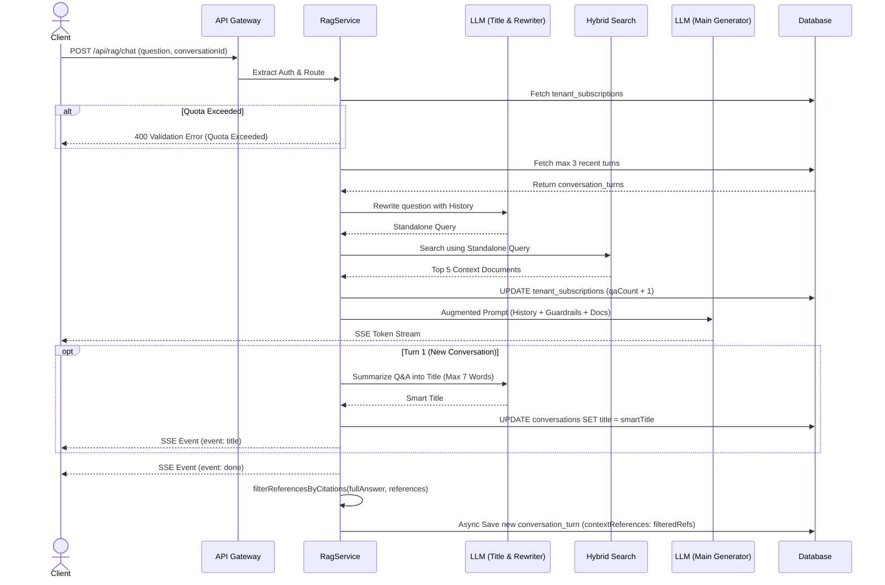

# RAG Conversation Management

## Core Logic
This feature encompasses the conversational memory capabilities, responsive user interface, and management of the Retrieval-Augmented Generation (RAG) system. It enables the AI to "remember" past interactions during a chat session without suffering from context bloat. Additionally, it provides users with full control over their data by allowing them to rename conversation titles, branch conversations, and permanently delete chat histories.

Key capabilities:
- **Conversation Memory (Sliding Window):** Automatically fetches up to 3 of the most recent conversation turns when a `conversationId` is provided.
- **Smart Title Generation (Turn 1 Only):** Automatically generates a concise 1-sentence title (max 7 words) using `gemini-3.1-flash-lite` upon completion of the initial turn.
- **Real-Time SSE Title Event:** Emits `event: title` over the active SSE stream so the client updates header title and sidebar in real-time with an animated `<Skeleton>` loading state.
- **Headerless Clean Chat UI:** Clean borderless layout without top header clutter.
- **Responsive Floating Input Capsule with Gradient Mask:** Fixed/sticky bottom container with a smooth linear gradient (`from-[#1F1E1D] via-[#1F1E1D]/90 to-transparent`) positioned `absolute bottom-0 left-0 right-0 z-30` inside the main layout. Automatically adapts to mobile screens, desktop expanded sidebar, and desktop collapsed sidebar.
- **Auto-Resetting Textarea Height:** Reactive Svelte 5 `$effect` observing `inputValue` to instantly reset `textInput.style.height = 'auto'` when input is cleared.
- **User Question & AI Response Action Bars:**
  - **User Question:** Copy button (`Copy`/`Check`) and Edit button (`Pencil`).
  - **AI Response:** Copy button (`Copy`/`Check`), Retry button (`RotateCw`), Thumbs Up/Down, and a Triple-dot Dropdown (`Ellipsis`) menu containing "Branch in new chat" (`GitBranch`) and "Read aloud" (`Volume2`).
- **Strict 3-Layer Citation Filtering & Fallback Bracket Stripping:**
  1. *System Prompt Rule 6:* Explicitly forbids generic document list brackets like `[Doc 1; Doc 2; Doc 3]` on negative/fallback answers.
  2. *Server & Client Citation Filtering (`filterReferencesByCitations`):* Strictly requires page-specific citation tags (`[Doc N: Hlm. X]`). If no page-specific citations exist, `contextReferences` evaluates to `null` so `Source References` UI block is completely hidden.
  3. *Frontend Fallback Tag Stripping:* Automatically strips leftover generic bracket tags (`/\s*\[Doc [^\]]+\]/gi`) from rendered markdown HTML and clipboard output.
- **Zero-Latency Document Title Hydration:** Joins `documents` table during hybrid search chunk hydration to include original filename `title` without extra DB queries.
- **Document-Level Unique Indexing:** Maps search results by unique `documentId` to `[Doc 1..M]`, preventing chunk-index hallucination mismatches.
- **Single-Pass In-Context Sentence Citations:** Prompts LLM to append `[Doc N: Hlm. X]` tags to factual sentences, rendered as truncated filename badge buttons (`📄 Lapor... • Hlm. 148`) in frontend markdown.
- **Clean Clipboard Copying:** Automatically strips `[Doc N: Hlm. X]` citation tags when user clicks Copy button.
- **Standalone Query Rewriting:** Uses a high-speed LLM (Gemini Flash Lite) to rewrite follow-up questions contextually, ensuring hybrid searches remain highly accurate and do not match against vague pronouns.
- **Prompt Guardrails:** Protects against document-based prompt injection by isolating the context documents inside the augmented prompt.
- **Tier Quota Validation (Soft Lock):** Enforces monthly Q&A limits based on the tenant's subscription tier. Blocks requests with HTTP 400 if limits are exceeded.
- **Conversation CRUD:** Endpoints to safely update conversation titles and delete histories, scoped by `tenantId` to ensure multi-tenant data isolation.

## Flow Diagram

## Completion Timestamp
**Date:** 2026-08-05
**Time:** 15:43 (UTC+7)

## File Mapping
- `apps/backend/src/modules/rag/rag.service.ts`: Implemented prompt guardrails, `filterReferencesByCitations` server-side DB & history filtering, `isNewConversation` detection, smart title generation, and `event: title` SSE emission.
- `apps/backend/src/modules/rag/rag.service.test.ts`: Added unit tests covering positive and negative paths for `filterReferencesByCitations`.
- `apps/frontend/src/routes/app/+layout.svelte`: Locked viewport bounds on `<main>` (`h-svh max-h-svh flex-1 min-h-0 flex-col overflow-hidden`).
- `apps/frontend/src/routes/app/chat/[id]/+page.svelte`: Built headerless layout, responsive floating input bar with linear gradient, action bars (Copy, Retry, ThumbsUp/Down, Dropdown menu), auto-resetting textarea height `$effect`, and client-side citation tag transformer and filtering.
- `apps/frontend/src/routes/app/chat/+page.svelte`: Applied auto-resetting textarea height `$effect` to main chat page input.
- `apps/frontend/src/lib/state/conversations.store.svelte.ts`: Created reactive Svelte 5 conversation store for real-time sidebar synchronization.
- `apps/frontend/src/lib/components/app/AppSidebar.svelte`: Connected recent chats list to `conversationsStore` for instant live updates.

## Connections
- **Client (Frontend):** Sends `conversation_id` in chat requests, handles SSE streams, renders markdown with inline citation badges, and dynamically resets input heights.
- **Deno API (Backend):** Manages sliding window memory, performs standalone query rewriting, executes hybrid search, streams SSE tokens, and filters references by citations before DB save.
- **PostgreSQL (Database):** Holds `conversations` and `conversation_turns`, isolated via `tenant_id`.
- **LLM Provider (Gemini / Groq / OpenAI):** `gemini-3.1-flash-lite` used for security gatekeeping, query contextualization, and title generation, while selected main model streams the answer.

## Architectural Decisions
1. **Responsive Absolute Floating Input:** Positioned `absolute bottom-0 left-0 right-0 z-30` inside the main layout content area. Automatically centers input capsule across Mobile screens, Desktop expanded sidebar, and Desktop collapsed sidebar without hardcoded CSS pixel offsets.
2. **Auto-Resetting Textarea Height:** Utilizes Svelte 5 `$effect` observing `inputValue`. When `inputValue` is programmatically cleared upon message submission, `style.height` is reset to `'auto'` instantly, restoring default 1-line height (`min-h-[36px]`).
3. **3-Layer Strict Citation Filtering:**
   - *System Prompt Rule 6:* Prevents LLM from emitting generic fallback list brackets (`[Doc 1; Doc 2; Doc 3]`) on negative answers.
   - *Server & Client Regex:* Requires page-specific citation tags (`[Doc N: Hlm. X]`). If no page-specific citations exist, `contextReferences` evaluates to `null` so `Source References` UI block is completely hidden.
   - *Fallback Stripping:* Strips any generic bracket tags from rendered HTML and copied clipboard text.
4. **Sliding Window Memory (Max 3):** Chosen over full history injection to prevent token exhaustion and ensure LLM attention focuses on retrieved knowledge documents.
5. **Tenant-Level Deletions & Multi-Tenancy:** Drizzle ORM queries for `update` and `delete` strictly mandate `eq(conversations.tenantId, tenantId)` constraints to prevent data leakage.
