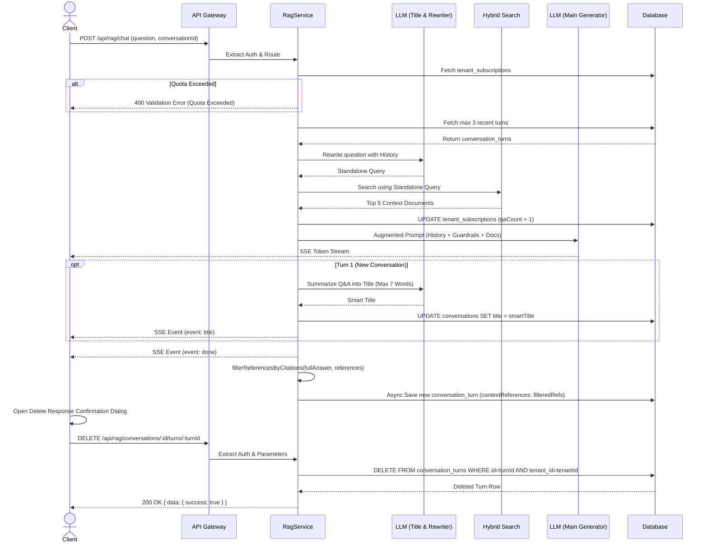

# RAG Conversation Management

## Core Logic
This feature encompasses the conversational memory capabilities, responsive user interface, and management of the Retrieval-Augmented Generation (RAG) system. It enables the AI to "remember" past interactions during a chat session without suffering from context bloat. Additionally, it provides users with full control over their data by allowing them to rename conversation titles, branch conversations, edit/regenerate turns, delete single turns with confirmation dialogs, and permanently delete chat histories.

Key capabilities:
- **Conversation Memory (Sliding Window):** Automatically fetches up to 3 of the most recent conversation turns when a `conversationId` is provided.
- **Smart Title Generation (Turn 1 Only):** Automatically generates a concise 1-sentence title (max 7 words) using `gemini-3.1-flash-lite` upon completion of the initial turn.
- **Real-Time SSE Title Event:** Emits `event: title` over the active SSE stream so the client updates header title and sidebar in real-time with an animated `<Skeleton>` loading state.
- **Headerless Clean Chat UI:** Clean borderless layout without top header clutter.
- **Responsive Floating Input Capsule with Gradient Mask:** Fixed/sticky bottom container with a smooth linear gradient (`from-[#1F1E1D] via-[#1F1E1D]/90 to-transparent`) positioned `absolute bottom-0 left-0 right-0 z-30` inside the main layout. Automatically adapts to mobile screens, desktop expanded sidebar, and desktop collapsed sidebar.
- **Auto-Resetting Textarea Height:** Reactive Svelte 5 `$effect` observing `inputValue` to instantly reset `textInput.style.height = 'auto'` when input is cleared.
- **User Question & AI Response Action Bars:**
  - **User Question:** Copy button (`Copy`/`Check`) and Edit button (`Pencil`).
  - **AI Response:** Copy button (`Copy`/`Check`), Retry button (`RotateCw`), Thumbs Up/Down, and a Triple-dot Dropdown (`Ellipsis`) menu containing "Branch in new chat" (`GitBranch`), "Read aloud" (`Volume2`), and "Delete response" (`Trash2`).
- **Retry as Alternative Responses (Varian):** "Try Again" pada turn terakhir kini membuat **varian jawaban baru** (`turn_alternatives`, bukan turn duplikat), ditelusuri dengan `◀ N/M ▶` di baris toolbar — tanpa tombol "pilih"; jawaban yang sedang ditampilkan itulah pilihan. Saat follow-up dikirim, jawaban varian terpilih dipakai sebagai konteks history dan **dipromosikan** menjadi jawaban kanonik turn; varian yang tidak dipilih dihapus setelah follow-up sukses. Edit prompt menghapus semua varian turn tersebut. Backend: `retry_turn_id` / `selected_variant_id` di `POST /api/rag/chat` (detail: `docs/backend/rag-turn-status-and-edit-mode.md` §15).
- **Interactive Feedback System with Sonner Toasts:**
  - Explicit semi-transparent hover state (`hover:bg-white/20 hover:text-white`) for active feedback buttons to prevent theme fallback to opaque white.
  - Sonner toast notifications on rating toggle (`toast.success` for Helpful, `toast.info` for Needs Improvement / Cleared).
- **Turn Deletion with Confirmation Modal:**
  - Dedicated `<Dialog.Root>` confirmation dialog before executing response turn deletion.
  - Asynchronous HTTP API call (`DELETE /api/rag/conversations/:id/turns/:turnId`) with optimistic UI removal.
- **Non-Existent Conversation 404 Route Protection:**
  - Automatic detection of invalid/non-existent conversation UUIDs when accessed directly via URL address bar.
  - Triggers `toast.error('Conversation not found')` and smoothly redirects client to `/app/chat`.
- **Svelte 5 `untrack()` Effect Optimization:**
  - Wraps `loadConversation` inside Svelte 5 `untrack()` within `$effect` to prevent infinite re-submission loops triggered by reactive state mutations during SSE streaming.
- **Matching Markdown Horizontal Rule (`---`) Styling:**
  - Custom `:global(.prose hr)` border (`rgba(255, 255, 255, 0.12)`) and spacing matching markdown table grid dividers.
- **Strict 3-Layer Citation Filtering & Fallback Bracket Stripping:**
  1. *System Prompt Rule 6:* Explicitly forbids generic document list brackets like `[Doc 1; Doc 2; Doc 3]` on negative/fallback answers.
  2. *Server & Client Citation Filtering (`filterReferencesByCitations`):* Strictly requires page-specific citation tags (`[Doc N: Hlm. X]`). If no page-specific citations exist, `contextReferences` evaluates to `null` so `Source References` UI block is completely hidden.
  3. *Frontend Fallback Tag Stripping:* Automatically strips leftover generic bracket tags (`/\s*\[Doc [^\]]+\]/gi`) from rendered markdown HTML and clipboard output.
- **Zero-Latency Document Title Hydration:** Joins `documents` table during hybrid search chunk hydration to include original filename `title` without extra DB queries.
- **Document-Level Unique Indexing:** Maps search results by unique `documentId` to `[Doc 1..M]`, preventing chunk-index hallucination mismatches.
- **Single-Pass In-Context Sentence Citations:** Prompts LLM to append `[Doc N: Hlm. X]` tags to factual sentences, rendered as truncated filename badge buttons (`📄 Lapor... • Hlm. 148`) in frontend markdown.
- **Clean Clipboard Copying:** Automatically strips `[Doc N: Hlm. X]` citation tags when user clicks Copy button.
- **Standalone Query Rewriting:** Uses a high-speed LLM (Gemini Flash Lite) to rewrite follow-up questions contextually, ensuring hybrid searches remain highly accurate and do not match against vague pronouns.
- **Prompt Guardrails:** Protects against document-based prompt injection by isolating the context documents inside the augmented prompt.
- **Tier Quota Validation (Soft Lock):** Enforces monthly Q&A limits based on the tenant's subscription tier. Blocks requests with HTTP 400 if limits are exceeded.
- **Conversation CRUD & Turn Management:** Endpoints to safely update conversation titles, delete single turns, and delete entire conversation histories, strictly scoped by `tenantId` to ensure multi-tenant data isolation.

## Flow Diagram

## Branching Conversations

### 1. Core Logic
Branch = conversation baru yang dimulai dari **salinan history** sampai turn batas (endpoint) yang dipilih, lalu divergen. Parent dan branch **independen** (snapshot immutable): meng-edit turn parent setelah branch tidak mengubah branch, dan sebaliknya. Pendekatan salin dipilih (bukan shared-prefix ala Git) karena branch harus snapshot — model copy-on-write over-engineered untuk skala ini.

### 2. DB (Migrasi 0021–0022)

- `conversations.branch_of_id` — FK → `conversations.id`, `ON DELETE SET NULL`. Penanda "conversation ini branch dari X" + sumber label. Parent dihapus → null (branch tetap hidup).
- `conversation_turns.branched_from_turn_id` — **plain column, sengaja TANPA FK**. Marker turn batas (turn terakhir yang disalin), menunjuk ke id turn asli di parent. Tanpa FK karena marker harus **bertahan** saat parent (dan turn aslinya) dihapus — kalau pakai FK `ON DELETE SET NULL`, marker ikut ter-null-kan dan divider "Branched from Deleted Conversation" tidak akan pernah render (bug yang pernah terjadi).

### 3. Endpoint & Service

`POST /api/rag/conversations/{id}/branch` — body `{ "turn_id": "..." }` → `{ id, title }`.

`RagService.branchConversation` (satu transaksi):
1. Validasi parent (conversation + tenant) → 404; cari index turn batas → 404 kalau tidak ada.
2. Buat conversation baru: `title = "Branched - {parent.title}"`, `branchOfId = parent.id`.
3. Salin prefix `[0..boundaryIndex]` dengan aturan:
   - **id baru** (lineage via marker, bukan id sama),
   - `createdAt` dipertahankan (timeline/urutan faithful),
   - **status asli dipertahankan** (turn stopped/failed tetap begitu),
   - `feedback`/`feedbackAt` di-reset (interaksi tidak ikut branch),
   - turn batas diberi `branchedFromTurnId` = id turn asli.

### 4. Response `getConversation`

- Level conversation: `branchOf: { id, title } | null` — null saat parent dihapus.
- Per turn: `branchedFromTurnId: string | null` — frontend render divider **setelah** turn dengan marker ini.

### 5. Frontend

- Divider `Branched from {title}` dirender **hanya di bawah response AI** (bukan question user): icon `GitBranch` + title sebagai `<a href>` (underline, hyperlink ke parent conversation; SvelteKit tetap client-side nav). Parent dihapus → **"Branched from Deleted Conversation"** tanpa link.
- Setelah branch berhasil: `conversationsStore.addOrUpdate(id, "Branched - XXXX")` → conversation branch langsung muncul di **paling atas** sidebar, lalu navigate ke halaman branch.

### 6. Pin Conversation Feature

#### 6.1 Core Logic
Allows users to pin important conversations so they stay at the top of the sidebar list regardless of update timestamps. Pinned conversations are sorted first in descending order (`desc(isPinned)`), followed by non-pinned conversations ordered by `desc(updatedAt)`.

#### 6.2 Database Schema (Migration `0023_add_is_pinned_to_conversations.sql`)
- Added column `conversations.is_pinned` (boolean, default `false`, NOT NULL).

#### 6.3 REST Endpoint & Partial Update (`PATCH /api/rag/conversations/{id}`)
- Updated `UpdateConversationBodySchema` to accept optional `title` and/or `isPinned` properties.
- Service `RagService.updateConversation` updates `title` and/or `isPinned` without modifying `updatedAt`.
- `updatedAt` is strictly reserved for creation/streaming of new conversation turns (`POST /api/rag/chat`).
- Preserves natural chronological order within pinned and unpinned sections.
#### 6.4 UI Mutually-Exclusive Icon Swap Structure
- Inside `Sidebar.MenuAction`, the static Pin icon and action button (`MoreHorizontal`) are placed inside mutually-exclusive `div` containers:
  - Static Pin icon: `group-hover/menu-item:hidden data-[state=open]:hidden`
  - Action button (`MoreHorizontal`): `hidden group-hover/menu-item:flex data-[state=open]:flex`
- Prevents icon overlap when focus remains on `Sidebar.MenuItem` after closing the dropdown menu.
- **Header Title Dropdown Menu Integration & 2-Way Real-time Sync (`/app/chat/[id]`)**:
  - Added `isPinned` state and `togglePinConversation()` handler in `+page.svelte`.
  - Added Pin indicator icon to Desktop and Mobile header title buttons.
  - Added "Pin conversation" / "Unpin conversation" action item to Desktop title dropdown menu (`isTitleMenuOpen`) and Mobile title actions panel (`isMobileTitleActionsOpen`).
  - **Reactive 2-Way Title Sync**: Added `$effect` in `+page.svelte` listening to `conversationsStore.list`. When a conversation title is updated from the Sidebar, the Header Title on `/app/chat/[id]` instantly syncs in real-time. Both Sidebar (`AppSidebar.svelte`) and Header (`+page.svelte`) implement Optimistic UI updates with fallback revert on API error.
- **Shared `EditTitleDialog.svelte` & `DeleteConversationDialog.svelte` Components**:
  - Extracted Edit Title and Delete Conversation dialog designs from `/chat/[id]` into reusable components at `apps/frontend/src/lib/components/app/EditTitleDialog.svelte` and `apps/frontend/src/lib/components/app/DeleteConversationDialog.svelte`.
  - Replaced inline dialogs in both `AppSidebar.svelte` and `+page.svelte`.
  - **Optimistic Deletion Store Sync**: In `AppSidebar.svelte`, `handleDeleteConversation()` calls `conversationsStore.remove(deletedId)` and filters local state immediately so deleted items vanish instantly from the sidebar feed without lingering.
  - **Sonner Toast Feedback**: Integrated `toast.success('Conversation title updated')` and `toast.success('Conversation deleted')` across both `AppSidebar.svelte` and `/chat/[id]/+page.svelte`.
  - **Unpin Icon (`PinOff`)**: Replaced standard `Pin` icon with `PinOff` from Lucide icons for all "Unpin" actions in both `AppSidebar.svelte` and `/chat/[id]/+page.svelte` (Desktop & Mobile menus).
  - **Custom Floating Overlay Menus (No shadcn DropdownMenu)**: Replaced shadcn `DropdownMenu` components in `AppSidebar.svelte` with custom backdrop-click overlay menus (`isUserMenuOpen` & `activeConversationMenu`) using `transition:scale={{ duration: 150, start: 0.95 }}` matching `/chat/[id]` (L3198-3239) exactly.

### 7. Completion Timestamps
- **Branching:** 2026-08-08
- **Pin Conversation Backend:** 2026-08-09 11:04 (UTC+7)

## Completion Timestamp
**Date:** 2026-08-09
**Time:** 11:04 (UTC+7)

## File Mapping
- `apps/backend/drizzle/migrations/0023_add_is_pinned_to_conversations.sql`: Drizzle migration adding `is_pinned` column to `conversations`.
- `apps/backend/src/shared/models/db.model.ts`: Added `isPinned` column to `conversations` pgTable model.
- `apps/backend/src/modules/rag/rag.schema.ts`: Updated `UpdateConversationBodySchema` (optional `title` and `isPinned`) and `ConversationItemSchema` (`isPinned: z.boolean()`).
- `apps/backend/src/modules/rag/rag.service.ts`: Implemented `RagService.updateConversation`, updated `listConversations` ordering (`desc(isPinned), desc(updatedAt)`), and included `isPinned` in return payloads.
- `apps/backend/src/modules/rag/rag.controller.ts`: Refactored `handleUpdateConversationTitle` into `handleUpdateConversation`.
- `apps/backend/src/modules/rag/rag.routes.ts`: Updated OpenAPI spec for `PATCH /api/rag/conversations/{id}` to support partial updates (`title`, `isPinned`).
- `apps/backend/src/modules/rag/rag.service.test.ts`: Added unit test suite for `updateConversation` (`isPinned` update & title update).
- `apps/backend/src/modules/rag/rag.routes.test.ts`: Added route test for `PATCH /api/rag/conversations/:id` with `isPinned: true`.
- `api-collections/Search & RAG/03_Update Conversation Title.bru`: Updated Bruno API request collection payload for conversation update.

## Connections
- **Client (Frontend):** Calls `updateConversation(id, { isPinned })` helper, updates reactive store.
- **Deno API (Backend):** Validates payload with Zod OpenAPI schema, enforces multi-tenancy `tenant_id` filter, executes DB update, and orders `listConversations` with `isPinned` priority.
- **PostgreSQL (Database):** Persists `conversations.is_pinned` column.

## Architectural Decisions
1. **Single-Turn Hard Delete:** Chosen `DELETE FROM conversation_turns WHERE id = turnId AND tenant_id = tenantId` over truncating entire subsequent thread or soft-deleting answer fields.
2. **Partial Resource Update via Single PATCH Endpoint:** Reused `PATCH /api/rag/conversations/{id}` for both renaming title and toggling `isPinned` status instead of polluting the routing table with extra endpoints (`/pin`, `/unpin`).
3. **Primary Sorting Priority (`desc(isPinned), desc(updatedAt)`):** Pinned conversations always surface at the top of the sidebar feed, keeping pinned chats easily accessible. Surviving turns in the table automatically re-form the chronological sliding window during subsequent completions.
2. **Svelte 5 `untrack()` Effect Guarding:** Wrapped history initialization in `untrack()` inside `$effect` to untrack transient `page.state` mutations during streaming, preventing infinite re-submission loops.
3. **Invalid Conversation URL Protection:** Directly checking `convRes.error?.code === 'NOT_FOUND'` inside `loadConversation` when `initialQuestion` is absent. Automatically notifies user and redirects invalid UUID URLs back to `/app/chat`.
4. **Strict Multi-Tenancy Isolation:** Every Drizzle ORM query (`deleteTurn`, `deleteConversation`, `updateTurnFeedback`) explicitly mandates `eq(conversationTurns.tenantId, tenantId)` to guarantee data isolation.
5. **Responsive Absolute Floating Input:** Positioned `absolute bottom-0 left-0 right-0 z-30` inside the main layout content area. Automatically centers input capsule across Mobile screens, Desktop expanded sidebar, and Desktop collapsed sidebar without hardcoded CSS pixel offsets.
6. **Auto-Resetting Textarea Height:** Utilizes Svelte 5 `$effect` observing `inputValue`. When `inputValue` is programmatically cleared upon message submission, `style.height` is reset to `'auto'` instantly, restoring default 1-line height (`min-h-[36px]`).
7. **3-Layer Strict Citation Filtering:**
   - *System Prompt Rule 6:* Prevents LLM from emitting generic fallback list brackets (`[Doc 1; Doc 2; Doc 3]`) on negative answers.
   - *Server & Client Regex:* Requires page-specific citation tags (`[Doc N: Hlm. X]`). If no page-specific citations exist, `contextReferences` evaluates to `null` so `Source References` UI block is completely hidden.
   - *Fallback Stripping:* Strips any generic bracket tags from rendered HTML and copied clipboard text.
8. **Sliding Window Memory (Max 3):** Chosen over full history injection to prevent token exhaustion and ensure LLM attention focuses on retrieved knowledge documents.
