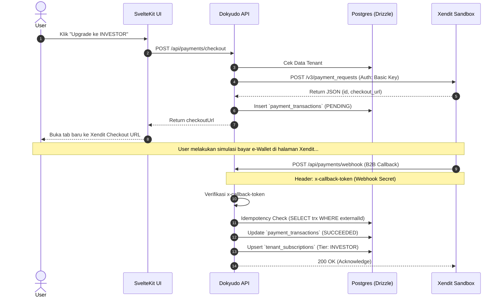

# Sandbox Payments & Subscriptions (Xendit)

**Completion Timestamp**: 2026-06-30T22:15:00+07:00 (WIB)

## Core Logic
Fitur ini mengintegrasikan Dokyudo dengan Xendit Payment Gateway v3 (Sandbox Mode) untuk mensimulasikan pembelian paket langganan (Tier INVESTOR / REAL). 
Alurnya menggunakan metode B2B Server-to-Server. Backend menyediakan endpoint bagi pengguna untuk menghasilkan URL tagihan (Checkout Session), lalu menunggu notifikasi keberhasilan pembayaran (Webhook) yang dikirim oleh sistem Xendit sebelum melakukan *upgrade* tingkat langganan (`tenant_tiers`).

## Flow Diagram

## File Mapping

- **Database Models**: 
  - `apps/backend/src/shared/models/db.model.ts` (Menambahkan tabel `tenant_subscriptions`, `payment_transactions`, dan enum `tierEnum`, `paymentStatusEnum`).
- **Configuration**:
  - `apps/backend/src/config/xendit.ts` (Client wrapper untuk Basic Auth ke Xendit v3).
  - `apps/backend/src/config/env.ts` & `.env.example` (Penambahan `XENDIT_SECRET_KEY` & `XENDIT_WEBHOOK_SECRET`).
- **Payments Module** (`apps/backend/src/modules/payments/`):
  - `payments.schema.ts` (Validasi Zod input checkout dan webhook headers).
  - `payments.service.ts` (Logika pembuatan URL tagihan dan penanganan *idempotency* webhook).
  - `payments.controller.ts` (Hono controller yang memanggil *Service*).
  - `payments.routes.ts` (Definisi endpoint OpenAPI).
  - `mod.ts` (Entry point modul).
- **API Router**:
  - `apps/backend/src/api/router.ts` (Mendaftarkan rute `/api/payments` dan membypass `authMiddleware` untuk URL webhook eksternal).

## Connections
- **Database**: Memisahkan entitas `tenant_subscriptions` dari tabel utama `tenants` untuk menghindari *bottleneck* penguncian baris (*Row-Level Lock*) saat kueri perhitungan *usage* melonjak.
- **Server**: Menerima request ber-JWT dari Frontend untuk *Checkout*, dan menerima request ber-Token dari Xendit untuk *Webhook*.
- **External Network (Xendit)**: Koneksi via REST API (`fetch`) murni tanpa SDK NPM yang berat.

## Architectural Decisions
1. **No External SDK (`xendit-node`)**: Sesuai prinsip *Zero-Cost* serverless, pengikatan SDK eksternal dihindari untuk memangkas *bundle size* dan mempercepat *cold-start*. Logika Auth Basic diimplementasikan secara mandiri via utilitas Deno `encodeBase64`.
2. **Enum over Varchar (pgEnum)**: Menggunakan Drizzle `pgEnum` untuk status pembayaran dan tingkat *tier* guna mencegah *typo* sistematis dan menghemat spasi memori pada disk Postgres.
3. **Integer for Amounts**: Nominal tagihan (`amount`) disimpan murni sebagai `integer` alih-alih `string` untuk mengoptimalkan kinerja penghitungan agregat agregat keuangan SQL (seperti fungsi `SUM`).
4. **Idempotency Control**: Memeriksa *ID* transaksi di DB setiap menerima panggilan webhook dan mengembalikan `200 OK` segera meski transaksi sudah berstatus `SUCCEEDED`, mencegah sistem memotong/mendobel tagihan ketika terjadi pantulan ulang jaringan (*network bounce/retry*) dari pihak Xendit.
