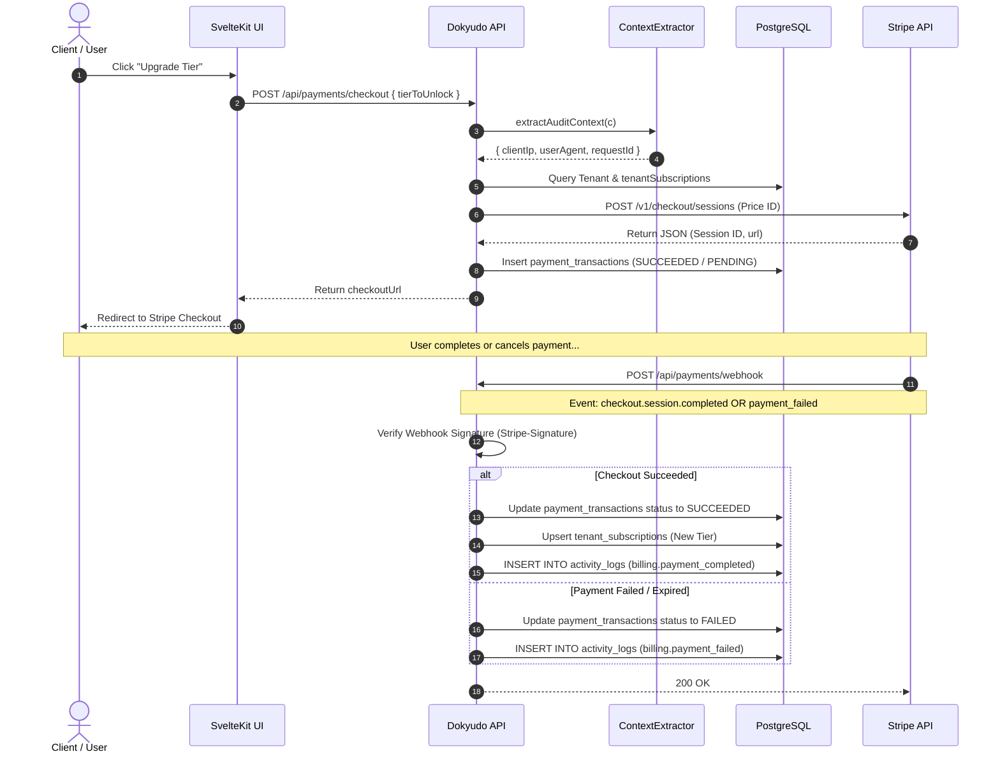

# Stripe Payment Gateway Documentation

**Completion Timestamp**: 2026-07-31T16:43:00+07:00 (WIB)

## Core Logic

The Stripe Payment Gateway integration handles tier upgrades, subscriptions, and single purchases within Dokyudo. It utilizes a **Hybrid Architecture**:
1. **One-Time Purchase (`payment` mode)**: Used for `SIMULATE` (24-hour expiration) and `OIL_INVESTOR` (Lifetime access) tiers.
2. **Recurring Subscription (`subscription` mode)**: Used for the `PRO` monthly subscription tier.

Pricing and currencies are managed directly within the Stripe Dashboard (`price_id`), ensuring the backend never hardcodes transaction amounts. Upon successful or failed transactions, the service emits audit entries into `activity_logs` (`billing.payment_completed` or `billing.payment_failed`) enriched with `clientIp`, `userAgent`, and `requestId` extracted via `ContextExtractor.extractAuditContext()`.

---

## Flow Diagram

---

## File Mapping

- **Database Models**: 
  - `apps/backend/src/shared/models/db.model.ts` (`tenant_subscriptions`, `payment_transactions`, `activity_logs`, `tierEnum`: `FREE`, `SIMULATE`, `OIL_INVESTOR`, `PRO`, `paymentStatusEnum`: `PENDING`, `SUCCEEDED`, `FAILED`, `CANCELED`, `EXPIRED`).
- **Configuration**:
  - `apps/backend/src/config/stripe.ts` (Stripe instance initialization).
  - `apps/backend/src/config/env.ts` (`STRIPE_SECRET_KEY` & `STRIPE_WEBHOOK_SECRET` validation).
- **Payments Module** (`apps/backend/src/modules/payments/`):
  - `payments.schema.ts` (Zod schemas for checkout and portal requests).
  - `payments.service.ts` (Dynamic checkout sessions, webhook handlers for `checkout.session.completed`, `checkout.session.async_payment_failed`, `invoice.payment_failed`, and audit log emissions).
  - `payments.controller.ts` (Context extraction via `ContextExtractor.extractAuditContext()`, JWT validation, and Stripe signature verification).
  - `payments.routes.ts` (OpenAPI endpoint definitions).

---

## Connections

- **Database**: Separated between `payment_transactions` (immutable transaction ledger) and `tenant_subscriptions` (current active tier state).
- **Stripe API**: Connected via official `stripe-node` SDK using dashboard-configured `price_id` references.
- **Audit Logging**: Webhook and checkout handlers extract `clientIp` and `userAgent` metadata to record `billing.payment_completed` or `billing.payment_failed` activity logs.

---

## Architectural Decisions

1. **Hybrid Checkout Modes**: Separates `payment` and `subscription` modes so Stripe does not reject one-time purchase attempts.
2. **Dashboard-Driven Pricing**: Amounts and currency codes are read directly from Stripe event payloads (`amount_total`, `currency`) and saved into database records and activity log metadata.
3. **Resilient Status Tracking**: `paymentTransactions.status` enum strictly uses `"PENDING" | "SUCCEEDED" | "FAILED" | "CANCELED" | "EXPIRED"`.
4. **Audit Context Extraction**: Webhook and portal controllers call `ContextExtractor.extractAuditContext()` to attach IP and client user-agent metadata to billing logs.
