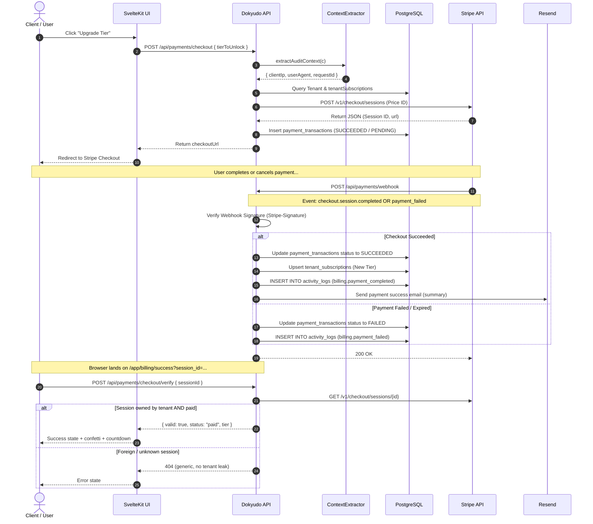
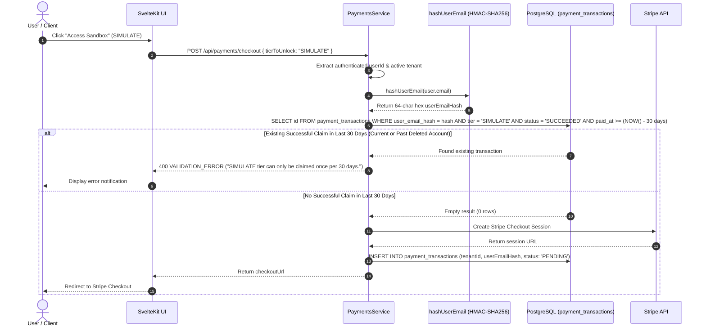

# Stripe Payment Gateway Documentation

**Completion Timestamp**: 2026-07-31T16:43:00+07:00 (WIB)

## Core Logic

The Stripe Payment Gateway integration handles tier upgrades, subscriptions, and single purchases within Dokyudo. It utilizes a **Hybrid Architecture**:
1. **One-Time Purchase (`payment` mode)**: Used for `SIMULATE` (24-hour expiration) and `OIL_INVESTOR` (Lifetime access) tiers.
2. **Recurring Subscription (`subscription` mode)**: Used for the `PRO` monthly subscription tier.

Pricing and currencies are managed directly within the Stripe Dashboard (`price_id`), ensuring the backend never hardcodes transaction amounts. Upon successful or failed transactions, the service emits audit entries into `activity_logs` (`billing.payment_completed` or `billing.payment_failed`) enriched with `clientIp`, `userAgent`, and `requestId` extracted via `ContextExtractor.extractAuditContext()`.

---

## Flow Diagram

---

## File Mapping

- **Database Models**: 
  - `apps/backend/src/shared/models/db.model.ts` (`tenant_subscriptions`, `payment_transactions`, `activity_logs`, `tierEnum`: `FREE`, `SIMULATE`, `OIL_INVESTOR`, `PRO`, `paymentStatusEnum`: `PENDING`, `SUCCEEDED`, `FAILED`, `CANCELED`, `EXPIRED`).
- **Configuration**:
  - `apps/backend/src/config/stripe.ts` (Stripe instance initialization).
  - `apps/backend/src/config/env.ts` (`STRIPE_SECRET_KEY` & `STRIPE_WEBHOOK_SECRET` validation).
- **Payments Module** (`apps/backend/src/modules/payments/`):
  - `payments.schema.ts` (Zod schemas untuk checkout, portal, dan verifikasi session).
  - `payments.service.ts` (Dynamic checkout sessions, webhook handlers untuk `checkout.session.completed`, `checkout.session.async_payment_failed`, `invoice.payment_failed`, verifikasi session `verifyCheckoutSession`, notifikasi email `sendPaymentSuccessNotification`, dan audit log emissions).
  - `payments.controller.ts` (Context extraction via `ContextExtractor.extractAuditContext()`, JWT validation, dan Stripe signature verification).
  - `payments.routes.ts` (OpenAPI endpoint definitions: `/checkout`, `/webhook`, `/portal`, `/checkout/verify`).
- **Email Notifications** (`apps/backend/src/shared/utils/email.util.ts`): `sendVerificationEmail`, `sendRecoveryEmail`, `sendShareInviteEmail`, `sendPaymentSuccessEmail`.

---

## Update 2026-08-12 — Webhook Fulfillment Fix & Payment Success Page

**Bug**: transaksi tetap `PENDING` meskipun pembayaran berhasil. Handler `checkout.session.completed` mensyaratkan `tenantId`, `externalId`, `tierToUnlock` di `session.metadata`, tetapi saat create checkout `externalId` hanya dikirim via `client_reference_id` dan **tidak dimasukkan ke metadata** → handler selalu `break` di "Missing metadata" (log `webhookWarning`), transaksi tidak pernah di-mark `SUCCEEDED`, tier tidak ter-upgrade.

**Fix** (`apps/backend/src/modules/payments/payments.service.ts`):
1. `metadata` saat `checkout.sessions.create` kini menyertakan `externalId` (selain `tenantId` + `tierToUnlock`).
2. Handler webhook punya fallback `session.metadata?.externalId ?? session.client_reference_id` untuk resiliensi (mis. fixture test tanpa metadata).
3. Catatan: event dari `stripe trigger checkout.session.completed` (fixture) memang tanpa metadata maupun `client_reference_id`, jadi warning "Missing metadata" tetap wajar muncul untuk fixture — uji E2E pakai checkout asli lewat dashboard.

**Alur halaman sukses** (`apps/frontend/src/routes/dashboard/billing/success/+page.svelte` — sebelum dipindah ke `/app` pada 2026-08-13):
1. Membaca `session_id` dari URL, menampilkan state `Confirming payment`.
2. Polling `GET /api/me/usage` (maks 5× dengan jeda) sampai webhook Stripe sempat meng-update tier.
3. Menampilkan `Payment successful` + tier aktif, countdown redirect ~5 detik.
4. Redirect ke `/app?billing=open` → `AppSidebar` membuka `AccountPanelDialog` langsung di tab `billing` (via `account-panel.store`).

**Perubahan lain**:
- `return_url` portal Stripe diubah dari `/dashboard/billing` → **`/app/dashboard`** (rute app yang benar).
- Frontend: `lib/api/payments.ts` menambah `createCheckoutSession({ tierToUnlock })` dan `createBillingPortalSession()`; tipe `CheckoutResponse`/`BillingPortalResponse` di `lib/types/payments.types.ts`.
- UI Billing ada di `AccountPanelDialog.svelte` (tab `billing`): usage dengan limit (`TIER_LIMITS`), countdown reset bulanan (FREE), `expiresAt` (non-FREE) + `Manage billing`, pricing plans (`TIER_PLANS`), tombol `Access Sandbox` → `POST /api/payments/checkout { tierToUnlock: "SIMULATE" }` lalu redirect ke Stripe Checkout.

---

## Update 2026-08-13 — Session Verification & Payment Success Email

**Keamanan halaman success** (tiga lapis):
1. **Route guard**: halaman dipindah ke `apps/frontend/src/routes/app/billing/success/` — guard existing `/app/+layout.ts` (cek `dokyudo_session` di localStorage) memblokir akses tanpa login. Direktori `routes/dashboard/` dihapus.
2. **Verifikasi session server-side**: endpoint baru `POST /api/payments/checkout/verify` (`apps/backend/src/modules/payments/`):
   - Zod: `sessionId` wajib berformat `cs_*`.
   - `stripe.checkout.sessions.retrieve(sessionId)` dengan secret key; error apa pun → 404 generik "Unable to verify payment session" (tidak membocorkan apakah session milik tenant lain).
   - Binding: `session.metadata.tenantId` harus sama dengan `tenantId` dari JWT; fallback ke baris `payment_transactions` (by `stripe_session_id`) untuk session lama tanpa metadata.
   - Response `{ valid, status, tier }`; hanya menentukan state UI — **provisioning tier tetap satu-satunya tugas webhook** yang signature-verified.
3. **Hapus fallback palsu**: loop polling `getMeUsage` 5× yang menetapkan `success` tanpa syarat dihapus. User login mana pun tidak bisa lagi memalsukan halaman sukses dengan `session_id` acak.

**Email notifikasi pembayaran** (`apps/backend/src/shared/utils/email.util.ts` → `sendPaymentSuccessEmail`):
- Dipicu dari webhook `checkout.session.completed` (jalur provisioning terverifikasi), satu email per session (`idempotencyKey: payment-success/{externalId}`).
- Dari `Dokyudo <team@dokyudo.my.id>`, subject `Payment successful - {Plan} - Dokyudo`.
- **2026-08-31 — Template `emailShell()`:** heading `Payment successful` (`kicker Payment confirmed`), summary table `FAFAFA` border `#E8E8E8` (label `11px uppercase #9C9996` / value `13px 600 #0E0E0E`, status pill `lime #E0E07B Active`), CTA `Open Dokyudo → dashboardUrl` (`#F04E23 on #0E0E0E 8px`), footer note transactional. Header/kicker/footer terpusat dari `landing.css` tokens.
- Amount mengikuti aturan minor unit Stripe: currency zero-decimal (IDR, JPY, VND, ...) tidak dibagi 100; sisanya dibagi 100; fallback aman untuk currency tak dikenal. Plan name di-escape HTML via `escapeHtml()`.
- Penerima: email user pemilik tenant (user pertama `users` by `tenantId`).
- **Best-effort by design**: kegagalan email hanya di-log (`emailError` di logContext), tidak pernah menggagalkan ack webhook.

**Kontrak API baru**:
- `POST /api/payments/checkout/verify` — body `{ sessionId }`, response `{ valid, status, tier }`, error 400/401/404.
- `success_url` checkout diubah ke `${FRONTEND_URL}/app/billing/success?session_id={CHECKOUT_SESSION_ID}`; `cancel_url` diselaraskan ke `/app?billing=open` (sebelumnya menunjuk route yang tidak pernah ada).

**File Mapping tambahan**:
- `apps/backend/src/modules/payments/payments.schema.ts` — `VerifyCheckoutSessionBodySchema` + response/params schemas.
- `apps/backend/src/modules/payments/payments.service.ts` — `verifyCheckoutSession`, `sendPaymentSuccessNotification`, `TIER_LABELS`.
- `apps/backend/src/modules/payments/payments.controller.ts` — `handleVerifyCheckoutSession`.
- `apps/backend/src/modules/payments/payments.routes.ts` — `POST /checkout/verify`.
- `apps/backend/src/shared/utils/email.util.ts` — `sendPaymentSuccessEmail`.
- `apps/frontend/src/lib/api/payments.ts` + `lib/types/payments.types.ts` — `verifyCheckoutSession`.
- `apps/frontend/src/routes/app/billing/success/+page.svelte` — alur verify-first (confirming → success / syncing / error).
- Koleksi Bruno: `api-collections/Payments & Subscriptions/04_Verify Checkout Session.bru`.

---

## Update 2026-08-19 — Pseudonymized Email Hash Ledger for SIMULATE Rate Limiting across Account Lifecycles

**Completion Timestamp**: 2026-08-19T13:45:11+07:00 (WIB)

### Core Logic
To prevent promo and trial tier abuse (`SIMULATE` sandbox tier) across account deletions and subsequent re-registrations with the same email/OAuth identity, the system implements a **Pseudonymized Email Hash Ledger**:
1. When an active user requests a checkout for the `SIMULATE` tier, the user's raw email is extracted from `users` and normalized (`email.trim().toLowerCase()`).
2. An HMAC-SHA256 signature is calculated using the server-secret pepper `EMAIL_HASH_PEPPER`.
3. The system queries the permanent `payment_transactions` ledger for any existing transaction matching `user_email_hash = emailHash AND tier_to_unlock = 'SIMULATE' AND status = 'SUCCEEDED' AND paid_at >= (NOW() - 30 days)`.
4. If a prior successful transaction is found within 30 days, the request is rejected with `400 VALIDATION_ERROR` ("SIMULATE tier can only be claimed once per 30 days.").
5. Upon account deletion (`MeService.purgeTenant`), `payment_transactions` is retained as an immutable financial audit trail. Because only `user_email_hash` (and not plaintext PII) is stored, privacy and GDPR Right to Erasure requirements remain strictly satisfied while maintaining anti-abuse protections.

### Flow Diagram

### File Mapping

- **Database Model**: `apps/backend/src/shared/models/db.model.ts` (added `userEmailHash: varchar("user_email_hash", { length: 64 })` and composite index `emailTierClaimIdx` on `[userEmailHash, tierToUnlock, status, paidAt]`).
- **Database Migration**: `apps/backend/drizzle/migrations/0033_payment_user_email_hash.sql`.
- **Environment Configuration**: `apps/backend/src/config/env.ts` & `apps/backend/.env.example` (added `EMAIL_HASH_PEPPER` with fallback default).
- **Utility**: `apps/backend/src/shared/utils/hash.util.ts` (`hashUserEmail`) & `apps/backend/src/shared/utils/hash.util.test.ts`.
- **Payments Service**: `apps/backend/src/modules/payments/payments.service.ts` (`createCheckoutSession` validation and insert, resilient webhook resolution).
- **Unit & Integration Tests**: `apps/backend/src/modules/payments/payments.service.test.ts` (added test for cross-account deletion & re-registration abuse rejection).
- **API Collection**: `api-collections/Payments & Subscriptions/01_Checkout Session.bru`.

### Architectural Decisions

1. **Pseudonymized Hash over Plaintext**: Storing plaintext emails in financial transaction tables after an account deletion violates GDPR deletion mandates. Using an HMAC-SHA256 hash keyed with a server-side pepper satisfies the Legitimate Interest clause for fraud prevention while guaranteeing irreversibility.
2. **Rolling 30-Day Window**: Replaced calendar month comparison (`startOfMonth`) with a rolling 30-day window (`NOW() - 30 days`) to prevent exploitation at month boundaries (e.g. claiming on the 31st and immediately claiming again on the 1st).
3. **Cross-Tenant Ledger Query**: The check directly queries `payment_transactions` via the superuser DB connection because fraud prevention must bridge across the soft-deleted tenant boundary of a previously purged account.

---

## Connections

- **Database**: Separated between `payment_transactions` (immutable transaction ledger with pseudonymized `user_email_hash`) and `tenant_subscriptions` (current active tier state).
- **Stripe API**: Connected via official `stripe-node` SDK using dashboard-configured `price_id` references.
- **Audit Logging**: Webhook and checkout handlers extract `clientIp` and `userAgent` metadata to record `billing.payment_completed` or `billing.payment_failed` activity logs.

---

## Architectural Decisions

1. **Hybrid Checkout Modes**: Separates `payment` and `subscription` modes so Stripe does not reject one-time purchase attempts.
2. **Dashboard-Driven Pricing**: Amounts and currency codes are read directly from Stripe event payloads (`amount_total`, `currency`) and saved into database records and activity log metadata.
3. **Resilient Status Tracking**: `paymentTransactions.status` enum strictly uses `"PENDING" | "SUCCEEDED" | "FAILED" | "CANCELED" | "EXPIRED"`.
4. **Audit Context Extraction**: Webhook and portal controllers call `ContextExtractor.extractAuditContext()` to attach IP and client user-agent metadata to billing logs.

