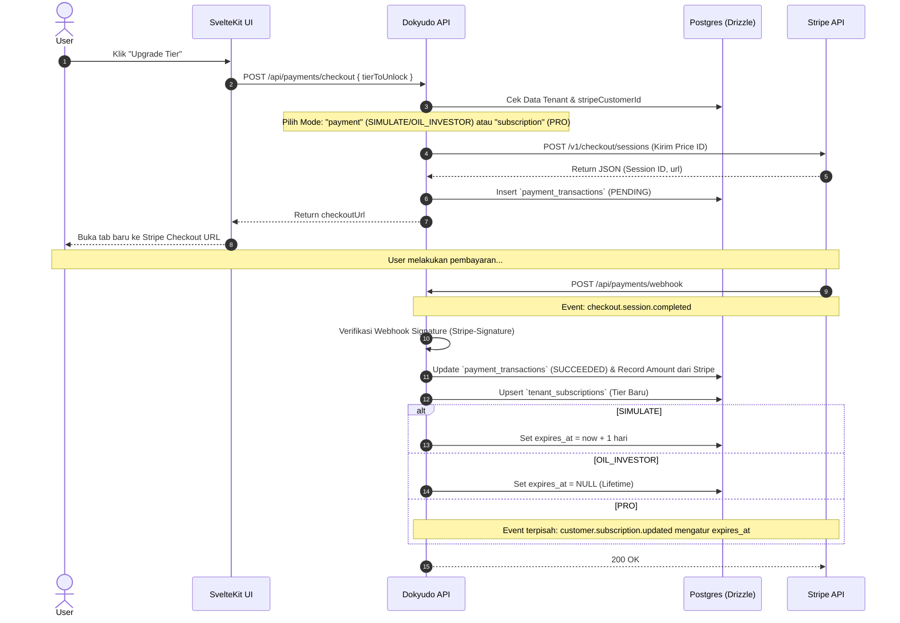

# Stripe Payment Gateway (Hybrid Architecture)

**Completion Timestamp**: 2026-07-01T15:15:00+07:00 (WIB)

## Core Logic
Fitur ini mengintegrasikan Dokyudo dengan **Stripe Payment Gateway** untuk mensimulasikan pembelian paket langganan dan sekali bayar.
Arsitektur pembayaran dirancang menggunakan pendekatan **Hybrid**:
1. **One-time Purchase (`payment` mode)**: Digunakan untuk tier `SIMULATE` (kedaluwarsa dalam 1 hari) dan `OIL_INVESTOR` (Lifetime / seumur hidup).
2. **Recurring Subscription (`subscription` mode)**: Digunakan untuk tier `PRO` (berlangganan bulanan).

Sistem secara penuh bergantung pada harga yang dikonfigurasi di Dashboard Stripe (`price_id`), bukan mengatur nominal secara *hardcode* di Backend.

## Flow Diagram

## File Mapping

- **Database Models**: 
  - `apps/backend/src/shared/models/db.model.ts` (Tabel `tenant_subscriptions`, `payment_transactions`, enum `tierEnum` yang baru: `FREE`, `SIMULATE`, `OIL_INVESTOR`, `PRO`).
- **Configuration**:
  - `apps/backend/src/config/stripe.ts` (Inisialisasi `Stripe` instance).
  - `apps/backend/src/config/env.ts` (Validasi `STRIPE_SECRET_KEY` & `STRIPE_WEBHOOK_SECRET`).
- **Payments Module** (`apps/backend/src/modules/payments/`):
  - `payments.schema.ts` (Validasi Zod input checkout dan webhook body `text`).
  - `payments.service.ts` (Logika *Checkout* dinamis dan *Webhook event router*).
  - `payments.controller.ts` (Validasi JWT dan *Stripe Signature*).
  - `payments.routes.ts` (Definisi OpenAPI endpoints).
- **Documentation**:
  - Dihapus: `sandbox-payments.md` (Xendit kuno).
  - Ditambahkan: `stripe-payment-gateway.md`.

## Connections
- **Database**: Terpisah antara riwayat transaksi `payment_transactions` (Audit log) dan keadaan langganan saat ini `tenant_subscriptions` (Single Source of Truth).
- **Stripe API**: Terhubung menggunakan SDK resmi `stripe-node`. Semua perhitungan nominal dan *currency* dilakukan di *Dashboard Stripe*, *Backend* hanya mengirim `price_id`.
- **Frontend URL**: Webhook dan *Checkout Session* terhubung kembali ke *Frontend* melalui `FRONTEND_URL` yang dikonfigurasi secara dinamis.

## Architectural Decisions
1. **Hybrid Checkout Modes**: Memisahkan logika mode `payment` dan `subscription` agar Stripe tidak menolak transaksi *One-Time Purchase*.
2. **Dashboard-Driven Pricing**: Nominal pembayaran (Rp vs $) dicabut seluruhnya dari *Backend*. *Backend* murni menggunakan *Price ID* dan membaca hasil nominal yang ditagihkan (*amount_total*) dari respons Sesi Stripe untuk direkam di *Database*. Ini menjamin konsistensi 100%.
3. **Resilient Webhook Parsing**: `customer.subscription.updated` terkadang tidak menyertakan `current_period_end` di level atas pada lingkungan tertentu. Sistem direfaktor untuk mencegah *RangeError (Invalid Date)* dengan aman.
4. **Lazy Evaluation Architecture**: Dokyudo tidak menggunakan *cron job* atau *long-polling* untuk mencabut *tier* langganan yang sudah kedaluwarsa. Validasi akan dilakukan pada level *Middleware* saat pengguna melakukan interaksi dengan sistem, menghemat 100% biaya komputasi *idle*.
