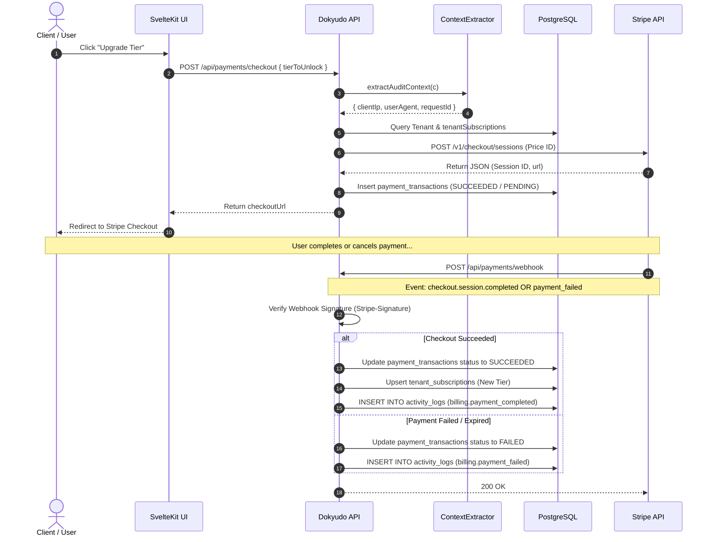

# Stripe Payment Gateway Documentation

**Completion Timestamp**: 2026-07-31T16:43:00+07:00 (WIB)

## Core Logic

The Stripe Payment Gateway integration handles tier upgrades, subscriptions, and single purchases within Dokyudo. It utilizes a **Hybrid Architecture**:
1. **One-Time Purchase (`payment` mode)**: Used for `SIMULATE` (24-hour expiration) and `OIL_INVESTOR` (Lifetime access) tiers.
2. **Recurring Subscription (`subscription` mode)**: Used for the `PRO` monthly subscription tier.

Pricing and currencies are managed directly within the Stripe Dashboard (`price_id`), ensuring the backend never hardcodes transaction amounts. Upon successful or failed transactions, the service emits audit entries into `activity_logs` (`billing.payment_completed` or `billing.payment_failed`) enriched with `clientIp`, `userAgent`, and `requestId` extracted via `ContextExtractor.extractAuditContext()`.

---

## Flow Diagram

---

## File Mapping

- **Database Models**: 
  - `apps/backend/src/shared/models/db.model.ts` (`tenant_subscriptions`, `payment_transactions`, `activity_logs`, `tierEnum`: `FREE`, `SIMULATE`, `OIL_INVESTOR`, `PRO`, `paymentStatusEnum`: `PENDING`, `SUCCEEDED`, `FAILED`, `CANCELED`, `EXPIRED`).
- **Configuration**:
  - `apps/backend/src/config/stripe.ts` (Stripe instance initialization).
  - `apps/backend/src/config/env.ts` (`STRIPE_SECRET_KEY` & `STRIPE_WEBHOOK_SECRET` validation).
- **Payments Module** (`apps/backend/src/modules/payments/`):
  - `payments.schema.ts` (Zod schemas for checkout and portal requests).
  - `payments.service.ts` (Dynamic checkout sessions, webhook handlers for `checkout.session.completed`, `checkout.session.async_payment_failed`, `invoice.payment_failed`, and audit log emissions).
  - `payments.controller.ts` (Context extraction via `ContextExtractor.extractAuditContext()`, JWT validation, and Stripe signature verification).
  - `payments.routes.ts` (OpenAPI endpoint definitions).

---

## Update 2026-08-12 — Webhook Fulfillment Fix & Payment Success Page

**Bug**: transaksi tetap `PENDING` meskipun pembayaran berhasil. Handler `checkout.session.completed` mensyaratkan `tenantId`, `externalId`, `tierToUnlock` di `session.metadata`, tetapi saat create checkout `externalId` hanya dikirim via `client_reference_id` dan **tidak dimasukkan ke metadata** → handler selalu `break` di "Missing metadata" (log `webhookWarning`), transaksi tidak pernah di-mark `SUCCEEDED`, tier tidak ter-upgrade.

**Fix** (`apps/backend/src/modules/payments/payments.service.ts`):
1. `metadata` saat `checkout.sessions.create` kini menyertakan `externalId` (selain `tenantId` + `tierToUnlock`).
2. Handler webhook punya fallback `session.metadata?.externalId ?? session.client_reference_id` untuk resiliensi (mis. fixture test tanpa metadata).
3. Catatan: event dari `stripe trigger checkout.session.completed` (fixture) memang tanpa metadata maupun `client_reference_id`, jadi warning "Missing metadata" tetap wajar muncul untuk fixture — uji E2E pakai checkout asli lewat dashboard.

**Alur halaman sukses** (`apps/frontend/src/routes/dashboard/billing/success/+page.svelte`):
1. Membaca `session_id` dari URL, menampilkan state `Confirming payment`.
2. Polling `GET /api/me/usage` (maks 5× dengan jeda) sampai webhook Stripe sempat meng-update tier.
3. Menampilkan `Payment successful` + tier aktif, countdown redirect ~5 detik.
4. Redirect ke `/app?billing=open` → `AppSidebar` membuka `AccountPanelDialog` langsung di tab `billing` (via `account-panel.store`).

**Perubahan lain**:
- `return_url` portal Stripe diubah dari `/dashboard/billing` → **`/app/dashboard`** (rute app yang benar).
- Frontend: `lib/api/payments.ts` menambah `createCheckoutSession({ tierToUnlock })` dan `createBillingPortalSession()`; tipe `CheckoutResponse`/`BillingPortalResponse` di `lib/types/payments.types.ts`.
- UI Billing ada di `AccountPanelDialog.svelte` (tab `billing`): usage dengan limit (`TIER_LIMITS`), countdown reset bulanan (FREE), `expiresAt` (non-FREE) + `Manage billing`, pricing plans (`TIER_PLANS`), tombol `Access Sandbox` → `POST /api/payments/checkout { tierToUnlock: "SIMULATE" }` lalu redirect ke Stripe Checkout.

---

## Connections

- **Database**: Separated between `payment_transactions` (immutable transaction ledger) and `tenant_subscriptions` (current active tier state).
- **Stripe API**: Connected via official `stripe-node` SDK using dashboard-configured `price_id` references.
- **Audit Logging**: Webhook and checkout handlers extract `clientIp` and `userAgent` metadata to record `billing.payment_completed` or `billing.payment_failed` activity logs.

---

## Architectural Decisions

1. **Hybrid Checkout Modes**: Separates `payment` and `subscription` modes so Stripe does not reject one-time purchase attempts.
2. **Dashboard-Driven Pricing**: Amounts and currency codes are read directly from Stripe event payloads (`amount_total`, `currency`) and saved into database records and activity log metadata.
3. **Resilient Status Tracking**: `paymentTransactions.status` enum strictly uses `"PENDING" | "SUCCEEDED" | "FAILED" | "CANCELED" | "EXPIRED"`.
4. **Audit Context Extraction**: Webhook and portal controllers call `ContextExtractor.extractAuditContext()` to attach IP and client user-agent metadata to billing logs.
