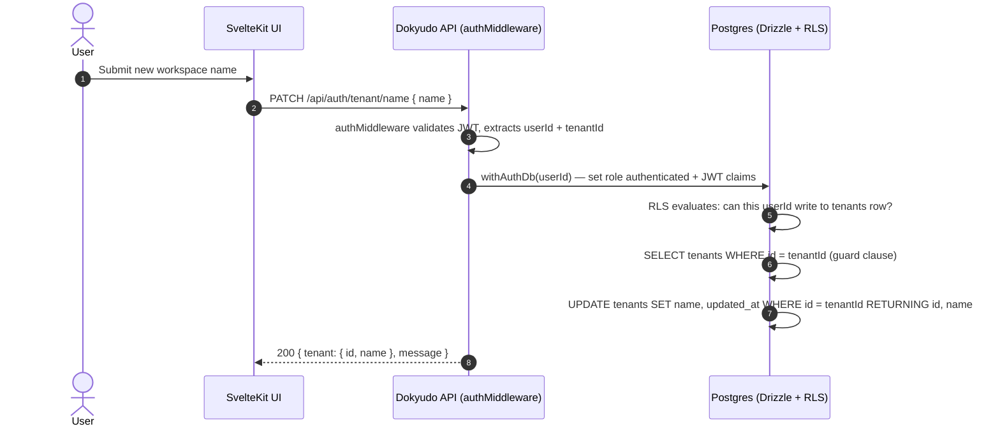

# Update Tenant Name Endpoint

**Completion Timestamp**: 2026-07-15T18:53:00+07:00 (WIB)

## Core Logic

Endpoint `PATCH /api/auth/tenant/name` allows an authenticated user to update their tenant's display name. The operation runs inside a `withAuthDb` transaction to enforce Supabase Row-Level Security (RLS), ensuring a tenant can only modify their own row in the `tenants` table.

The `tenants` table also received a new `updated_at` column as part of this feature, consistent with `users`, `payment_transactions`, `documents`, and `tenant_keys` tables.

## Flow Diagram

## File Mapping

| File | Change |
|---|---|
| `apps/backend/src/shared/models/db.model.ts` | Added `updated_at` column to `tenants` table |
| `apps/backend/src/modules/auth/auth.schema.ts` | Added `UpdateTenantNameBodySchema`, `UpdateTenantNameParams`, `UpdateTenantNameResponseSchema` |
| `apps/backend/src/modules/auth/auth.service.ts` | Added `static async updateTenantName(params)` using `withAuthDb` |
| `apps/backend/src/modules/auth/auth.controller.ts` | Added `handleUpdateTenantName` — extracts `userId` + `tenantId` from Hono context |
| `apps/backend/src/modules/auth/auth.routes.ts` | Added `PATCH /tenant/name` OpenAPI route with `authMiddleware` |
| `apps/backend/src/modules/auth/auth.service.test.ts` | Added `updateTenantName` describe block (positive + negative tests) |
| `api-collections/Auth/13_Update Tenant Name.bru` | Bruno collection file for the new endpoint |
| `drizzle/migrations/0012_rapid_sue_storm.sql` | Migration: `ALTER TABLE tenants ADD COLUMN updated_at` |

## Connections

- **Database**: The `tenants` table update is wrapped in `withAuthDb(userId)` which sets `role = authenticated` and injects `request.jwt.claims = { sub: userId }`. This allows Supabase RLS policies (if defined on the tenants table) to validate write access.
- **Auth Middleware**: The route is protected by `authMiddleware` which populates `c.get("userId")` and `c.get("tenantId")` from the verified JWT.
- **Observability**: On success, `logContext.authEvent = "tenant_name_updated"` is injected, which is picked up by the `loggerMiddleware` wide event.

## Architectural Decisions

1. **`withAuthDb` over bare `db`**: All tenant-scoped mutations must run inside an `authenticated` RLS session. Using the bare `db` (superuser role) would bypass RLS entirely and violate the multi-tenancy isolation contract.
2. **Guard Clause Pattern**: The service checks tenant existence before updating, throwing a `VALIDATION_ERROR` (not `NOT_FOUND`) to avoid leaking information about other tenants' IDs to a potential attacker.
3. **`.returning()`**: Used to atomically retrieve the updated name in the same DB round-trip, avoiding a redundant `SELECT` after the `UPDATE`.
4. **Schema-First**: The endpoint follows the project's `schema-first-contract` rule — Zod schemas in `auth.schema.ts` are the single source of truth, consumed by both the route definition and the OpenAPI spec auto-generation via `@hono/zod-openapi`.
