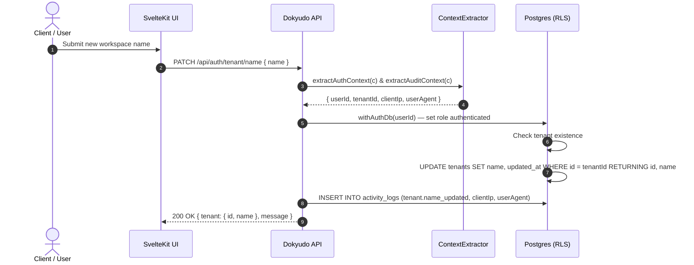

# Update Tenant Name Endpoint Documentation

**Completion Timestamp**: 2026-07-31T16:43:00+07:00 (WIB)

## Core Logic

The `PATCH /api/auth/tenant/name` endpoint allows an authenticated user to update their workspace's display name. The operation executes inside a `withAuthDb` transaction to enforce Supabase Row-Level Security (RLS), ensuring users can only modify their own tenant record in the `tenants` table.

Upon completion, an audit log entry (`tenant.name_updated`) is recorded in `activity_logs` with `clientIp` and `userAgent` metadata extracted via `ContextExtractor.extractAuditContext()`.

---

## Flow Diagram

---

## File Mapping

| File | Purpose / Changes |
|---|---|
| `apps/backend/src/shared/models/db.model.ts` | `tenants` table definition with `updated_at` column. |
| `apps/backend/src/modules/auth/auth.schema.ts` | Defined `UpdateTenantNameBodySchema`, `UpdateTenantNameParamsSchema` (including optional `clientIp` and `userAgent`), and `UpdateTenantNameResponseSchema`. |
| `apps/backend/src/modules/auth/auth.service.ts` | Implemented `static async updateTenantName(params: AuthParams.UpdateTenantNameParams)` using `withAuthDb` and `logActivity()`. |
| `apps/backend/src/modules/auth/auth.controller.ts` | Implemented `handleUpdateTenantName` using `ContextExtractor` to pull `userId`, `tenantId`, `clientIp`, and `userAgent`. |
| `apps/backend/src/modules/auth/auth.routes.ts` | Exposed `PATCH /tenant/name` route protected by `authMiddleware`. |
| `apps/backend/src/modules/auth/auth.service.test.ts` | Unit tests covering `updateTenantName` (positive and negative execution paths). |
| `api-collections/Auth/13_Update Tenant Name.bru` | Bruno collection request file for the endpoint. |

---

## Connections

- **Database**: The update is executed inside `withAuthDb(userId)` which sets `role = authenticated` and injects `request.jwt.claims = { sub: userId }`.
- **Audit Trail**: Emissions to `activity_logs` record `tenant.name_updated` alongside `clientIp` and `userAgent` extracted from request proxy headers.

---

## Architectural Decisions

1. **`withAuthDb` over bare `db`**: All tenant-scoped mutations run inside an `authenticated` RLS session to maintain multi-tenancy isolation contracts.
2. **Audit Context Extraction**: `handleUpdateTenantName` extracts `clientIp` and `userAgent` via `ContextExtractor.extractAuditContext()` and passes `AuthParams.UpdateTenantNameParams` to `AuthService.updateTenantName`.
3. **`.returning()`**: Retrieves the updated name in the same DB round-trip, avoiding redundant `SELECT` queries after `UPDATE`.
4. **Schema-First**: Zod schemas in `auth.schema.ts` serve as the single source of truth for both runtime validation and auto-generated OpenAPI specs.
