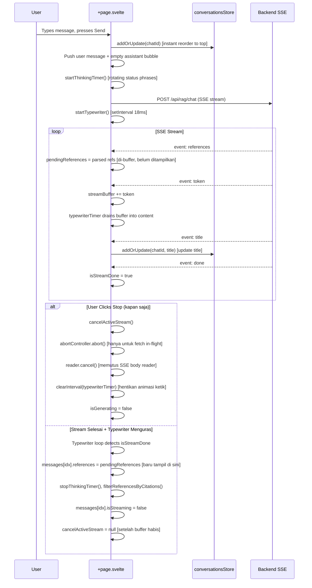

# Chat Detail Interface Enhancements (`/app/chat/[id]`)

## Core Logic

This document covers a comprehensive set of UI/UX, citation, and streaming improvements made to the `/app/chat/[id]` detail conversation route across multiple iterations.

### Features Implemented

1. **Mode Toggle Removal on `/chat/[id]`**: The Chat/Search mode toggle buttons were removed from the detail chat page, keeping them only on the `/chat` landing page. A left-aligned English AI disclaimer was added below the input area: `Dokyudo can make mistakes. Check important info.`

2. **Compact Floating Input Container**: Reduced the floating gradient area's top padding to make it more compact and visually connected with the last chat message.

3. **Monochrome Dark Palette & Cursor-Pointer Accents**: Replaced all bright yellow/amber (`amber-400`, `amber-300`) highlights with a coherent monochrome dark grey/white theme (`text-white/90`, `bg-[#2B2A29]`, `hover:bg-[#383736]`). All interactive action buttons received `cursor-pointer`.

4. **Grey Capsule Citation Badges**: Inline citation tags (e.g. `[Doc 1: 32, 33]`) are rendered as rounded-full dark grey capsule badges with a subtle border (`bg-[#2B2A29] border-white/15`), matching the Dokyudo monochrome aesthetic.

5. **Citation Hallucination Protection**: Added negative answer detection regex. When triggered, all bracketed citation tags and the Source References block are suppressed client-side and backend-side.

6. **Page Number Formatting (Comma-Separated, No "Hlm.", No Dashes)**: A `formatPageNumbers(raw: string)` helper expands dash-ranges, deduplicates, sorts numerically, and joins with commas. The function strips any "Hlm." / "Page" prefixes.

7. **SSE Citation Reference Bug Fix**: The regex pattern for matching citation tags after stream completion was made flexible to correctly parse tags without keyword prefixes (e.g. `[Doc 1: 32, 182]`). This prevented `references` from being wrongly cleared on `done` event.

8. **Randomized Thinking Status Phrases**: Added 49 humorous rotating status phrases that cycle every 1.4s while awaiting the first SSE token.

9. **Custom Animated SVG Thinking Loader**: Replaced Sparkles icon with a 6-arm animated SVG using `currentColor` at `size-6` (24px). Each arm pulses with a staggered delay.

10. **Smooth Typewriter Stream Buffer**: SSE tokens are buffered into `streamBuffer`. A `setInterval` at 18ms (~60fps) steadily drains 1-3 characters per tick into the displayed message. This smooths erratic LLM token bursts into a silky continuous typewriter effect.

11. **Flicker-Free Streaming**: Removed `wrapWordsInHtml()` and `@keyframes wordFadeIn` (`filter: blur(4px)`) which caused each word to re-animate (blink/blur) on every typewriter tick. Markdown now renders directly, sharp and stable.

12. **Instant Sidebar Conversation Reordering**: `conversationsStore.addOrUpdate()` now moves the updated conversation item to index 0 (top of the list) immediately upon sending a new message, creating an illusion that matches the backend ORDER BY updated_at DESC behavior.

---

## Flow Diagram

---

## Completion Timestamp

**Date Completed**: 2026-08-05T16:46:00+07:00  
**Stream Cancellation Hardened**: 2026-08-05T21:10:00+07:00

---

## File Mapping

| File | Change |
|---|---|
| `apps/frontend/src/routes/app/chat/[id]/+page.svelte` | All UI/UX, streaming, citation, animation changes; cancellation via `reader.read()` race with AbortSignal, orphan rejection absorption, `cancelActiveStream` kept alive during typewriter drain |
| `apps/frontend/src/lib/state/conversations.store.svelte.ts` | addOrUpdate() now shifts item to top of list |
| `apps/backend/src/modules/rag/rag.service.ts` | System prompt rules for citation formatting; filterReferencesByCitations negative-answer guard; combined `AbortSignal.any()` + `isConsumerGone()` live cancel detection |

---

## Connections

- **Backend RAG Service**: System prompt updated with strict rules: single-doc tags only, comma-separated page numbers without "Hlm." or dashes, and no citation tags on negative/off-topic answers.
- **Sidebar State**: `conversationsStore` (Svelte 5 reactive store) is shared between `AppSidebar.svelte` and `[id]/+page.svelte`. Updating its list triggers an immediate reactive reorder in the sidebar without any page reload or API refetch.
- **SSE Pipeline**: The typewriter timer (setInterval, 18ms) decouples the raw SSE network speed from the render speed, preventing UI thrashing on token bursts. Cancellation races `reader.read()` against the abort signal and cancels the reader directly to tear down the body stream mid-flight.

---

## Architectural Decisions

1. **Stream Buffer vs. Direct DOM Mutation**: Rather than calling `messages[idx].content += token` directly on every SSE token event (which causes Svelte to diff and re-render the entire markdown HTML on each token), tokens are buffered and the timer drains the buffer at a fixed cadence. This gives 60fps rendering without forced layout thrashing.

2. **Citation Regex Flexibility**: The regex is deliberately optional on the keyword prefix, because the LLM was instructed (via system prompt) to omit "Hlm." entirely. Requiring it would have caused the done handler to silently wipe all references.

3. **Client-Side Negative-Answer Detection**: Checking for negative phrases client-side provides an instant UX guard even if the backend hallucination suppression in the system prompt partially fails. This is a defense-in-depth approach.

4. **Removing Per-Word Animation**: keyframes wordFadeIn with filter blur caused every word already visible on screen to re-animate when new tokens arrived (because Svelte re-renders the html block). The cleanest fix was to remove all per-word animation entirely, keeping rendering pure and flicker-free.

5. **Typewriter Drain vs Network Stream — Dua Hal Berbeda**: `isStreamDone` (event `done` dari SSE) menandakan **network stream selesai**, tapi typewriter masih "menguras" `streamBuffer` (3 char/18ms). Ini penting untuk UX stop: stream selesai ≠ teks selesai ditampilkan. Tombol stop harus tetap berfungsi selama typewriter masih menguras buffer.

6. **Cancel Tiga Lapis di Frontend**:
   - `abortController.abort()` — membatalkan fetch request. **Hanya efektif sebelum** response headers diterima; setelah SSE mulai mengalir, sinyal ini tidak lagi menghentikan response body reader.
   - `activeStreamReader?.cancel()` — membatalkan response body reader. Inilah yang benar-benar memutus aliran SSE mid-stream. Dipanggil via `Promise.race` agar respon instan.
   - `clearInterval(typewriterTimer)` — menghentikan animasi ketik.

7. **`reader.read()` di-Race dengan AbortSignal**: Setiap iterasi loop membaca body menggunakan `Promise.race([reader.read(), abortPromise])`. Saat user klik stop, `abortPromise` langsung reject → loop keluar tanpa menunggu chunk berikutnya. Rejection dari `reader.read()` yang "kalah race" diserap dengan `.catch(() => {})` untuk mencegah `Uncaught (in promise) DOMException`.

8. **`cancelActiveStream` Dipertahankan Selama Typewriter Menguras**: Bug: setelah network stream selesai (misal `done` event diterima), `cancelActiveStream` di-set `null` di `finally` — padahal typewriter masih mengetik. Akibatnya klik stop tidak bereaksi. Perbaikan: `cancelActiveStream` hanya di-null saat tidak ada `streamBuffer` tersisa untuk ditampilkan, atau oleh typewriter completion handler setelah buffer habis. Dengan ini, `isGenerating` tetap `true` (tombol tetap "stop") sampai teks selesai ditampilkan.

9. **Delayed Source References**: Event `references` dari SSE di-buffer ke `pendingReferences` dan hanya di-assign ke `messages[idx].references` pada typewriter completion handler — yaitu saat stream benar-benar DONE (event `done` diterima, typewriter selesai menguras buffer, dan tidak ada error). Alasan: menampilkan references saat AI masih mengetik membuat UI terasa "belum selesai" dan references bisa berubah-ubah. Guard `streamHadError` mencegah references muncul pada respons yang gagal.
