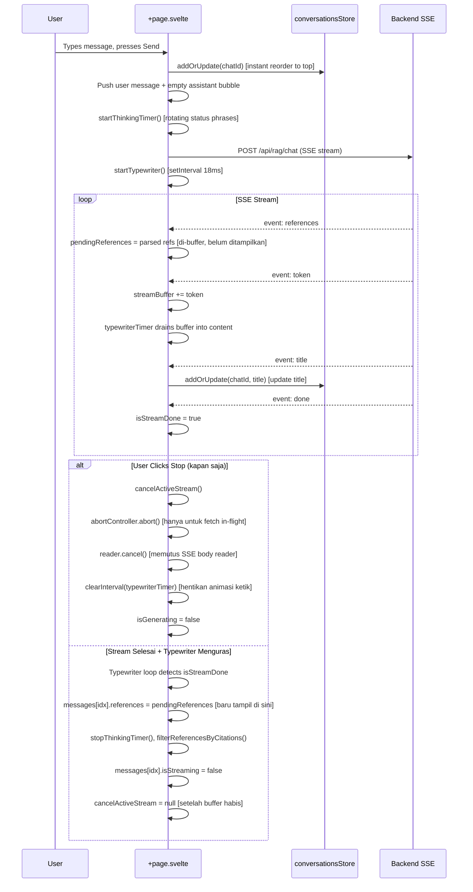

# Chat Detail Interface Enhancements (`/app/chat/[id]`)

## Core Logic

This document covers a comprehensive set of UI/UX, citation, and streaming improvements made to the `/app/chat/[id]` detail conversation route across multiple iterations.

### Features Implemented

1. **Mode Toggle Removal on `/chat/[id]`**: The Chat/Search mode toggle buttons were removed from the detail chat page, keeping them only on the `/chat` landing page. A left-aligned English AI disclaimer was added below the input area: `Dokyudo can make mistakes. Check important info.`

2. **Compact Floating Input Container**: Reduced the floating gradient area's top padding to make it more compact and visually connected with the last chat message.

3. **Monochrome Dark Palette & Cursor-Pointer Accents**: Replaced all bright yellow/amber (`amber-400`, `amber-300`) highlights with a coherent monochrome dark grey/white theme (`text-white/90`, `bg-[#2B2A29]`, `hover:bg-[#383736]`). All interactive action buttons received `cursor-pointer`.

4. **Grey Capsule Citation Badges**: Inline citation tags (e.g. `[Doc 1: 32, 33]`) are rendered as rounded-full dark grey capsule badges with a subtle border (`bg-[#2B2A29] border-white/15`), matching the Dokyudo monochrome aesthetic.

5. **Citation Hallucination Protection**: Added negative answer detection regex. When triggered, all bracketed citation tags and the Source References block are suppressed client-side and backend-side.

6. **Page Number Formatting (Comma-Separated, No "Hlm.", No Dashes)**: A `formatPageNumbers(raw: string)` helper expands dash-ranges, deduplicates, sorts numerically, and joins with commas. The function strips any "Hlm." / "Page" prefixes.

7. **SSE Citation Reference Bug Fix**: The regex pattern for matching citation tags after stream completion was made flexible to correctly parse tags without keyword prefixes (e.g. `[Doc 1: 32, 182]`). This prevented `references` from being wrongly cleared on `done` event.

8. **Randomized Thinking Status Phrases**: Added 49 humorous rotating status phrases that cycle every 1.4s while awaiting the first SSE token.

9. **Custom Animated SVG Thinking Loader**: Replaced Sparkles icon with a 6-arm animated SVG using `currentColor` at `size-6` (24px). Each arm pulses with a staggered delay.

10. **Smooth Typewriter Stream Buffer**: SSE tokens are buffered into `streamBuffer`. A `setInterval` at 18ms (~60fps) steadily drains 1-3 characters per tick into the displayed message. This smooths erratic LLM token bursts into a silky continuous typewriter effect.

11. **Flicker-Free Streaming**: Removed `wrapWordsInHtml()` and `@keyframes wordFadeIn` (`filter: blur(4px)`) which caused each word to re-animate (blink/blur) on every typewriter tick. Markdown now renders directly, sharp and stable.

12. **Instant Sidebar Conversation Reordering**: `conversationsStore.addOrUpdate()` now moves the updated conversation item to index 0 (top of the list) immediately upon sending a new message, creating an illusion that matches the backend ORDER BY updated_at DESC behavior.

---

## Flow Diagram

---

## Completion Timestamp

**Date Completed**: 2026-08-05T16:46:00+07:00  
**Stream Cancellation Hardened**: 2026-08-05T21:10:00+07:00

---

## File Mapping

| File | Change |
|---|---|
| `apps/frontend/src/routes/app/chat/[id]/+page.svelte` | All UI/UX, streaming, citation, animation changes; cancellation via `reader.read()` race with AbortSignal, orphan rejection absorption, `cancelActiveStream` kept alive during typewriter drain |
| `apps/frontend/src/lib/state/conversations.store.svelte.ts` | addOrUpdate() now shifts item to top of list |
| `apps/backend/src/modules/rag/rag.service.ts` | System prompt rules for citation formatting; filterReferencesByCitations negative-answer guard; combined `AbortSignal.any()` + `isConsumerGone()` live cancel detection |

---

## Connections

- **Backend RAG Service**: System prompt updated with strict rules: single-doc tags only, comma-separated page numbers without "Hlm." or dashes, and no citation tags on negative/off-topic answers.
- **Sidebar State**: `conversationsStore` (Svelte 5 reactive store) is shared between `AppSidebar.svelte` and `[id]/+page.svelte`. Updating its list triggers an immediate reactive reorder in the sidebar without any page reload or API refetch.
- **SSE Pipeline**: The typewriter timer (setInterval, 18ms) decouples the raw SSE network speed from the render speed, preventing UI thrashing on token bursts. Cancellation races `reader.read()` against the abort signal and cancels the reader directly to tear down the body stream mid-flight.

---

## Architectural Decisions

1. **Stream Buffer vs. Direct DOM Mutation**: Rather than calling `messages[idx].content += token` directly on every SSE token event (which causes Svelte to diff and re-render the entire markdown HTML on each token), tokens are buffered and the timer drains the buffer at a fixed cadence. This gives 60fps rendering without forced layout thrashing.

2. **Citation Regex Flexibility**: The regex is deliberately optional on the keyword prefix, because the LLM was instructed (via system prompt) to omit "Hlm." entirely. Requiring it would have caused the done handler to silently wipe all references.

3. **Client-Side Negative-Answer Detection**: Checking for negative phrases client-side provides an instant UX guard even if the backend hallucination suppression in the system prompt partially fails. This is a defense-in-depth approach.

4. **Removing Per-Word Animation**: keyframes wordFadeIn with filter blur caused every word already visible on screen to re-animate when new tokens arrived (because Svelte re-renders the html block). The cleanest fix was to remove all per-word animation entirely, keeping rendering pure and flicker-free.

5. **Typewriter Drain vs Network Stream (Diperbarui 2026-08-07)**: `isStreamDone` (event `done` dari SSE) menandakan **network stream selesai**. *Iterasi awal*: typewriter tetap "menguras" `streamBuffer` (3 char/18ms) setelah done, dan tombol stop tetap aktif selama drain — ini menghasilkan bug: user klik stop saat stream sebenarnya sudah selesai → UI bilang "stopped" padahal DB menyimpan `complete`. *Perbaikan*: saat `isStreamDone`, typewriter langsung **flush seluruh buffer** (`content = streamBuffer`) dan selesai → `isGenerating = false` → tombol stop **hanya aktif selama stream benar-benar sedang generasi**. Abort selalu mendarat di tengah SSE, sehingga backend menyimpan jawaban parsial `stopped` dan UI konsisten setelah reload.

6. **Cancel Tiga Lapis di Frontend**:
   - `abortController.abort()` — membatalkan fetch request. **Hanya efektif sebelum** response headers diterima; setelah SSE mulai mengalir, sinyal ini tidak lagi menghentikan response body reader.
   - `activeStreamReader?.cancel()` — membatalkan response body reader. Inilah yang benar-benar memutus aliran SSE mid-stream. Dipanggil via `Promise.race` agar respon instan.
   - `clearInterval(typewriterTimer)` — menghentikan animasi ketik.

7. **`reader.read()` di-Race dengan AbortSignal**: Setiap iterasi loop membaca body menggunakan `Promise.race([reader.read(), abortPromise])`. Saat user klik stop, `abortPromise` langsung reject → loop keluar tanpa menunggu chunk berikutnya. Rejection dari `reader.read()` yang "kalah race" diserap dengan `.catch(() => {})` untuk mencegah `Uncaught (in promise) DOMException`.

8. **`cancelActiveStream` & Stop yang Jujur (Diperbarui 2026-08-07)**: Awalnya `cancelActiveStream` dipertahankan selama typewriter menguras buffer (agar tombol stop tetap bisa ditekan). Setelah perbaikan di poin #5 (flush on done), handler stop kini: `abortController.abort()` + `reader.cancel()`, membekukan konten di `streamBuffer` (semua yang benar-benar diterima — itulah parsial yang disimpan backend), lalu `status = isStreamDone ? 'complete' : 'stopped'`. UI tidak bisa lagi mengklaim `stopped` padahal DB menyimpan `complete`.

9. **Delayed Source References**: Event `references` dari SSE di-buffer ke `pendingReferences` dan hanya di-assign ke `messages[idx].references` pada typewriter completion handler — yaitu saat stream benar-benar DONE (event `done` diterima, typewriter selesai menguras buffer, dan tidak ada error). Alasan: menampilkan references saat AI masih mengetik membuat UI terasa "belum selesai" dan references bisa berubah-ubah. Guard `streamHadError` mencegah references muncul pada respons yang gagal.

---

## Turn Status & Edit Mode — Iteration 2 (2026-08-07)

### 1. Edit In-Place (Prompt Terakhir)

- `saveEditMessage()` kini memotong `messages` lokal dari pesan yang diedit ke bawah, lalu memanggil `streamChatTurn(editedPrompt, selectedModel, msg.turnId)` — payload `edit_turn_id` dikirim ke `POST /api/rag/chat`, server meng-update **row turn yang sama** (bukan INSERT turn baru).
- Sumber `turnId`:
  - Pesan historis → `getConversation` (message key `${turn.id}-user`).
  - Pesan yang baru di-stream → event `done` yang kini membawa `{"turnId": "..."}` (id pre-generated server), sehingga edit bisa dilakukan **tanpa reload**.
- Tombol edit hanya muncul di pesan user terakhir (`lastUserMsgId`) — konsisten dengan desain "edit prompt terakhir".

### 2. Status Marker (stopped / failed / blocked)

- `status` dari server dirender sebagai chip netral konsisten (`border-white/10 bg-white/5 text-white/50`):
  - `stopped` → icon `Square` + "Response Stopped"
  - `failed` → icon `TriangleAlert` + "Response failed — regenerate or edit the question above"
  - `blocked` → icon `ShieldAlert` + "Response blocked by security filter"
- Sumber status:
  - **Reload**: dipetakan dari `turn.status` di `loadConversation` (`status ?? 'complete'`).
  - **Sesi aktif**: cancel → `status='stopped'`; SSE `error` → `status='failed'`; SSE `warning` (PROMPT_INJECTION) → `status='blocked'` — chip "Response blocked by security filter" langsung tampil **tanpa menunggu reload**.
- Tombol retry ("Try Again" / "Regenerate response") disembunyikan untuk `status === 'blocked'` — pertanyaan yang terdeteksi injeksi tidak layak di-retry (akan di-block lagi), sementara `failed` tetap bisa di-retry.

### 3. Flow Stop (Setelah Fix Bug "UI stopped, DB complete")

Akar masalah bug: animasi typing (read loop mem-buffer seluruh SSE secepat jaringan) tertinggal di belakang stream — user klik stop saat stream sebenarnya sudah selesai diterima, sehingga backend sudah menyimpan `complete`. Perbaikan berlapis:

1. Stream selesai → typewriter **flush seluruh buffer** → tombol stop hilang (`isGenerating=false`). Stop hanya bisa ditekan saat generasi benar-benar berjalan.
2. User klik stop saat stream live → `abortController.abort()` + `reader.cancel()` → konten dibekukan di `streamBuffer` → `status='stopped'` → backend menghentikan loop token dan menyimpan jawaban parsial `stopped`.
3. Backend juga re-check sinyal abort live di titik finalize — menutup race "abort tiba tepat setelah token terakhir" agar request yang di-cancel tidak pernah tercatat `complete`.

### 4. File Mapping

| File | Change |
|---|---|
| `apps/frontend/src/routes/app/chat/[id]/+page.svelte` | `saveEditMessage` (truncate + `edit_turn_id`), `streamChatTurn(editTurnId?)`, parse `turnId` dari event `done`, typewriter flush on done, honest stop, status markers + icons (`Square`/`TriangleAlert`/`ShieldAlert`), retry hidden untuk blocked |
| `apps/frontend/src/lib/types/rag.types.ts` | `TurnStatus` union (`processing \| complete \| stopped \| failed \| blocked`), `ConversationTurn.status` + `updatedAt` |
| Backend | `docs/backend/rag-turn-status-and-edit-mode.md` |

### 5. Completion Timestamp

**Iteration 2 (status tracking + edit mode + honest stop):** 2026-08-07

---

## Iteration 3 — Feedback Wiring & Toolbar Visibility (2026-08-07/08)

### 1. Feedback (good/bad) di-Wire

- Tombol 👍/👎 memanggil `toggleFeedback(msg, 'good'|'bad')`:
  - Update **optimis** — klik langsung mengubah state; revert + `toast.error` jika API gagal.
  - Klik rating yang sama lagi = **batal** (`rating: null`).
  - State aktif ditandai `bg-white/10 text-white` (monokrom, konsisten tema).
- `turnId` sekarang diisi di pesan **assistant** juga: dari `getConversation` (history) atau event `done` (pesan baru) — jawaban yang baru selesai bisa langsung di-rating tanpa reload.
- `feedback` dimuat dari DB saat reload (`turn.feedback ?? null`) → rating bertahan.

Backend: `PATCH /api/rag/conversations/{id}/turns/{turnId}/feedback` (lihat `docs/backend/rag-turn-status-and-edit-mode.md` §14).

### 2. Toolbar Aksi Hanya Tampil Setelah Response Selesai

Sebelumnya icon copy/feedback/action langsung muncul saat pesan dikirim/streaming. Sekarang:

- **Toolbar pesan user** (Copy + Edit): dibungkus `{#if !(msg.id === lastUserMsgId && isGenerating)}` — sembunyi saat pesan itu adalah pesan user terakhir **dan** response masih diproses; turn-turn sebelumnya tetap tampil.
- **Toolbar pesan assistant** (Copy, Thumbs, Retry, Menu): dibungkus `{#if !msg.isStreaming}` — sembunyi selama streaming, muncul setelah response tuntas (sukses/gagal/cancel).

Efek: layar bersih selama proses; icon feedback tidak bisa diklik pada jawaban yang belum final. Catatan: satu bug nesting sempat terjadi saat wrap (`
` salah hitung) — sudah diperbaiki, `svelte-check` 0 error.

### 3. File Mapping

| File | Change |
|---|---|
| `apps/frontend/src/routes/app/chat/[id]/+page.svelte` | `toggleFeedback`, `turnId` di assistant messages, wrap toolbar user + assistant, thumbs active state |
| `apps/frontend/src/lib/api/rag.ts` | `updateTurnFeedback()` |
| `apps/frontend/src/lib/types/rag.types.ts` | `FeedbackRating`, `UpdateTurnFeedbackParams`, `ConversationTurn.feedback/feedbackAt` |

### 4. Completion Timestamp

**Iteration 3 (feedback + toolbar visibility):** 2026-08-07/08

---

## Iteration 4 — Retry Variants (Alternative Responses) (2026-08-09)

### 1. Alur Retry (Varian, bukan Turn Duplikat)

- Tombol "Try Again" (dropdown RotateCw) kini memanggil `streamChatTurn(userMsg.content, selectedModel, { retryTurnId: msg.turnId })` — **tidak lagi membuat turn duplikat**; jawaban stream masuk sebagai varian baru dari turn terakhir.
- `streamChatTurn(questionText, modelChoice, opts)` menerima `{ editTurnId?, retryTurnId?, selectedVariantId? }`.
- Mode retry tidak push pesan user/assistant baru — target pesan assistant terakhir; varian lokal (`ChatVariant extends TurnAlternative` + `references`/`isStreaming`) di-push ke `msg.variants`, `variantIndex` diarahkan ke varian baru.
- Event SSE `done` retry membawa `variantId` → id placeholder lokal diganti id server.

### 2. Browser Varian (`◀ N/M ▶`)

- Tampil hanya untuk pesan assistant terakhir yang punya varian; tombol prev/next nonaktif saat `isGenerating`.
- Counter `{(variantIndex ?? 0) + 1} / {(variants?.length ?? 0) + 1}` — posisi 1 = jawaban kanonik, posisi k+1 = `variants[k-1]`.
- Jawaban yang sedang ditampilkan = pilihan (tanpa tombol "pilih"); `displayedContentOf(msg)` / `displayedRefsOf(msg)` / `displayedStatusOf(msg)` / `displayedCancelledOf(msg)` membaca varian aktif.
- **Reaktivitas**: semua baca/tulis streaming varian lewat `activeRetryVariant()` yang me-resolve `messages[asstIndex].variants[...]` melalui proxy `$state` — mutasi objek mentah di luar proxy tidak memicu re-render (bug "output retry tidak muncul").
- Navigasi `◀ ▶` + counter berada **satu baris dengan toolbar aksi** (Copy/Thumbs/Retry/More), rata kanan (`justify-between`).

### 3. Status Marker Mengikuti Jawaban yang Ditampilkan

- Marker stopped/failed/blocked dirender dari `displayedStatusOf(msg)` — status **varian aktif**, bukan status kanonik pesan:
  - Retry berhasil (varian `complete`) → marker "Response Stopped" hilang.
  - Browse balik ke jawaban kanonik/varian yang `stopped` → marker muncul lagi.
  - Saat varian streaming (`processing`) → marker disembunyikan.
- Blok Source References memakai `displayedCancelledOf(msg)` — referensi varian sukses dari turn yang pernah di-stop tetap tampil.

### 4. Follow-up dengan Varian Terpilih

- `handleSendMessage` mengirim `selected_variant_id` = id varian aktif bila `variantIndex > 0`; kosong bila menampilkan jawaban asli.
- Setelah follow-up sukses (`done` tanpa error): prune lokal — varian pesan sebelumnya dihapus; bila ada seleksi, konten varian terpilih menjadi konten kanonik pesan (mirror promosi server).
- Event `turn_started` (event SSE pertama) menyediakan `turnId`/`variantId` sejak awal stream — turn `stopped` tetap bisa di-retry/di-edit **tanpa reload**.

### 5. File Mapping

| File | Change |
|---|---|
| `apps/frontend/src/routes/app/chat/[id]/+page.svelte` | `ChatMessage.variants/variantIndex/isRetrying`, `ChatVariant`, `activeVariantOf`/`displayed*Of`, `streamChatTurn(opts)`, `browseVariant`, `retryMessage` → retry turn, prune on follow-up, `turn_started` handler, marker ikut varian, nav varian di toolbar |
| `apps/frontend/src/lib/types/rag.types.ts` | `TurnAlternative`, `ConversationTurn.alternatives` |
| Backend | `docs/backend/rag-turn-status-and-edit-mode.md` §15 |

### 6. Completion Timestamp

**Iteration 4 (retry variants + browser UI + status marker ikut varian + toolbar nav):** 2026-08-09

---

## Iteration 5 — Reusable ChatInput & ConfigureByokDialog Extraction (2026-08-09)

### 1. Kapsul input dipindah ke `ChatInput.svelte`

Markup kapsul input (file chips, attach + tooltip kuota, textarea auto-resize, model dropdown, tombol send/stop) dan seluruh logika terkait dipindah dari halaman ini ke komponen shared `apps/frontend/src/lib/components/chat/ChatInput.svelte` (dipakai juga oleh `/chat`). Ukuran/style detail (`max-w-4xl`, `bg-[#232323]/[0.85] shadow-2xl backdrop-blur-[42px]`) dijadikan baseline komponen.

- State yang pindah: `fileInput`, `textInput`, `modelSearchQuery`, `modelGroups`, auto-reset height effect, `triggerFileInput`, `handleFileChange`, `removeFile`, derived `currentUploadCount`/`currentStorageBytes`/`maxFileSizeMB`, focus-on-mount.
- `showError` tetap di halaman (dipakai juga oleh alur streaming error).
- Model dropdown rich (search + grup + Configure) kini berada di dalam ChatInput; halaman tinggal melempar `onconfigure`.

### 2. Dialog Configure BYOK → `ConfigureByokDialog.svelte`

Dialog "Configure BYOK" (tab provider Google AI/Mistral/OpenRouter, masked-key "API Key Configured", reset, input key, save) diextract menjadi komponen reusable `apps/frontend/src/lib/components/chat/ConfigureByokDialog.svelte`, dipakai oleh **kedua** halaman chat.

- Props: `bind:open`, `onSaved` (dipanggil setelah save/reset agar halaman me-refresh `llmOptions`).
- Mengelola sendiri: `BYOK_PROVIDER_OPTIONS`, `provider`, `apiKey`, `keyMasks` (di-load via `getKeys()` saat dialog dibuka), `isSavingKey`/`isResettingKey`, `error`, `saveConfigureKey`/`resetConfigureKey` (`upsertKey`/`deleteKey`).
- Halaman ini kini hanya menyisakan `isConfigureDialogOpen` + `openConfigureDialog()`; `loadLlmOptions` disederhanakan (tanpa `configuredKeyMasks`).
- Styling glassmorphic seragam dengan input chat: `bg-[#232323]/[0.85] backdrop-blur-[42px] border-white/[0.16]` (sebelumnya solid `bg-[#232323]`). Dropdown model juga `bg-[#232323]/[0.85]` (atau `[0.40]` saat `transparent`).

### 3. View Transitions & penghapusan fade `isMounted`

- Root div halaman **tidak lagi** memakai `transition-opacity duration-500` + `isMounted` (opacity 0→1) — fade ini beradu dengan SvelteKit View Transition dan membuat input berkedip. State `isMounted` dihapus.
- Transisi submit chat kini ditangani global: `onNavigate` di `app/+layout.svelte` (hanya `goto` dari `/app/chat` → `/app/chat/<id>`), crossfade 700ms pada `app-main` di bawah sidebar, kapsul input ikut capture `app-main` (tanpa nama sendiri → tanpa artefak sudut tajam). Detail: `docs/frontend/app-chat.md` §Iteration 2.

### 4. File Mapping

| File | Change |
|---|---|
| `apps/frontend/src/lib/components/chat/ChatInput.svelte` | Komponen baru (baseline style dari halaman ini) |
| `apps/frontend/src/lib/components/chat/ConfigureByokDialog.svelte` | Komponen baru (dialog BYOK, diextract dari halaman ini) |
| `apps/frontend/src/routes/app/chat/[id]/+page.svelte` | Pakai ChatInput + ConfigureByokDialog; hapus state/fungsi configure & file, derived usage, fade isMounted |

### 5. Completion Timestamp

**Iteration 5 (ChatInput/ConfigureByokDialog extraction, hapus fade isMounted):** 2026-08-09

## Iteration 6 — Attachment Cards di Luar Bubble (2026-08-12)

### 1. Kartu attachment 1:1 di atas user pill

Tampilan attachment berubah dari chip kecil di dalam bubble menjadi **kartu** yang dirender **di luar bubble, di atasnya** (rata kanan mengikuti posisi user pill):

- Kotak **1:1 (`aspect-square`) rounded-xl** dengan **ikon dokumen besar** di tengah (`MxIcon document-outline`, `size-8`).
- **Judul di bawah kotak**: di-truncate dengan ellipsis (`truncate` + tooltip nama lengkap saat hover) — base nama file tanpa ekstensi.
- **Ekstensi file** di baris terpisah (`text-[10px] text-white/40`, mis. `.pdf`), diparse dari nama file (`lastIndexOf('.')`).
- **Klikabel di chat privat**: klik kartu → `openCitationPreview(documentId, name, [])` → signed URL (`/api/documents/{id}/preview`, LRU-cached) → `PdfPreviewPanel` — perilaku sama dengan chip `@`-mention.
- Kartu disembunyikan saat **edit mode** (parity dengan perilaku lama — chip lama juga hanya tampil di cabang non-edit).
- Satu baris attachment tanpa `documentId` (upload belum selesai di sesi) dirender sebagai kartu statis.

### 2. Komponen shared `AttachmentCards.svelte`

Komponen baru `apps/frontend/src/lib/components/chat/AttachmentCards.svelte` mengikuti pola `SourceReferences`:

- Props: `attachments: { name, documentId? }[]`, `interactive?: boolean`, `onPreview?: (documentId, name) => void`.
- `interactive=true` (chat privat) → kartu `<button>` dengan hover affordance; `false` (default, halaman publik) → `
` statis tanpa handler — **tidak openable, tanpa error**.
- Max 5 per turn sudah dijamin backend (`attachment_document_ids` max 5) + frontend (`MAX_CHAT_ATTACHMENTS`).

### 3. Ekstensi tanpa perubahan backend

`documents.title` = nama file asli **termasuk ekstensi** (`documents.service.ts` set `title: file.filename`), jadi ekstensi diparse dari `title` di sisi frontend — snapshot share (`attachments: [{documentId, title}]`) dan `getConversation` (`attachmentDocuments`) tidak perlu diubah.

### 4. File Mapping

| File | Change |
|---|---|
| `apps/frontend/src/lib/components/chat/AttachmentCards.svelte` | Komponen baru (kartu attachment 1:1, judul truncate + ekstensi, mode interactive/statis) |
| `apps/frontend/src/routes/app/chat/[id]/+page.svelte` | Kartu di atas bubble (interactive, `openCitationPreview`); hapus chip attachment di dalam bubble; `attachmentsOf` memakai judul dari chips |
| `apps/frontend/src/routes/s/[code]/+page.svelte` | Kartu statis di atas bubble (judul + ekstensi, tanpa klik) |

### 5. Completion Timestamp

**Iteration 6 (attachment cards di luar bubble):** 2026-08-12
