# Frontend Authentication Architecture & Second Brain Reference

## Core Logic

The Dokyudo SvelteKit presentation layer (`apps/frontend`) provides a complete, modern authentication system designed around Svelte 5 runes (`$state`), `sveltekit-superforms`, Zod schema validation, and `shadcn-svelte` UI components. 

The frontend acts as a presentation layer, communicating exclusively via HTTP requests to the Deno API Gateway (`/api/auth/*`) and managing authenticated user state via a centralized, rune-based session store.

---

## Key Feature Modules

### 1. Svelte 5 Rune Session Store (`session.store.svelte.ts`)
- **Location**: `apps/frontend/src/lib/state/session.store.svelte.ts`
- **Logic**: Reactive session state using Svelte 5 `$state` runes. Automatically persists `accessToken`, `refreshToken`, and `user` payload to browser `localStorage` on mutation.
- **Header Injection**: `apps/frontend/src/lib/api/client.ts` automatically reads `sessionStore.accessToken` and attaches `Authorization: Bearer <token>` to outgoing API requests.

### 2. Custom Branded Email Verification (`/auth/verify`)
- **Location**: `apps/frontend/src/routes/(auth)/auth/verify/+page.svelte`
- **Logic**: When users click the verification link in their email (`http://localhost:5173/auth/verify?token_hash=XYZ&type=signup`), this page reads URL search parameters, calls `authVerifyEmail({ token_hash, type })`, stores the returned JWT session in `sessionStore`, and redirects the user directly to `/app/chat`.

### 3. Dual-Mode OAuth Callback Handler (`/oauth-callback`)
- **Location**: `apps/frontend/src/routes/(auth)/oauth-callback/+page.svelte`
- **Logic**: Handles both Supabase Hash Fragment implicit redirects (`#access_token=...&refresh_token=...`) and Query String PKCE redirects (`?access_token=...`).
- **Base64URL & UTF-8 Decoder**: Features a robust `parseJwt()` helper that handles unpadded Base64 strings (solving length modulo issues for GitHub OAuth JWTs) and UTF-8 URI decoding before saving the session and navigating to `/app/chat`.

### 4. 8-Digit OTP Password Reset with `InputOTP` (`/forget-password/update-password`)
- **Location**: `apps/frontend/src/routes/(auth)/forget-password/update-password/+page.svelte`
- **Logic**: Streamlined reset password screen requiring only the 8-digit OTP code and new password (`{ otp, newPassword }`).
- **UI Design**: Uses `shadcn-svelte` `InputOTP` with custom `InputOTP.Slot` styling (`h-12`, `bg-auth-input`, `border-white/10`, `rounded-md`, `font-sans text-base text-white`) that matches the dimensions and dark theme of the `AuthPasswordInput` fields. Preserves form data on error.

### 5. Sidebar Logout Confirmation Dialog (`AppSidebar.svelte`)
- **Location**: `apps/frontend/src/lib/components/app/AppSidebar.svelte`
- **Logic**: Intercepts sign-out clicks with a dark-themed `<Dialog>` modal (`bg-[#232323]`, `border-white/10`). Upon confirmation, calls `authLogout()`, clears `sessionStore`, and navigates to `/login`.

### 6. Client-Side Protected Route Guard (`/app/*`)
- **Location**: `apps/frontend/src/routes/app/+layout.ts`
- **Logic**: Client-side layout load function that checks `sessionStore.isAuthenticated`. Redirects unauthenticated users to `/login`.

---

## Flow Diagram

```mermaid
sequenceDiagram
    actor User
    participant Page as SvelteKit Route
    participant Store as session.store.svelte.ts
    participant API as Deno API Gateway (/api/auth)
    participant Supabase as Supabase Auth Service

    box Auth Operations & Navigation
    participant Chat as /app/chat Workspace
    end

    %% Email Verification Flow
    rect rgb(30, 30, 30)
    note right of User: Custom Email Verification Flow
    User->>Page: Clicks Email Link (/auth/verify?token_hash=XYZ&type=signup)
    Page->>API: POST /api/auth/verify-email (token_hash, type)
    API->>Supabase: verifyOtp({ token_hash, type })
    Supabase-->>API: 200 OK (Tokens & User Payload)
    API-->>Page: 200 OK (Session Envelope)
    Page->>Store: sessionStore.set(session)
    Page->>Chat: goto('/app/chat')
    end

    %% OAuth Callback Flow
    rect rgb(25, 25, 35)
    note right of User: OAuth Callback Flow (Google / GitHub)
    User->>Page: Lands on /oauth-callback#access_token=...&refresh_token=...
    Page->>Page: parseJwt(accessToken) [Base64URL & UTF-8 Safe]
    Page->>Store: sessionStore.set(tokens & user)
    Page->>Chat: goto('/app/chat')
    end

    %% Password Reset Flow
    rect rgb(35, 25, 25)
    note right of User: 8-Digit OTP Password Reset Flow
    User->>Page: Submits /forget-password/update-password ({ otp, newPassword })
    Page->>API: POST /api/auth/reset-password ({ otp, newPassword })
    API->>Supabase: verifyOtp({ token: otp, type: 'recovery' })
    API-->>Page: 200 OK
    Page-->>User: Displays "Password Updated" Success State
    end

    %% Logout Flow
    rect rgb(30, 35, 30)
    note right of User: Logout Confirmation Dialog Flow
    User->>Page: Clicks "Log out" in AppSidebar Avatar Dropdown
    Page->>Page: Opens Dialog.Root Confirmation Modal
    User->>Page: Clicks "Log out" Button
    Page->>API: POST /api/auth/logout (Bearer Token)
    API-->>Page: 200 OK
    Page->>Store: sessionStore.clear()
    Page->>User: goto('/login')
    end
```

---

## Completion Timestamp
**Date**: 2026-07-23 15:20 (Local Time)

---

## File Mapping

### Pages & Controllers (`src/routes/(auth)/` & `src/routes/app/`)
- [`src/routes/(auth)/+layout.svelte`](file:///home/kanz/Projects/Dokyudo/apps/frontend/src/routes/(auth)/+layout.svelte) - Shared layout (vintage background overlay, dark glassmorphism).
- [`src/routes/(auth)/login/+page.svelte`](file:///home/kanz/Projects/Dokyudo/apps/frontend/src/routes/(auth)/login/+page.svelte) - Sign in page controller. Saves session and navigates to `/app/chat`.
- [`src/routes/(auth)/register/+page.svelte`](file:///home/kanz/Projects/Dokyudo/apps/frontend/src/routes/(auth)/register/+page.svelte) - Registration page controller.
- [`src/routes/(auth)/forget-password/+page.svelte`](file:///home/kanz/Projects/Dokyudo/apps/frontend/src/routes/(auth)/forget-password/+page.svelte) - Password recovery request form. Saves email to `localStorage`.
- [`src/routes/(auth)/forget-password/update-password/+page.svelte`](file:///home/kanz/Projects/Dokyudo/apps/frontend/src/routes/(auth)/forget-password/update-password/+page.svelte) - 8-digit `InputOTP` password reset controller.
- [`src/routes/(auth)/auth/verify/+page.svelte`](file:///home/kanz/Projects/Dokyudo/apps/frontend/src/routes/(auth)/auth/verify/+page.svelte) - Custom email verification link controller.
- [`src/routes/(auth)/oauth-callback/+page.svelte`](file:///home/kanz/Projects/Dokyudo/apps/frontend/src/routes/(auth)/oauth-callback/+page.svelte) - Hash & query string OAuth token processor.
- [`src/routes/app/+layout.ts`](file:///home/kanz/Projects/Dokyudo/apps/frontend/src/routes/app/+layout.ts) - Protected route guard for `/app/*`.

### Reusable Auth Components (`src/lib/components/auth/`)
- [`src/lib/components/auth/AuthPasswordInput.svelte`](file:///home/kanz/Projects/Dokyudo/apps/frontend/src/lib/components/auth/AuthPasswordInput.svelte) - Eye-toggle password input element.
- [`src/lib/components/auth/AuthOAuthGroup.svelte`](file:///home/kanz/Projects/Dokyudo/apps/frontend/src/lib/components/auth/AuthOAuthGroup.svelte) - Google & GitHub OAuth button triggers.
- [`src/lib/components/auth/AuthErrorBox.svelte`](file:///home/kanz/Projects/Dokyudo/apps/frontend/src/lib/components/auth/AuthErrorBox.svelte) - Error envelope and anti-bruteforce countdown UI.
- [`src/lib/components/auth/AuthSuccessState.svelte`](file:///home/kanz/Projects/Dokyudo/apps/frontend/src/lib/components/auth/AuthSuccessState.svelte) - Reusable success confirmation state.
- [`src/lib/components/auth/AuthBackButton.svelte`](file:///home/kanz/Projects/Dokyudo/apps/frontend/src/lib/components/auth/AuthBackButton.svelte) - Back arrow navigation button.

### App Shell Components (`src/lib/components/app/`)
- [`src/lib/components/app/AppSidebar.svelte`](file:///home/kanz/Projects/Dokyudo/apps/frontend/src/lib/components/app/AppSidebar.svelte) - Sidebar featuring avatar dropdown & interactive logout `<Dialog>`.

### UI Component Library (`src/lib/components/ui/`)
- [`src/lib/components/ui/input-otp/*`](file:///home/kanz/Projects/Dokyudo/apps/frontend/src/lib/components/ui/input-otp/index.ts) - `shadcn-svelte` `InputOTP` (Root, Group, Slot, Separator) components.
- [`src/lib/components/ui/dialog/*`](file:///home/kanz/Projects/Dokyudo/apps/frontend/src/lib/components/ui/dialog/index.ts) - `shadcn-svelte` `Dialog` modal components.
- [`src/lib/components/ui/button/button.svelte`](file:///home/kanz/Projects/Dokyudo/apps/frontend/src/lib/components/ui/button/button.svelte) - Encapsulates `authPrimary` and `authOauth` variants.

### State & API Client (`src/lib/`)
- [`src/lib/state/session.store.svelte.ts`](file:///home/kanz/Projects/Dokyudo/apps/frontend/src/lib/state/session.store.svelte.ts) - Svelte 5 `$state` session store.
- [`src/lib/api/auth.ts`](file:///home/kanz/Projects/Dokyudo/apps/frontend/src/lib/api/auth.ts) - Typed API helper functions for all backend endpoints.
- [`src/lib/api/client.ts`](file:///home/kanz/Projects/Dokyudo/apps/frontend/src/lib/api/client.ts) - Base API client with automatic `Authorization` header injection.
- [`src/lib/schemas/auth.schema.ts`](file:///home/kanz/Projects/Dokyudo/apps/frontend/src/lib/schemas/auth.schema.ts) - Client-side Zod validation schemas.
- [`src/lib/types/auth.types.ts`](file:///home/kanz/Projects/Dokyudo/apps/frontend/src/lib/types/auth.types.ts) - Auth TypeScript interfaces.

---

## Architectural & Design Decisions

1. **Svelte 5 Runes File Extension (`.svelte.ts`)**:
   - Svelte 5 runes (`$state`, `$derived`) in non-component files require `.svelte.ts` extension so the Svelte compiler can transform reactive state properly without runtime `ReferenceError` exceptions.

2. **Presentation Layer Boundary**:
   - `apps/frontend` contains zero database imports (`drizzle-orm`) or server secret environment variables. All state changes are dispatched as typed JSON payloads to the Deno API Gateway.

3. **Base64URL & UTF-8 Safe JWT Parsing**:
   - Decoding JWT tokens directly on the client allows instant session setup without waiting for an extra round-trip API call.
   - Using a custom `parseJwt()` helper guarantees that unpadded Base64 strings (common in GitHub OAuth JWTs) and multi-byte UTF-8 user metadata decode cleanly in browser JavaScript.

4. **Preserving Input Values on Validation Failure**:
   - Form submission handlers retain `$formData` inputs (such as passwords and OTP entries) when backend errors occur, preventing user frustration from re-entering credentials.

5. **Traceable DevTools Logging**:
   - Complies with frontend logging guidelines by prefixing console messages with bracketed contexts (e.g., `[Auth Login]`, `[Auth OAuth Callback]`, `[Auth Logout]`).
