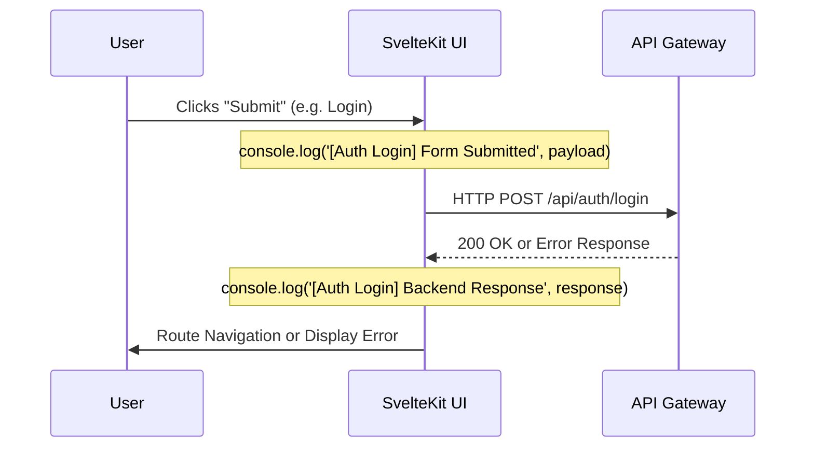
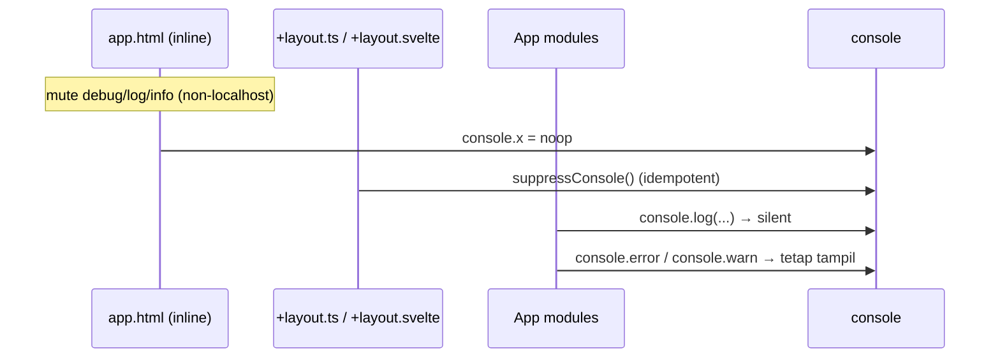

# Frontend Simple Logging

## Core Logic
The frontend application completely eschews backend-style "Wide Events" or heavily abstracted logger utilities in favor of **Simple Trace Logging**. 

Because the primary debugging pain point on the frontend is the discrepancy between what the user typed vs. what was actually serialized and sent to the backend, we use explicit `console.log()` statements wrapped around critical form submittal lifecycles.

## Flow Diagram

## Completion Timestamp
**Date**: June 18, 2026, 23:20:00 UTC+7

## File Mapping
**Implemented In:**
- `apps/frontend/src/routes/(auth)/login/+page.svelte`
- `apps/frontend/src/routes/(auth)/register/+page.svelte`

**Rules Enforced:**
- `.agents/rules/frontend-logging-policy.md` - New mandatory agent instruction to prevent AI from over-engineering frontend loggers in the future.

## Connections
- **Browser DevTools**: These logs are emitted directly to the standard browser console for the developer to inspect.

## Architectural Decisions
- **Rejection of Wide Events**: The backend uses the "Wide Event" pattern because logs are shipped remotely to Grafana Loki, requiring structured JSON tracking. The frontend runs in the user's browser, meaning logs are inspected visually by the developer in real-time. Abstracting this into "Wide Events" overcomplicates the Developer Experience (DX).
- **Explicit Payload Tracing**: Often, "data is missing in the backend body" due to misconfiguration in Svelte form handlers. By enforcing a `console.log` immediately *before* the `fetch()` call, developers can categorically prove whether the Svelte state holds the correct variables.
- **Unmasked Passwords in Dev**: Passwords and sensitive form fields are explicitly logged in `console.log()` during form submission. This is safe because this is purely client-side browser execution, and it vastly accelerates local debugging.
## Production Console Suppression (2026-08-31, 15:41 +07:00)

**Core Logic** — di production build, `console.debug/log/info` dibungkam; `warn`/`error` dipertahankan (diagnosa & observability). Tiga lapis, urutan eksekusi:

1. **Inline guard di `app.html`** — classic script di `<head>`, jalan sebelum semua modul app; membungkam `debug/log/info` kecuali host `localhost`/`127.0.0.1` (dev tetap normal); konten statis → hash `sha256-J/yX8DXf1UeNiAyCwisAjkaHAVEpw7zTkFOJUEb2/Do='` didaftarkan di `script-src` (`kit.csp`).
2. **`suppressConsole()`** di `+layout.svelte` `<script module>` dan `+layout.ts` — idempotent (guard `consolePatched`).
3. **`logger` wrapper** (`src/lib/utils/logger.ts`) — production: noop untuk `debug/log/info`; dev: delegasi ke `console.*`.

**Architectural Decisions**

- `import.meta.env.PROD` untuk `isProductionBuild`, **bukan** `$app/environment.dev` — esm-env (re-export `dev`/`browser`) pernah ter-fold nilai dev di bundle client production → patch mati. `import.meta.env.PROD` = native Vite (`mode === 'production'`), tidak melewati esm-env.
- Guard browser pakai `typeof window !== 'undefined'` (runtime, tidak bisa di-fold), bukan `$app/environment.browser`.
- Inline guard di `app.html` = lapis anti-"file hilang" di deploy; lapis layout tetap ada untuk dev-device behavior dan normal path.
- Lapis `warn`/`error` sengaja tidak dibungkam; bila `warn` juga mau dibungkam, tambahkan `'warn'` ke `MUTED_LEVELS` di `logger.ts`.

**Yang tetap tampil di production (bukan dari app, tidak bisa dibungkam dari kode):** log network browser (XHR/OPTIONS/GET/HTTP), warning parser CSS ("Error in parsing value ..." — mayoritas dari style @embedpdf), `console.warn` SvelteKit ("Loading ... using `window.fetch`" — ganti ke `event.fetch` di load bila mau dihilangkan; "history.pushState" dari lib pihak-3), CF beacon CORS/SRI (quirk Cloudflare Web Analytics — nonaktifkan di dashboard bila tak dipakai).