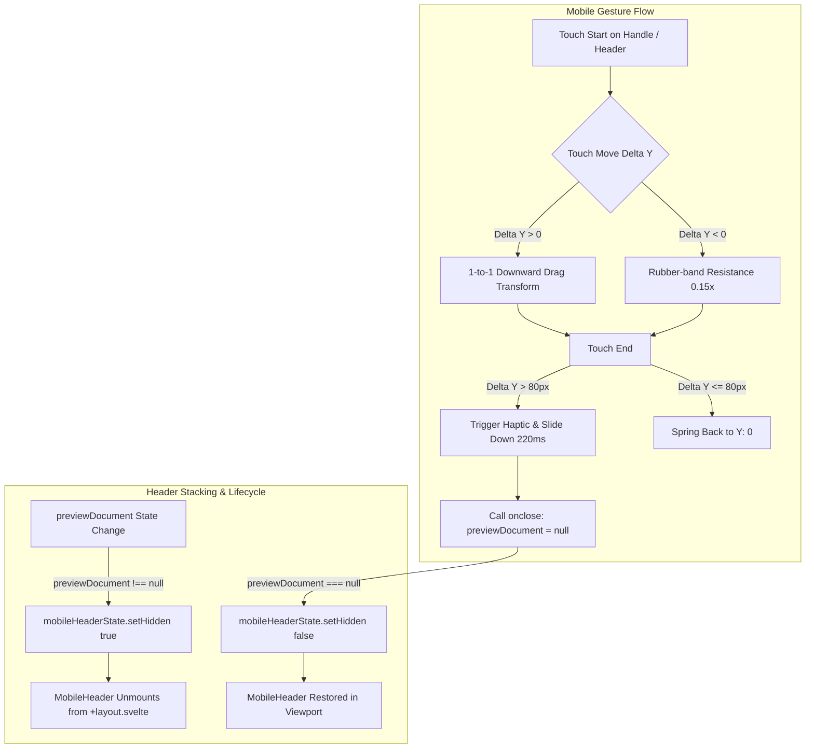

# Mobile Tactile Interactions, Swipe-Down PDF Dismiss & Header Stacking

## Core Logic
This feature enhances the mobile UX and responsiveness across the entire Dokyudo application by implementing:
1. **Universal Tactile Touch Feedback**: Active scale micro-interactions (`active:scale-[0.88..0.98]`), subtle native vibrational haptics (`navigator.vibrate`), `-webkit-tap-highlight-color`, and `touch-action: manipulation` across Account Panel Dialog, App Sidebar, Chat Input, Chat Messages, Document Library, Upload Dialog, Confirm Dialogs, and Activity Logs.
2. **Mobile Swipe-Down Gesture for PDF Preview**: Single-touch gesture handling in `PdfPreviewPanel` with natural 1-to-1 tracking, rubber-band resistance, grab handle visual feedback, and threshold-based auto-dismissal.
3. **Mobile Header Stacking & Viewport Isolation**: Dynamic synchronization between document preview state and `mobileHeaderState.hidden`, ensuring full-screen mobile immersion without header collisions.
4. **Defensive Flexbox Title Truncation**: Robust flex layouts using `min-w-0 flex-1 truncate` on titles and `shrink-0` on action menus in document cards to prevent long filenames from overlapping or pushing action buttons.

## Completion Timestamp
**Date**: 2026-08-18 12:55:00

## Flow Diagram

## File Mapping
- **Modified**: `apps/frontend/src/lib/components/app/AccountPanelDialog.svelte` (Mobile responsive layout, static height, active scales, haptics)
- **Modified**: `apps/frontend/src/lib/components/app/ConfirmDeleteDialog.svelte` (Active scales, haptics, tap highlights)
- **Modified**: `apps/frontend/src/lib/components/app/PdfPreviewPanel.svelte` (Swipe-down touch gesture, sheet-handle-zone, active states, header margin)
- **Modified**: `apps/frontend/src/lib/components/chat/ChatInput.svelte` (Touch scale transforms, selector haptics, tap highlight CSS)
- **Modified**: `apps/frontend/src/lib/state/mobile-header.svelte.ts` (Added `hidden` state and `setHidden()` method)
- **Modified**: `apps/frontend/src/routes/app/+layout.svelte` (Integrated `!mobileHeaderState.hidden` condition)
- **Modified**: `apps/frontend/src/routes/app/activity/+page.svelte` (Category pill active feedback, reset button haptics, tap styles)
- **Modified**: `apps/frontend/src/routes/app/activity/data-table.svelte` (Pagination active scales, haptics, tap styles)
- **Modified**: `apps/frontend/src/routes/app/chat/+page.svelte` (Tab mode toggles, usage badges, active feedback)
- **Modified**: `apps/frontend/src/routes/app/chat/[id]/+page.svelte` (Fixed duplicate tags, action menu touch feedback, fixed preview wrapper)
- **Modified**: `apps/frontend/src/routes/app/documents/+page.svelte` (Document card flex truncation, mobile header sync effect, toolbar haptics, elevated preview overlay)
- **Modified**: `apps/frontend/src/routes/app/documents/document-card-actions.svelte` (Trigger button scale, dropdown active states)
- **Modified**: `apps/frontend/src/routes/app/documents/UploadDocumentDialog.svelte` (Action button haptics, list row micro-interactions, tap highlights)

## Connections
- **Frontend Svelte State -> Layout Chrome**: Svelte 5 `$effect` in `documents/+page.svelte` monitors `previewDocument` and mutates the singleton `mobileHeaderState`. In `+layout.svelte`, the mobile header conditionally evaluates `!mobileHeaderState.hidden` to unmount during full-screen modal overlays.
- **Touch Events -> Native Vibration API**: User touch events trigger `navigator.vibrate([duration])` across supported mobile browsers, providing tactile physical confirmation for taps, menu open/close, and modal dismissals.

## Architectural Decisions
1. **State-Driven Chrome Hiding over Complex CSS Hacks**: Rather than fighting nested CSS stacking contexts (`z-index` with relative positioned parent containers), the mobile header is explicitly hidden via `mobileHeaderState.hidden` during document preview. This guarantees zero visual bleed regardless of device DPI or rendering engine.
2. **Defensive Flexbox Isolation (`min-w-0` + `shrink-0`)**: CSS Flex items default to `min-width: auto`, causing unbroken string titles to overflow container boundaries. Explicit `min-w-0 flex-1 truncate` on the title wrapper combined with `shrink-0` on action menus guarantees structural stability under any filename length.
3. **Lightweight Native Gestures without Heavy Libraries**: Touch drag handling is built directly with native Svelte 5 runes and standard `TouchEvent` listeners without adding third-party gesture dependencies (e.g. Framer Motion or Hammer.js), maintaining zero bundle weight overhead.
4. **Touch Action Manipulation**: Adding `touch-action: manipulation` and `-webkit-tap-highlight-color` to all interactive buttons removes mobile browser 300ms tap delays and unsightly grey tap boxes on iOS Safari and Android Chrome.
