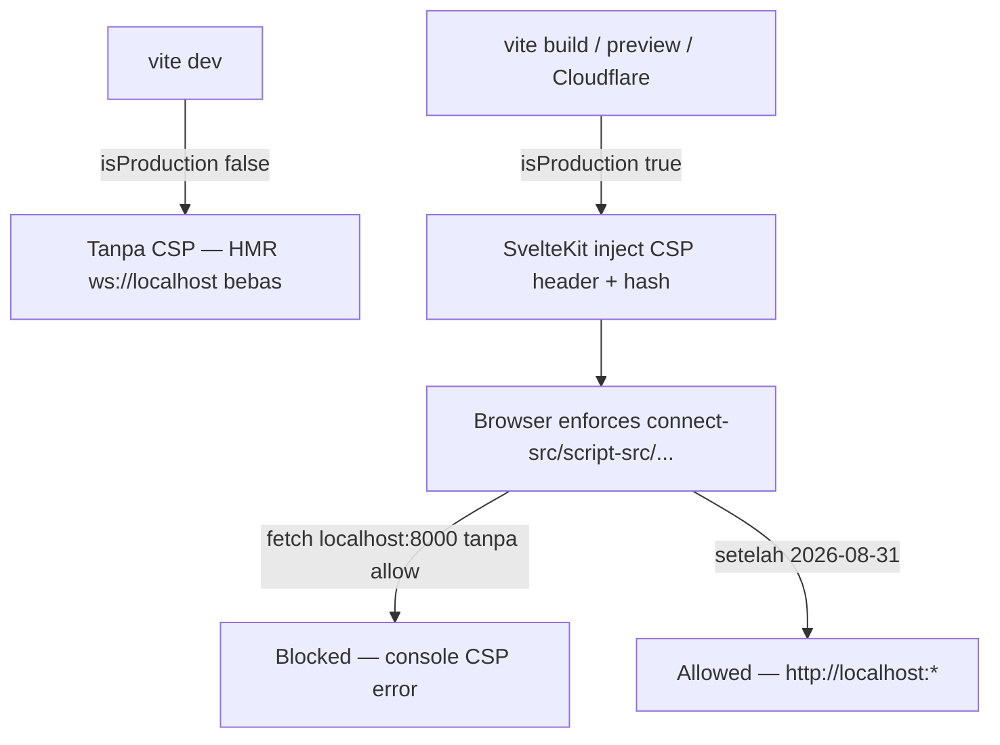

# Security Headers & Content Security Policy

**Completion Timestamp:** 2026-08-31 16:30 UTC+7

## Core Logic

Hardening header Dokyudo terpisah di dua lapisan:

1. **`kit.csp` (`apps/frontend/svelte.config.js:25`)** — CSP prod-only (`mode: 'hash'`). SvelteKit meng-hash inline bootstrap script-nya (`__sveltekit_*`) dan menambahkan hash ke `script-src` otomatis; tanpa `mode: 'hash'`, script tersebut terblokir dan app tidak hydrate. `isProduction = NODE_ENV === 'production' || 'prod'` — di `vite dev` CSP dimatikan agar HMR `ws://localhost` & inline dev script tidak terblokir.
2. **`SECURITY_HEADERS` (`apps/frontend/src/lib/server/security-headers.ts`)** — header non-CSP yang di-attach di `hooks.server.ts:17` (`Strict-Transport-Security`, `X-Frame-Options: SAMEORIGIN`, `X-Content-Type-Options: nosniff`, `Referrer-Policy`, `Permissions-Policy`, `Cross-Origin-*`). Sengaja **tidak** set CSP di sana (komentar `security-headers.ts:5`).

### Direktif CSP (prod)

- `default-src 'self'`
- `script-src 'self' 'wasm-unsafe-eval' 'sha256-J/yX8DXf1UeNiAyCwisAjkaHAVEpw7zTkFOJUEb2/Do=' https://www.google.com https://www.gstatic.com https://static.cloudflareinsights.com https://cdn.jsdelivr.net` — `wasm-unsafe-eval` untuk puzzle WASM anti-bot, hash untuk console guard `app.html`, `cdn.jsdelivr.net` untuk worker `@embedpdf`.
- `style-src 'self' 'unsafe-inline' https://fonts.googleapis.com`
- `font-src 'self' data: https://fonts.gstatic.com`
- `img-src 'self' data: blob: https:`
- `connect-src 'self' https://api.dokyudo.my.id http://localhost:* http://127.0.0.1:* http://localhost:8000 http://localhost:8080 http://127.0.0.1:8000 http://127.0.0.1:8080 ws://localhost:* ws://127.0.0.1:* https://*.supabase.co wss://*.supabase.co https://fonts.googleapis.com https://fonts.gstatic.com https://www.google.com https://www.gstatic.com https://static.cloudflareinsights.com https://cdn.jsdelivr.net https://s3.dokyudo.my.id` — **2026-08-31:** localhost entries ditambahkan agar preview prod build melawan `PUBLIC_API_URL=http://localhost:8000` (decrypt `apps/frontend/.env`) tidak kena `connect-src` violation (`fetcher.js:67` `…/api/auth/session`, `…/forget-password`). Wildcard `:*` CSP3-compliant; port eksplisit untuk parser lama. Aman di prod (localhost = mesin client sendiri).
- `frame-src 'self' https://www.google.com` (reCAPTCHA), `frame-ancestors 'self'`, `base-uri 'self'`, `form-action 'self'`, `object-src 'none'`, `worker-src 'self' blob: https://cdn.jsdelivr.net`.

## Flow Diagram

## File Mapping

- `apps/frontend/svelte.config.js:1` — `isProduction`, `kit.csp.directives`.
- `apps/frontend/src/lib/server/security-headers.ts` — `SECURITY_HEADERS`, `httpsRedirectUrl`.
- `apps/frontend/src/hooks.server.ts` — `handle` (HTTPS redirect + set hardening headers jika `!dev`).
- `apps/frontend/.env` — `PUBLIC_API_URL` ter-encrypt (`http://localhost:8000` lokal, `https://api.dokyudo.my.id` prod).
- `apps/frontend/src/lib/api/client.ts` / `fetcher.js:67` — `fetch` yang kena block sebelum fix.

## Architectural Decisions

1. **CSP di `kit.csp` bukan `hooks.server.ts`** — agar hash inline SvelteKit otomatis; manual header akan block bootstrap.
2. **Prod-only CSP** — `vite dev` butuh `ws` HMR & inline eval.
3. **Localhost tetap di prod `connect-src`** — preview prod vs staging lokal perlu `http://localhost`; tidak melemahkan prod (origin `dokyudo.my.id` → `localhost` = loopback client).
## Addendum (2026-08-31, 15:41 +07:00) — Pelajaran dari sesi debugging

- **Deteksi production di kode client: `import.meta.env.PROD`, BUKAN `$app/environment`.** `dev`/`browser` dari `$app/environment` adalah re-export paket `esm-env` (konstanta resolve-time via conditional exports). Pipeline build proyek ini pernah me-fold `browser=false` dan `dev=true` di bundle client production → guard konsol mati. `import.meta.env.PROD` diganti langsung oleh Vite (berbasis `mode === 'production'`) — terverifikasi benar di semua pipeline.
- **Deploy dapat tidak menyertakan file yang ada di HEAD.** Bundle live pernah diamati tanpa `+layout.ts` (patch konsol hilang total — dicek dari closure chunk node0) padahal CSP sudah versi terbaru. Sebelum deploy, pastikan `git rev-parse HEAD` di mesin deploy sesuai; acceptance: konsol `/login` TIDAK menampilkan `[Dokyudo Security]`.
- **Console guard 3 lapis** (inline `app.html` + `+layout.svelte` module script + `+layout.ts`) — detail di `docs/frontend/logging.md`.
- **CSP tidak menghalangi OAuth redirect-flow** (navigasi top-level tidak diatur CSP); hambatan sebelumnya murni dari bootstrap inline yang diblokir → app tidak hydrate (lihat `docs/backend/auth-oauth.md`).