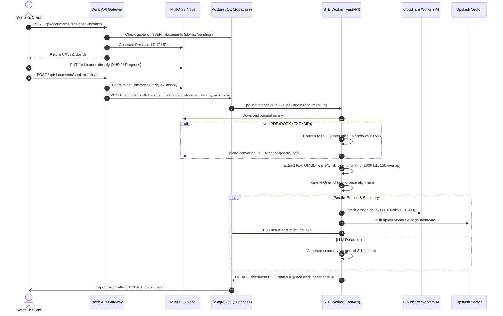
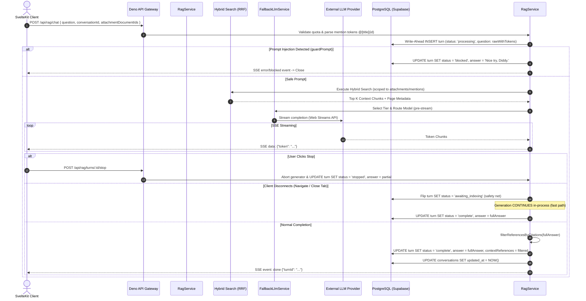

# Semantic Document Search & Q&A Platform (`Dokyudo`) — Project Requirements Document

---

## 1. Project Overview
**Dokyudo** is an advanced, production-grade SaaS platform designed for high-precision semantic document search and contextual Question & Answering (RAG). Specializing in dense technical documentation and financial reports, Dokyudo serves as an architectural masterclass in constructing **zero-cost, enterprise-grade distributed systems**.

The platform operates on a **Hybrid Cloud Architecture**, combining sovereign on-premise compute and storage with serverless edge services:
- **Frontend Presentation Layer**: SvelteKit (Svelte 5 runes) deployed to **Cloudflare Pages**.
- **Backend API Gateway & Modular Monolith**: Deno 2.x + Hono deployed via containerized CI/CD to an on-premise ARM64 Node (Amlogic S905X running Armbian Linux), routed globally via **Cloudflare Zero Trust Tunnels** (`api.dokyudo.my.id`).
- **Object Storage**: High-performance, self-hosted **MinIO** instance on ARM64 hardware exposed via Cloudflare Tunnels (`s3.dokyudo.my.id`).
- **Heavy Document Processing & Extraction Node**: Dedicated Python (FastAPI) worker on the ARM64 STB (`stb-worker`), utilizing LibreOffice headless, PyMuPDF, python-docx, and python-markdown for multi-format conversion and LaTeX equation extraction.
- **Polyglot Persistence**: Clean decoupling of transactional relational state (**Supabase PostgreSQL**) from high-throughput vector index storage (**Upstash Vector**, 1024-dimension BGE-M3 embeddings) and distributed caching/rate-limiting (**Upstash Redis**).

---

## 2. Goals & Objectives
- Deliver ultra-low latency hybrid semantic document search (P95 < 500ms) and contextual RAG streaming (first-token latency P95 < 3s).
- Provide comprehensive multi-format support (PDF, DOCX, TXT, Markdown) with faithful formula rendering via LaTeX and KaTeX.
- Implement strict multi-tenancy data isolation across relational, vector, and object storage layers.
- Implement enterprise-grade security: httpOnly session cookies, anti-bruteforce lockouts, Google reCAPTCHA v3, AES-256-GCM Bring Your Own Key (BYOK) encryption, and prompt injection defense.
- Provide advanced RAG conversation lifecycle controls: write-ahead turn state machines, explicit stop vs. background disconnect continuation, retry variant trees, in-place edit regeneration, and branchable chats.
- Enable document mentions (`@[title](id)`) directly inside user prompts to scope retrieval dynamically as a "Second Brain" main context.
- Implement immutable public/private read-only conversation sharing with token access gating, email invites via Resend, and SSR Open Graph previews.
- Support dual-mode monetization via Stripe Sandbox (One-Time Checkout and Recurring Subscriptions) with webhook verification, email receipts, and lazy subscription auto-downgrade.
- Maintain a strict $0/month operational footprint through zero-cost hardware utilization, multi-provider LLM failover, and serverless free-tier optimization.

---

## 3. Core Features & Capabilities Matrix

1. **Multi-Tenant SaaS & Subscription Management**: Strict tenant isolation across all database queries and storage buckets. 4-tier plan model (FREE, SIMULATE, OIL_INVESTOR, PRO) with lazy subscription evaluation.
2. **Two-Phase Staged Document Ingestion**: Client-side drag-and-drop staging, batch presigned S3 URLs, direct-to-MinIO streaming, and server-side head verification (`confirm-upload`).
3. **Multi-Format Extraction Pipeline**: Ingestion of PDF, DOCX (with OMML equation conversion to LaTeX), TXT (multi-encoding detection), and Markdown (rendered HTML-to-PDF conversion).
4. **Dual-File Storage & Unified Preview**: Non-PDF uploads automatically maintain original files for download alongside converted PDF artifacts rendered inside `@embedpdf/svelte-pdf-viewer`.
5. **Application-Layer Scatter-Gather RRF Search**: Parallel query dispatch to Upstash Vector and PostgreSQL Full-Text Search (FTS), in-memory Reciprocal Rank Fusion (RRF), and deduplicated document hydration with page tracking.
6. **Smart Multi-Provider LLM Fallback (Free Tier)**: Dynamic 3-tier model pools (LIGHT, MEDIUM, HEAVY) rotating across Gemini, Groq, Mistral, SambaNova, and Cohere with circuit breakers and `<think>` tag stripping.
7. **Enterprise BYOK (Bring Your Own Key)**: User-provided API keys (Google AI, Mistral, OpenRouter) encrypted via AES-256-GCM with master encryption keys (MEK).
8. **RAG Conversation Lifecycle (V2/V3)**: Write-ahead eager turn tracking (`processing`, `complete`, `stopped`, `failed`, `blocked`, `awaiting_indexing`), explicit stop endpoint vs. client disconnect background continuation (fast path + Deno.cron sweep fallback).
9. **Retry Variants & Conversation Branching**: Alternative response tracking (`turn_alternatives`) with variant browsing (`◀ N/M ▶`), history promotion upon follow-up, and immutable sub-tree conversation branching.
10. **Document Mention (`@` Second Brain)**: Inline prompt tokens `@[title](doc_id)` scoping hybrid search to selected processed documents while stripping tokens from model prompts.
11. **Public & Private Share System**: Immutable snapshot-based chat sharing, Base62 codes, custom URLs, private access tokens, Resend email invitations, sliding Redis cache, and "Continue Chat" cloning.
12. **Stripe Payment Gateway Integration**: Dual-mode payment processing (One-Time and Recurring), webhook signature verification, transaction ledger, server-side session verification, and transactional email receipts.
13. **Cookie-Based Cross-Subdomain Session**: `httpOnly`, `SameSite=Lax` session cookies with silent background refresh, deprecating vulnerable localStorage token patterns.
14. **Redis Gatekeeper & Defense-in-Depth**: Sliding window rate limiter (300 req/min standard, 20 req/min suspicious), auth-specific penalty escalation, and PostgreSQL-backed account lockout.
15. **Observability & Wide Events**: Single-request wide JSON log emission (`NDJSON` in prod, pretty in dev) with strict user prompt privacy masking.

---

## 4. User Roles & Identity

- **Tenant (User)**: Registered entity mapped 1:1 to a tenant workspace. Capable of uploading documents, executing hybrid searches, running RAG chats, configuring BYOK keys, purchasing tier upgrades, and sharing conversations. Authentication supported via Email/Password (bcrypt) and OAuth 2.0 (Google, GitHub) with Server-Side PKCE.
- **Admin**: Internal operational role capable of inspecting system health, managing tenant tiers, monitoring LLM routing fallback metrics, and flushing shared cache keys.

---

## 5. Functional Requirements

### 5.1 Multi-Tenancy, Subscription Tiers & Lazy Evaluation Quotas

1. **Tenant Isolation**: Every tenant owns a distinct workspace identifier (`tenant_id`). Every database table containing tenant assets (documents, document chunks, conversations, conversation turns, turn alternatives, chat shares, share invitees, payment transactions, tenant subscriptions, activity logs) enforces a `tenant_id` foreign key.
2. **Subscription Tiers & Quota Limits**:

| Tier | Max File Size | Uploads / Month | Searches / Month | Q&A / Month | Storage Limit | Billing Mode |
|---|---|---|---|---|---|---|
| **FREE** | 25 MB | 5 documents | 50 queries | 10 turns | 500 MB | Free ($0) |
| **SIMULATE** | 25 MB | 50 documents | 500 queries | 100 turns | 2 GB | One-Time ($0 Sandbox, 24h Expiry) |
| **OIL_INVESTOR** | 25 MB | Unlimited (FUP 50) | Unlimited (FUP 500) | 100 turns | 40 GB (FUP 2GB) | One-Time ($0 Sandbox, Lifetime) |
| **PRO** | 25 MB | 50 documents | 500 queries | 100 turns | 2 GB | Recurring Monthly ($0 Sandbox) |

3. **Lazy Subscription Evaluation**:
   - Rather than executing persistent background polling cron jobs to downgrade expired accounts, tier validity is lazily evaluated during profile retrieval (`GET /api/me`).
   - If `tenant_subscriptions.expires_at` is in the past, the backend automatically and quietly mutates the record to `tier = 'FREE'` and `expires_at = null`, ensuring subsequent quota checks enforce free tier constraints.
4. **Usage Metric Separation**:
   - `GET /api/me`: Returns user identity, workspace details, active tier, and `expiresAt`.
   - `GET /api/me/usage`: Returns realtime consumption counters (`uploadsCount`, `searchesCount`, `qaCount`, `storageUsedBytes`, `expiresAt`) using `withAuthDb` tenant isolation.

---

### 5.2 Document Ingestion & Storage Architecture

1. **Two-Phase Staged Batch Upload**:
   - Files dropped into the UI are staged in client memory (`staged`) without sending network requests until the user confirms.
   - Client requests batch upload URLs: `POST /api/documents/presigned-url/batch` with array of file metadata (max 10 files per batch, max 25MB per file).
   - Backend performs atomic quota validation against `uploadsCount` and `storageUsedBytes`. If compliant, inserts records into `documents` with `status = 'pending'` and generates AWS S3 Presigned PUT URLs (15-minute validity).
   - Duplicate file names automatically receive `(n)` suffix deduplication (e.g., `report (1).pdf`).
2. **Direct-to-MinIO Upload**:
   - Client uploads binaries directly to the MinIO storage node via the presigned URL, bypassing backend memory overhead.
3. **Upload Confirmation & Head Verification**:
   - Client sends `POST /api/documents/confirm-upload` with `documentId`.
   - Backend performs a lightweight `HeadObjectCommand` against MinIO (over local LAN endpoint) to verify physical existence before updating `documents.status = 'confirmed'` and atomically updating `storage_used_bytes`.
4. **Document Renaming & Deletion**:
   - `PATCH /api/documents/:id`: Updates document title with strict anti-XSS whitelist character validation while keeping the original file extension immutable. Emits `document.renamed` activity log.
   - `DELETE /api/documents/:id` and `POST /api/documents/batch-delete`: Dispatches cancellation to STB worker (`POST /api/cancel`), purges vectors from Upstash Vector, removes physical objects from MinIO (both original and converted PDF), cascades deletion in PostgreSQL, and refunds `storage_used_bytes` and `uploadsCount`.
5. **Document Preview & Download**:
   - `GET /api/documents/:id/preview`: Generates a 12-hour Presigned GET URL.
   - If `download=true`, attaches `ResponseContentDisposition: attachment; filename="..."` to force direct browser disk downloads of the original uploaded file.
   - For view mode on non-PDF files, returns presigned URL pointing to the converted PDF preview.

---

### 5.3 STB Extraction Worker & Resilience

1. **Event-Driven Trigger (`pg_net`)**:
   - PostgreSQL `AFTER UPDATE` trigger (`notify_document_uploaded`) fires whenever a document transitions to `status = 'confirmed'`, dispatching an asynchronous HTTP POST to the STB worker (`https://worker.dokyudo.my.id/api/ingest` or local tunnel).
2. **Multi-Format Processing Pipeline**:
   - **PDF**: Page-by-page text extraction via PyMuPDF. Tokenized using `tiktoken` (`cl100k_base`, chunk size 1000 tokens, overlap 150 tokens).
   - **DOCX**: Visual order extraction via `python-docx` (paragraphs, table cells, floating text boxes). OMML mathematical formulas converted into LaTeX enclosed in `$...$` (inline) or `$$...$$` (display). Converted to PDF via LibreOffice headless with `libreoffice-math` for viewer display. Aligned to PDF pages using rare n-gram windowing (25-character windows appearing <= 3 times).
   - **TXT**: Multi-encoding detection (UTF-8-BOM, UTF-16-BOM, UTF-8, CP1252; binary files rejected). Converted to PDF via LibreOffice.
   - **Markdown (MD)**: Rendered to styled HTML+CSS via `python-markdown` (supporting tables and fenced code), converted to PDF for viewer, and clean text stripped from HTML for chunks.
3. **Embeddings & Vectorization**:
   - Embeddings generated in batches of up to 32 chunks using **Cloudflare Workers AI (`@cf/baai/bge-m3`, 1024 dimensions)**.
   - In parallel, an asynchronous thread summarizes the first 3000 characters using `gemini-3.1-flash-lite` to produce a document description.
   - Vectors and metadata (including page mapping arrays) are bulk-upserted to Upstash Vector and PostgreSQL `document_chunks`.
   - On completion, documents transition to `status = 'processed'` with the generated `description`.
4. **Worker Fault Tolerance & Checkpointing**:
   - Transient Cloudflare API errors (401, 403, 429, 5xx, timeouts) trigger exponential backoff with jitter (2s, 4s, 8s, 16s, 32s).
   - If daily rate limits (TPD) are exhausted, worker marks document `status = 'quota_exhausted'`.
   - Daily Supabase `pg_cron` job at 00:05 UTC resets `quota_exhausted` documents back to `confirmed`, resuming from the last checkpoint (`get_last_processed_chunk_index`).
   - Pre-flush cancellation check: Worker verifies `ingestion_queue.is_cancelled(document_id)` prior to database writes to prevent 409 conflicts if a user canceled the upload mid-flight.

---

### 5.4 Hybrid Semantic Search (Scatter-Gather RRF)

1. **Query Pipeline (`GET /api/search` or `POST /api/search`)**:
   - Validates and atomically increments tenant's `searchesCount`.
   - Generates 1024-dimensional query vector via Cloudflare Workers AI with Redis circuit breaker protection.
2. **Scatter Phase (Parallel Fetch)**:
   - **Vector Search**: Queries Upstash Vector REST API for Top-K candidate IDs matching tenant filter (`tenantId = '...'`).
   - **Full-Text Search (FTS)**: Queries PostgreSQL `document_chunks` using `to_tsvector` / `websearch_to_tsquery` matching tenant filter.
3. **In-Memory Reciprocal Rank Fusion (RRF)**:
   - Deno Edge runtime computes RRF scores over candidate ID lists:
     $$\text{RRF Score}(d) = \sum_{m \in \{\text{Vector}, \text{FTS}\}} \frac{1}{60 + \text{Rank}_m(d)}$$
4. **Gather & Deduplication Phase (Lazy Hydration)**:
   - Hydrates top candidate chunk contents and JSONB page metadata from PostgreSQL in a single targeted query.
   - Groups results by parent `documentId`, aggregating all matched pages into a clean array and returning the highest scoring chunk preview.

---

### 5.5 RAG Conversation Engine & Lifecycle Architecture

1. **Write-Ahead Turn Lifecycle (V2/V3)**:
   - Turn creation is eager: `conversation_turns` record is inserted at request arrival with `status = 'processing'`, `answer = ''`, and `model_used = null`.
   - Guaranteed terminal status resolution: `complete`, `stopped`, `failed`, `blocked`, or `awaiting_indexing`.
2. **Explicit Stop vs. Disconnect Continuation**:
   - **Explicit Stop (`POST /api/rag/turns/:id/stop`)**: Client user presses Stop button. Active in-memory registry triggers `stopGenerationAbort`, freezes stream, and writes partial answer with `status = 'stopped'`.
   - **Client Disconnect**: User closes tab or navigates away. Client disconnect flips turn to `status = 'awaiting_indexing'` as a safety net, but generation **continues in-process (fast path)** using a decoupled `AbortController`. Upon completion, turn is finalized as `status = 'complete'`. If the serverless isolate suspends before finishing, a backup `Deno.cron` sweep (`sweepAwaitingTurns`) regenerates and completes the turn.
3. **Retry Variants (`turn_alternatives`)**:
   - Triggering "Try Again" on the final conversation turn sends `retry_turn_id` to `POST /api/rag/chat`.
   - Streams new answer into the `turn_alternatives` table with `status = 'processing' -> terminal`.
   - Frontend allows browsing variants via `◀ N/M ▶` controls.
   - Sending a follow-up prompt with `selected_variant_id` uses the chosen variant for history context and promotes it to the canonical turn upon successful completion, purging unselected variants.
4. **In-Place Turn Editing**:
   - Sending `edit_turn_id` updates the question on the existing turn, resets answer and references, purges all associated retry variants, and streams regenerated content into the same row.
5. **Prompt Injection Defense**:
   - `guardPrompt` validates input against injection, roleplay bypasses, and system prompt extraction.
   - Cached in Redis (`guard:injection:<sha256>`). Detected attacks immediately finalize turn as `status = 'blocked'`, return `"Nice try, Diddy."`, and avoid burning QA quotas.
6. **Citation Formatting & Hallucination Suppression**:
   - Strict citation contract: `[Doc N: Page X]` or `[Doc N: Pages X, Y]`.
   - Negative or off-topic answers strictly suppress citation tags.
   - Backend `filterReferencesByCitations()` filters `contextReferences` to only include cited documents before saving.
7. **KaTeX Formula Rendering**:
   - Chat assistant and public share pages parse LaTeX math syntax (`$$...$$` display, `$...$` inline) via KaTeX before markdown parsing.

---

### 5.6 Smart Model Routing & BYOK Architecture

1. **Free Tier Fallback Engine (`FallbackLlmService`)**:
   - Classifies query into token tiers using history depth and complexity score:
     $$\text{Score} = \text{QuestionTokens} + \text{HistoryTokens} + 0.1 \times \text{ContextTokens}$$
   - **LIGHT_POOL**: Depth 0 or (Depth 1 with Score <= 500) -> `gemini-3.1-flash-lite`, `llama-4-scout-17b`, `mistral-3b`.
   - **MEDIUM_POOL**: Depth 1 (Score > 500) or (Depth 2 with Score <= 1500) -> `gemini-2.0-flash`, `llama-3.3-70b`, `mistral-small`.
   - **HEAVY_POOL**: Depth 2 (Score > 1500), Depth 3, or Guard overrides (>30K total tokens, >12K context tokens) -> `gemini-2.5-flash`, `qwen3-32b`, `command-r-plus`.
   - Rotates across providers with 15s Time-to-First-Token timeouts, circuit breakers, and `<think>` tag stripping. Pre-stream selection emits `fallbackChain` metadata in wide logs.
2. **Bring Your Own Key (BYOK)**:
   - Supported providers: Google AI (Gemini), Mistral AI, OpenRouter.
   - Encrypted with AES-256-GCM using Web Crypto API and off-database Master Encryption Key (`BYOK_MASTER_KEY`).
   - Decrypted exclusively in RAM during stream dispatch and scrubbed immediately. Masked keys (`sk-*******************1234`) returned to UI.

---

### 5.7 Document Mention ("Second Brain" Main Context)

1. **Inline Token Syntax**: Users type `@` to select processed documents, inserting `@[title](doc_id)` inline into the question (max 5 mentions).
2. **Dynamic Retrieval Scoping**:
   - Backend extracts mention IDs from the question, combines them with attached document IDs, and scopes hybrid search strictly to those documents (`documentIds = [...]`).
   - If all mentioned documents are `processed`, chat executes interactively via SSE. If any document is still being indexed, the turn transitions to `awaiting_indexing` and completes in the background.
3. **Prompt Sanitization**: Mention tokens are stripped from query rewriter, history context, augmented prompt, and conversation title generation, while the original question with tokens is preserved in PostgreSQL for UI pill rendering.

---

### 5.8 Public & Private Conversation Sharing

1. **Immutable Snapshot Model**:
   - Creating a share (`POST /api/rag/conversations/:id/share`) freezes turns and attachment titles into `chat_shares.snapshot` (JSONB). Subsequent edits to the original conversation do not affect the public view.
2. **Access Control**:
   - **Public**: Accessible via Base62 code (~11 chars) or custom vanity alias (4-32 chars).
   - **Private**: Marked `is_private = true` with a 32-hex `access_token`. Only accessible via `{FRONTEND_URL}/s/{code}?invite={access_token}`. Invitee emails stored in `share_invitees`.
3. **Invitations & Email**:
   - Invitations delivered via Resend (`sendShareInviteEmail`).
4. **Caching & Open Graph**:
   - Public responses cached in Redis (`share:v1:{code}`) with sliding renewal up to 30 days.
   - SSR route `src/routes/s/[code]/+page.server.ts` generates dynamic Open Graph cards (`/s/:code/opengraph-image.svg`).
5. **Continue Chat**: Authenticated viewers can clone the snapshot into a new active conversation via `POST /api/rag/shares/:code/continue`.

---

### 5.9 Stripe Monetization Lifecycle

1. **Hybrid Checkout Modes**:
   - **One-Time (`payment`)**: Used for `SIMULATE` and `OIL_INVESTOR` plans.
   - **Recurring (`subscription`)**: Used for `PRO` monthly subscription.
2. **Checkout & Webhook Flow**:
   - `POST /api/payments/checkout`: Generates Stripe Checkout session with `price_id` and metadata (`tenantId`, `tierToUnlock`, `externalId`).
   - Webhook `POST /api/payments/webhook`: Verifies `Stripe-Signature`. On `checkout.session.completed`, records transaction `SUCCEEDED`, upgrades `tenant_subscriptions`, records audit log `billing.payment_completed`, and sends email confirmation via Resend (`sendPaymentSuccessEmail`).
3. **Session Verification**:
   - `POST /api/payments/checkout/verify`: Authenticated client verifies checkout session ownership before rendering success UI.
4. **Customer Billing Portal**:
   - `POST /api/payments/portal`: Generates Stripe Billing Portal session for managing recurring subscriptions.

---

### 5.10 Cookie-Based Session & Security Gatekeeper

1. **httpOnly Session Cookie Architecture**:
   - `dokyudo_access_token` (TTL 1 hour) and `dokyudo_refresh_token` (TTL 30 days) set with `HttpOnly; Secure; SameSite=Lax; Path=/; Domain=dokyudo.my.id`.
   - Eliminates localStorage XSS vulnerabilities and URL token leakage during OAuth redirects.
   - Silent refresh: If access token expires, `auth.middleware.ts` transparently refreshes session using refresh token and sets updated cookies.
   - `GET /api/auth/session`: Lightweight hydration endpoint returning current auth state.
2. **Anti-Bruteforce & Account Lockout**:
   - Google reCAPTCHA v3 verification (score >= 0.5) on register, login, and password reset.
   - Database-backed lockout (`users.is_locked`, `locked_until`): 5 failed login attempts on an email within 15 minutes locks the account for 15 minutes.
   - Per-IP rate limiting (20 attempts / 15m). User-Agent anomaly detection (>3 distinct UAs from one IP drops limit from 20 to 3).
   - Global session invalidation on logout and password reset (`admin.signOut(token, 'global')`).
3. **Redis Gatekeeper Rate Limiting**:
   - Standard limit: 300 req/min. Suspicious bots: 20 req/min.
   - Auth path penalty escalation: 4xx errors on `/api/auth/*` increment IP penalty score (score >= 5 -> 20 req/min, score >= 10 -> 1 req/hour block for 1 hour).
   - Opt-in load-test bypass gated via `LOAD_TEST_BYPASS_TOKEN` environment variable.

---

### 5.11 Activity Logs & Observability

1. **Activity Logs (`GET /api/activities`)**:
   - Records audit actions: `auth.register`, `auth.login`, `document.uploaded`, `document.deleted`, `document.renamed`, `document.failed`, `document.quota_exhausted`, `billing.payment_completed`, `billing.payment_failed`, `tenant.name_updated`.
   - Supports server-side SQL pagination and filtering by category, date range, and search keyword with composite index `(tenant_id, action, created_at DESC)`.
2. **Observability (Wide Events)**:
   - Centralized `loggerMiddleware` captures request duration, IP, status, route, and enriched `logContext` into a single structured JSON wide log emitted upon request completion.
   - Output formatted as pretty-printed JSON in development and NDJSON in production. User prompt text is strictly omitted from logs to guarantee privacy compliance.

---

### 5.12 Error Response Standard & Circuit Breaker Contracts

1. **JSON Error Envelope**:
```json
{
  "error": {
    "code": "VALIDATION_ERROR",
    "message": "Human readable description",
    "retryAfter": 30,
    "requestId": "uuid"
  }
}
```
**Standard Error Codes**: `UNAUTHORIZED`, `FORBIDDEN`, `PRIVATE_SHARE`, `FEATURE_DISABLED`, `RATE_LIMIT_EXCEEDED`, `QUOTA_EXCEEDED`, `DOCUMENT_NOT_READY`, `PROVIDER_UNAVAILABLE`, `VALIDATION_ERROR`, `NOT_FOUND`, `CODE_TAKEN`, `INTERNAL_ERROR`.

2. **Circuit Breaker Standards**:
   - Applied to Upstash Vector, Cloudflare Workers AI embeddings, external LLM providers, and webhook URLs.
   - Threshold: 5 consecutive failures in 10s opens circuit for 30s. Redis-backed state evaluation using atomic pipelines.

---

## 6. Non-Functional Requirements

- **Scalability**: Stateless backend design scaled via Docker containers. PostgreSQL connection pooling managed via Supabase PgBouncer (Port 6543) with mandatory `prepare: false` in `postgres.js` driver. Redis connection pool capped at 20.
- **Performance**:
  - Hybrid search P95 latency < 500ms.
  - RAG first-token SSE latency P95 < 3s.
  - Zero memory buffering: Native Web Streams API used for all SSE responses.
- **Data Isolation**: 100% tenant-isolated queries using application-layer `and(eq(table.tenantId, tenantId))` guards and PostgreSQL Row-Level Security (`withAuthDb`).
- **Resilience**: STB worker checkpoint resumption, dual-layer real-time sync (Supabase Realtime + 4s polling backup), and graceful fallback to PostgreSQL FTS on vector/embedding failure.

---

## 7. Architecture & Infrastructure Overview

```
                                      Internet Traffic
                                             │
                      ┌──────────────────────┴──────────────────────┐
                      ▼                                             ▼
           Cloudflare Pages (Frontend)                 Cloudflare Zero Trust Tunnel
           https://dokyudo.my.id                       (stb-dokyudo: 448b2e8f-...)
           (SvelteKit + Svelte 5)                                   │
                      │                                             ▼
                      │                                 https://api.dokyudo.my.id
                      │                                             │
                      ▼                                             ▼
┌─────────────────────────────────────────────────────────────────────────────────────────────┐
│ On-Premise Bare-Metal STB Node (Amlogic S905X ARM64 @ 192.168.0.118)                       │
│                                                                                             │
│  ┌────────────────────────────────────────┐     ┌────────────────────────────────────────┐  │
│  │ dokyudo-backend (Docker :8001 -> :8000)│     │ stb-worker (Docker :8080)              │  │
│  │ Deno 2.x + Hono (Modular Monolith)     │◄───►│ Python FastAPI (Clean Architecture)    │  │
│  │ • API Gateway & Auth Cookies           │     │ • LibreOffice Headless (DOCX/TXT/MD)   │  │
│  │ • Document & Search Service (RRF)      │     │ • OMML -> LaTeX Equation Converter     │  │
│  │ • RAG Service (Lifecycle V3)           │     │ • PyMuPDF & TikToken Chunking          │  │
│  │ • Share, Payments & Activity Modules   │     │ • Rare N-Gram Page Alignment           │  │
│  └───────────────────┬────────────────────┘     └───────────────────┬────────────────────┘  │
│                      │                                              │                       │
│                      ▼                                              ▼                       │
│  ┌───────────────────────────────────────────────────────────────────────────────────────┐  │
│  │ MinIO S3 Object Storage (:9000 Internal LAN / s3.dokyudo.my.id Public Presigned URLs) │  │
│  │ • Original Binaries ({tenant}/{docId}.ext)                                            │  │
│  │ • Converted PDF Previews ({tenant}/{docId}.pdf)                                       │  │
│  └───────────────────────────────────────────────────────────────────────────────────────┘  │
└──────────────────────────────┬──────────────────────────────────────────────┬───────────────┘
                               │                                              │
                               ▼                                              ▼
┌──────────────────────────────────────────────┐ ┌────────────────────────────────────────────┐
│ Cloud & Serverless Infrastructure            │ │ External AI & Transactional Providers      │
│ • Supabase PostgreSQL (PgBouncer Port 6543)  │ │ • Cloudflare Workers AI (@cf/baai/bge-m3)  │
│ • Supabase Auth (OIDC PKCE Google/GitHub)    │ │ • Google Gemini (Flash, Flash Lite, Embed) │
│ • Supabase pg_net Webhooks & pg_cron         │ │ • Groq, Mistral, SambaNova, Cohere v2      │
│ • Upstash Vector (1024-dim Serverless Index) │ │ • Resend Transactional Email API          │
│ • Upstash Redis (Rate Limiter, Gatekeeper)   │ │ • Stripe Sandbox Payment Gateway           │
└──────────────────────────────────────────────┘ └────────────────────────────────────────────┘
```

---

## 8. Database Schema & Data Models

### 8.1 PostgreSQL Relational Tables (Supabase)

1. **`tenants`**: Workspace container (`id` UUID PK, `name` text, `created_at`, `updated_at`).
2. **`users`**: User identity mapped 1:1 to tenant (`id` UUID PK, `tenant_id` FK, `email` varchar, `role` varchar, `is_locked` bool, `locked_until` timestamp, `created_at`, `updated_at`).
3. **`tenant_subscriptions`**: Active billing state (`id` UUID PK, `tenant_id` FK unique, `tier` enum `FREE|SIMULATE|OIL_INVESTOR|PRO`, `expires_at` timestamp, `uploads_count` int, `searches_count` int, `qa_count` int, `storage_used_bytes` bigint, `created_at`, `updated_at`).
4. **`login_attempts`**: Audit and rate-limiting log (`id` UUID PK, `email_attempted` varchar, `ip_address` varchar, `user_agent` text, `is_success` bool, `auth_provider` varchar, `created_at`).
5. **`documents`**: Knowledge documents (`id` UUID PK, `tenant_id` FK, `title` varchar(255), `storage_path` text, `mime_type` varchar, `size_bytes` bigint, `status` enum `pending|confirmed|processed|quota_exhausted|failed|failed_vectorizing`, `description` text, `created_at`, `updated_at`).
6. **`document_chunks`**: Text segments and vector metadata (`id` UUID PK, `tenant_id` FK, `document_id` FK cascade, `chunk_index` int, `content` text, `token_count` int, `metadata` jsonb `{"pages": [1, 2]}`, `created_at`).
7. **`conversations`**: Chat sessions (`id` UUID PK, `tenant_id` FK, `title` text, `is_pinned` bool default false, `branch_of_id` FK nullable set null, `created_at`, `updated_at`).
8. **`conversation_turns`**: Chronological exchanges (`id` UUID PK, `tenant_id` FK, `conversation_id` FK cascade, `question` text, `answer` text, `model_used` varchar nullable, `latency_ms` int, `context_references` jsonb, `attachment_document_ids` uuid[], `status` enum `processing|complete|stopped|failed|blocked|awaiting_indexing`, `feedback` enum `good|bad` nullable, `feedback_at` timestamp, `branched_from_turn_id` uuid nullable without FK, `created_at`, `updated_at`).
9. **`turn_alternatives`**: Retry variant trees (`id` UUID PK, `tenant_id` FK, `conversation_id` FK cascade, `turn_id` FK cascade, `answer` text, `model_used` varchar, `latency_ms` int, `context_references` jsonb, `status` enum `processing|complete|stopped|failed|blocked`, `created_at`, `updated_at`).
10. **`chat_shares`**: Read-only snapshot links (`code` varchar(32) PK, `tenant_id` FK, `conversation_id` FK cascade, `created_by` FK set null, `title` text, `snapshot` jsonb, `is_custom` bool, `is_private` bool, `access_token` varchar(64) nullable, `expires_at` timestamp nullable, `created_at`, `updated_at`).
11. **`share_invitees`**: Private share email access list (`code` varchar(32) FK cascade, `email` varchar(255), `notified_at` timestamp nullable, `created_at`, PK `(code, email)`).
12. **`payment_transactions`**: Ledger (`id` UUID PK, `tenant_id` FK, `stripe_session_id` varchar, `amount` int, `currency` varchar, `tier` enum, `status` enum `PENDING|SUCCEEDED|FAILED|CANCELED|EXPIRED`, `external_id` varchar, `created_at`, `updated_at`).
13. **`activity_logs`**: Workspace audit trail (`id` UUID PK, `tenant_id` FK, `action` enum `auth.register|auth.login|document.uploaded|document.deleted|document.renamed|document.failed|document.quota_exhausted|billing.payment_completed|billing.payment_failed|tenant.name_updated`, `ip_address` varchar, `user_agent` text, `metadata` jsonb, `created_at`). Composite index: `(tenant_id, action, created_at DESC)`.

### 8.2 Vector & Key-Value Stores

- **Upstash Vector**: Index `dokyudo-chunks-1024` (1024-dim, Cosine distance). Vector ID = Chunk UUID. Metadata: `{ "tenantId": "uuid", "documentId": "uuid", "pages": [1] }`.
- **Upstash Redis**:
  - Rate Limiting: `ratelimit:standard:{ip}`, `ratelimit:strict:{ip}`, `ratelimit:block:{ip}`, `penalty:{ip}`.
  - Security Cache: `guard:injection:<sha256(question)>` (TTL 24h).
  - Share Read Cache: `share:v1:{code}` (Sliding TTL <= 30d).
  - Rate Limiter Fallback Pools: `quota:rpm:{provider}:{model}`, `circuit_breaker:{provider}`.

---

## 9. API Endpoints Catalog

### 9.1 Authentication & Workspace (`/api/auth`)
- `POST /api/auth/register`: Register with email, password, and reCAPTCHA token.
- `POST /api/auth/verify-email`: Confirm verification OTP/token hash and set session cookies.
- `POST /api/auth/login`: Authenticate credentials, enforce lockouts, and set session cookies.
- `POST /api/auth/logout`: Invalidate session globally and clear cookies.
- `GET /api/auth/session`: Lightweight session verification for client hydration.
- `GET /api/auth/oauth/:provider`: Initiate Google/GitHub PKCE login flow.
- `GET /api/auth/oauth/:provider/callback`: Handle OAuth callback, verify email, and set cookies.
- `POST /api/auth/forget-password`: Send recovery email via Resend.
- `POST /api/auth/reset-password`: Reset password using OTP code or token hash.
- `PUT /api/auth/update-password`: Authenticated password update.
- `PATCH /api/auth/tenant/name`: Update workspace name.

### 9.2 Profile & Usage (`/api/me`)
- `GET /api/me`: Get profile, tenant info, active tier, and trigger lazy downgrade evaluation.
- `GET /api/me/usage`: Realtime counters (`uploadsCount`, `searchesCount`, `qaCount`, `storageUsedBytes`, `expiresAt`).

### 9.3 Documents Management (`/api/documents`)
- `POST /api/documents/presigned-url/batch`: Request batch presigned S3 PUT URLs.
- `POST /api/documents/confirm-upload`: Confirm physical upload via S3 HeadObject.
- `GET /api/documents`: List all tenant documents.
- `GET /api/documents/:id/preview`: Generate presigned GET URL for inline preview or attachment download.
- `PATCH /api/documents/:id`: Rename document title with immutable extension.
- `DELETE /api/documents/:id`: Delete single document and purge vectors/objects.
- `POST /api/documents/batch-delete`: Batch document deletion and quota refund.

### 9.4 Hybrid Search (`/api/search`)
- `GET /api/search` & `POST /api/search`: Execute Application-Layer Scatter-Gather RRF hybrid search.

### 9.5 RAG Conversations & Turns (`/api/rag`)
- `POST /api/rag/chat`: Stream RAG response via SSE (supports `edit_turn_id`, `retry_turn_id`, `selected_variant_id`, and `attachment_document_ids`).
- `POST /api/rag/turns/:id/stop`: Explicitly stop active turn generation.
- `GET /api/rag/conversations`: List conversations (supports cursor pagination, ordered by `is_pinned DESC, updated_at DESC`).
- `GET /api/rag/conversations/:id`: Retrieve conversation details, turns, retry alternatives, and resolved attachments.
- `PATCH /api/rag/conversations/:id`: Update title and/or toggle `isPinned`.
- `DELETE /api/rag/conversations/:id`: Delete entire conversation.
- `DELETE /api/rag/conversations/:id/turns/:turnId`: Delete single conversation turn.
- `PATCH /api/rag/conversations/:id/turns/:turnId/feedback`: Submit or toggle turn feedback rating (`good|bad|null`).
- `POST /api/rag/conversations/:id/branch`: Create branch conversation from specified turn boundary.

### 9.6 Public & Private Shares (`/api/rag/shares` & `/api/rag/conversations/:id/share`)
- `POST /api/rag/conversations/:id/share`: Create public or private share snapshot.
- `GET /api/rag/shares/:code`: Public/invitee read-only access (query `?invite=` for private).
- `POST /api/rag/shares/:code/invitees`: Add private invitee emails and dispatch Resend invites.
- `POST /api/rag/shares/:code/continue`: Clone share snapshot into new active user conversation.
- `GET /api/rag/shares`: List all active shares for authenticated tenant.
- `DELETE /api/rag/shares/:code`: Revoke single share.
- `DELETE /api/rag/conversations/:id/shares`: Revoke all shares for a conversation.
- `DELETE /api/rag/shares`: Revoke all shares for the tenant.

### 9.7 Payments & Subscriptions (`/api/payments`)
- `POST /api/payments/checkout`: Create Stripe Checkout session for tier upgrade.
- `POST /api/payments/checkout/verify`: Verify checkout session ownership.
- `POST /api/payments/portal`: Create Stripe Billing Portal session.
- `POST /api/payments/webhook`: Handle Stripe webhook events (`checkout.session.completed`, etc.).

### 9.8 Activity Logs (`/api/activities`)
- `GET /api/activities`: Retrieve workspace activity logs with category, date range, and text search filters.

---

## 10. Data Flow Diagrams

### 10.1 Multi-Format Document Ingestion & STB Extraction


### 10.2 RAG Chat Stream & Write-Ahead Lifecycle


---

## 11. Technology Stack

| Layer | Technology | Purpose & Justification |
|---|---|---|
| **Frontend Framework** | SvelteKit (Svelte 5 Runes) | High performance, zero virtual DOM overhead, fine-grained reactivity (`$state`, `$derived`, `$effect`). |
| **Frontend Styling** | Tailwind CSS v4, shadcn-svelte, mx-icons | Modern utility-first CSS, accessible primitives (bits-ui), high-end design aesthetic. |
| **PDF Rendering** | `@embedpdf/svelte-pdf-viewer` | WebGL/PDFium WASM viewer with dark theme matching Dokyudo design tokens. |
| **Backend Runtime** | Deno 2.x + TypeScript + Hono | Secure-by-default, native Web APIs, ultra-fast routing, seamless npm compatibility. |
| **On-Premise STB Worker** | Python 3.11 + FastAPI + Docker | Heavy computation offloading: LibreOffice, PyMuPDF, python-docx, tiktoken. |
| **Relational Database** | Supabase PostgreSQL 15+ | Multi-tenant relational storage, PgBouncer transaction pooling, pg_net, and pg_cron. |
| **Vector Database** | Upstash Vector | Serverless REST vector index (1024-dim BGE-M3, Cosine distance, HNSW). |
| **Distributed Cache & Rate Limiter** | Upstash Redis | Sliding window rate limiting, circuit breaker state, prompt injection cache, share cache. |
| **Object Storage** | Self-Hosted MinIO (ARM64) | S3-compatible sovereign object storage exposed via Cloudflare Zero Trust Tunnels. |
| **Edge Ingress & Tunnels** | Cloudflare Tunnels (`cloudflared`) | Zero-trust public ingress routing for `api.dokyudo.my.id`, `s3.dokyudo.my.id`, and `worker`. |
| **Embeddings & Inference** | Cloudflare Workers AI (`@cf/baai/bge-m3`) | SOTA 1024-dimensional multilingual embeddings. |
| **LLM Generation Providers** | Gemini, Groq, Mistral, SambaNova, Cohere | Multi-provider fallback pool with automatic circuit breakers and tier routing. |
| **Email Delivery** | Resend API | Transactional emails for auth verification, recovery, share invites, and payment receipts. |
| **Payment Gateway** | Stripe (Sandbox) | Dual-mode checkout (One-Time and Recurring Subscriptions) with webhook verification. |
| **ORM & Migrations** | Drizzle ORM (`postgres.js`) | Type-safe SQL schema definitions, migrations, and parameterized query execution (`prepare: false`). |

---

## 12. Deployment, CI/CD & Operations Runbook

### 12.1 GitHub Actions & Watchtower CI/CD Pipeline

Both the primary Deno API backend server (`apps/backend`) and the Python extraction worker (`apps/stb-worker`) utilize automated GitHub Actions multi-stage Docker builds targeting the ARM64 architecture:
- **Backend Workflow (`.github/workflows/deploy-backend.yml`)**: Builds `ghcr.io/kanzhamada/dokyudo-backend:latest` on changes to `apps/backend/**`. Pre-caches `$DENO_DIR` for offline container startups.
- **STB Worker Workflow (`.github/workflows/deploy-stb-worker.yml`)**: Cross-compiles Python virtual environments and LibreOffice runtime into `ghcr.io/kanzhamada/dokyudo-stb-worker:latest`.
- **Watchtower Daemon (STB)**: Polls GHCR every 60 seconds. When new image digests are detected, gracefully stops the running container and restarts the updated version with identical volume bindings and environment files.

### 12.2 Operational Runbook

```bash
# Starting the backend container on STB
docker run -d \
  --name dokyudo-backend \
  --restart unless-stopped \
  -p 8001:8000 \
  --env-file /mnt/hdd/dokyudo-backend/.env \
  ghcr.io/kanzhamada/dokyudo-backend:latest

# Starting the STB extraction worker
docker run -d \
  --name stb-worker \
  --restart always \
  -p 8080:8080 \
  -v /mnt/hdd/worker_tmp:/mnt/hdd/worker_tmp \
  --env-file /root/stb-worker/.env \
  ghcr.io/kanzhamada/dokyudo-stb-worker:latest

# Checking health
curl http://localhost:8001/health
curl https://api.dokyudo.my.id/health
```

---

## 13. Project Status & Roadmap

- **Phase 1: Core Foundation & Hybrid Infrastructure**
  - Self-hosted MinIO on ARM64 STB via Cloudflare Tunnels.
  - Supabase PostgreSQL + Drizzle ORM with PgBouncer transaction mode (`prepare: false`).
  - httpOnly session cookie authentication with silent refresh and reCAPTCHA v3 anti-bruteforce protection.
  - SvelteKit + Svelte 5 frontend on Cloudflare Pages.
- **Phase 2: Ingestion & Hybrid Search Pipeline**
  - Multi-format ingestion: PDF, DOCX (OMML to LaTeX), TXT, Markdown.
  - Event-driven `pg_net` webhook trigger to STB FastAPI extraction worker.
  - Cloudflare Workers AI (`@cf/baai/bge-m3`, 1024-dim) + Upstash Vector.
  - Application-Layer Scatter-Gather RRF search with deduplication.
  - EmbedPDF WASM viewer integration with layout-ready scroll hooks.
- **Phase 3: RAG Conversation Engine & Advanced Features**
  - Write-ahead eager turn tracking with explicit stop and background disconnect continuation.
  - Retry alternative response trees (`turn_alternatives`) and in-place turn editing.
  - Dynamic 3-tier fallback LLM routing (Light, Medium, Heavy pools) across 5 free providers.
  - AES-256-GCM encrypted BYOK management for Gemini, Mistral, and OpenRouter.
  - Document Mention (`@[title](id)`) Second Brain main context retrieval.
  - Public & Private share links with snapshot isolation and Resend email invitations.
- **Phase 4: Monetization & Enterprise Observability**
  - Dual-mode Stripe payment integration (One-Time and Recurring) with server-side session verification.
  - Dedicated `/api/me` and `/api/me/usage` endpoints with lazy subscription evaluation.
  - Workspace Activity Logs with multi-category SQL search filters.
  - Wide Events logging infrastructure with user prompt privacy protection.
