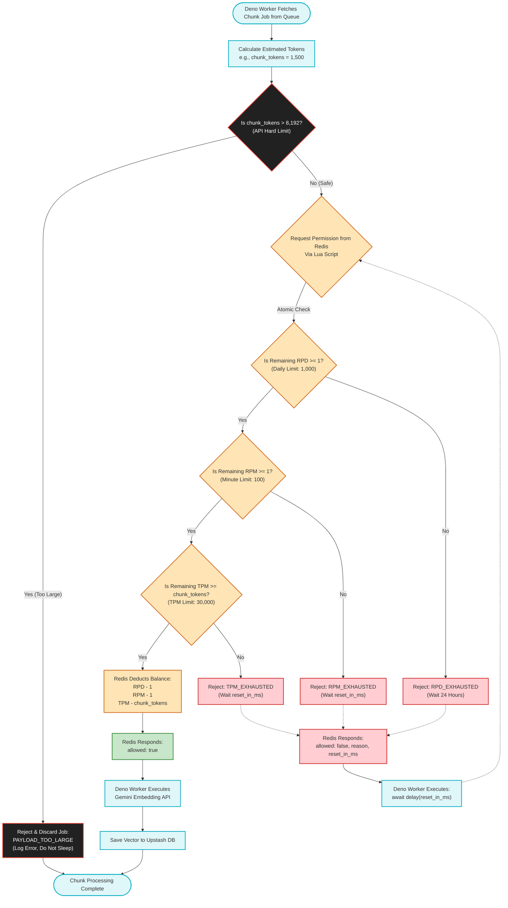
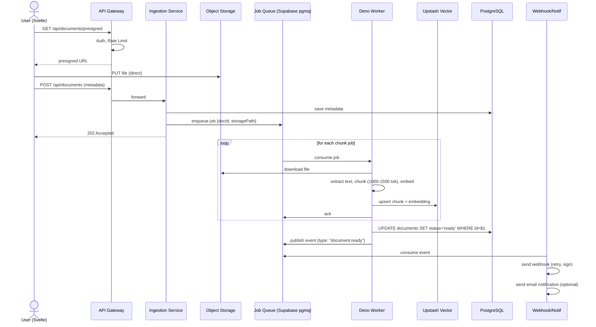
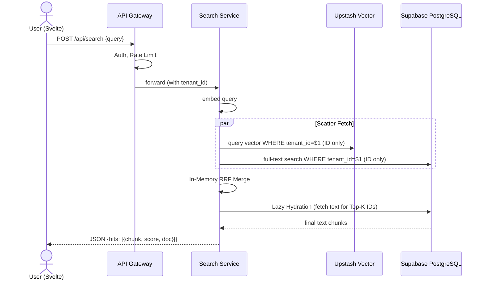
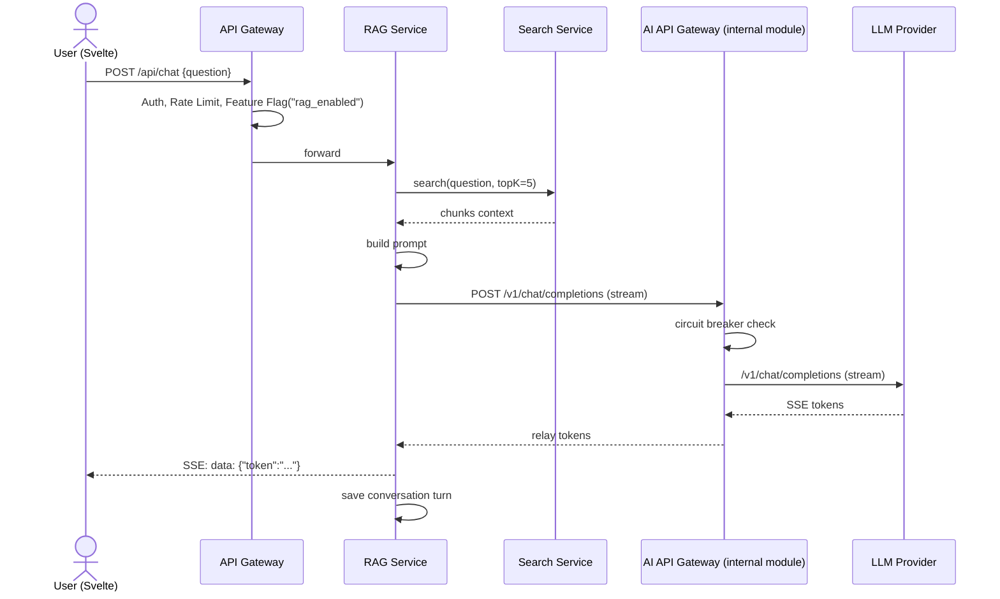
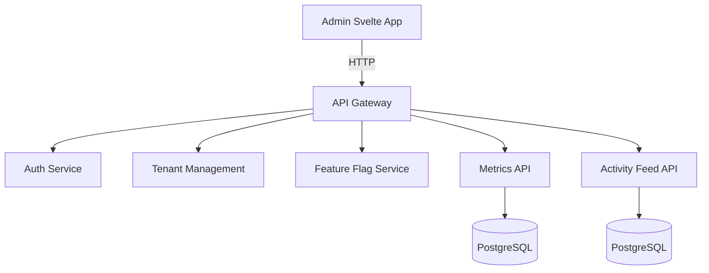

# Semantic Document Search & Q&A Platform (`Dokyudo`) — Project Requirements Document

---

## 1. Project Overview
**Dokyudo** is an advanced _SaaS platform_ that allows users to upload documents (PDF, DOCX, TXT), search them semantically, and ask contextual questions. The platform serves as an architectural masterclass in building **$0-cost, enterprise-grade distributed systems**. It utilizes **SvelteKit** (deployed to Cloudflare Pages) for the frontend, **Deno + Hono** (deployed to Deno Deploy) for the backend API, and a **Hybrid Cloud On-Premise Storage Node** (Self-hosted MinIO routed via Cloudflare Zero Trust Tunnels). Furthermore, it employs a **Polyglot Persistence** strategy by decoupling relational data (Supabase) from vector data (Upstash Vector).

---

## 2. Goals & Objectives
- Provide ultra-low latency semantic document search and Retrieval-Augmented Generation (RAG) specialized for dense Financial Reports.
- Implement _multi‑tenancy_, _rate limiting_, _job queue_, _webhook_, _feature flag_, and _observability_ in one integrated project.
- Demonstrate deep expertise in **Hybrid Cloud Architecture**, connecting serverless edge computing with secure on-premise bare-metal nodes.
- Implement robust **SaaS Monetization** showcasing both **One-Time Payments** and **Recurring Subscriptions** via Sandbox Payment Gateways.
- Maintain a strict **$0/month operational footprint** by utilizing BYOK (Bring Your Own Key) mechanics, multi-provider LLM fallbacks, and serverless Micro-Databases.

---

## 3. Core Features
1. **Multi‑Tenant SaaS & Tier Management** – Data isolation per user/tenant, with a dynamic 4-tier system (Free, Simulate, Investor, Real).
2. **Hybrid Cloud Object Storage** – Bypassing cloud vendor lock-in by utilizing an On-Premise ARM64 Set-Top Box running MinIO, secured and exposed via Cloudflare Tunnels.
3. **Enterprise BYOK (Bring Your Own Key)** – Users can input their own OpenAI/Claude API keys. Keys are secured using AES-256-GCM Symmetric Encryption with an off-database Master Encryption Key (MEK).
4. **Smart AI Gateway & Multi-Provider Fallback** – A dedicated routing service ensuring High Availability (HA) by failing over between fast inference models with an automatic circuit breaker if rate limits are hit.
5. **Financial-Grade Embeddings & Micro-Databases** – Utilizing Gemini `gemini-embedding-2` (768-dim) for high-accuracy financial context extraction, stored in an external Serverless Vector DB (Upstash Vector) to completely offload storage pressure from the main Postgres database.
6. **Dual-Mode Sandbox Payment Gateway** – Integration with Midtrans/Xendit (Sandbox mode) to demonstrate two distinct billing architectures: One-Time Invoices (Investor Tier) and Auto-Debit Subscriptions (Real Tier), along with webhook handling, subscription lifecycle, and multi-seat license provisioning.
7. **Cost-Optimized Ingestion Pipeline** – Upload → text extraction → optimized chunking (256 tokens) → rate-limited embedding → HNSW vector index, specifically designed to bypass LLM free-tier rate limits.
8. **Self-Destructing Data & Teardown** – Automated cron jobs that wipe physical storage and database records for expired simulation accounts and aged portfolio data to permanently maintain a $0 cloud bill.
9. **Semantic Search** – Vector search + full‑text (_hybrid_) with tenant filtering done inside the database queries.
10. **RAG Q&A & Streaming Optimization** – Retrieve relevant context, build prompt, and stream the LLM answer using the native Web Streams API to minimize serverless CPU time consumption.
11. **API Gateway** – Authentication, _routing_, _rate limiting_ (sliding window via Redis Pipelining), and **feature‑flag enforcement**.
12. **Distributed Job Queue & Eventual Consistency** – Asynchronous document ingestion and _Dual-Write_ protection using Upstash Redis to orchestrate database synchronization safely.
13. **Webhook Delivery** – Notification to tenant URL when document processing is complete (idempotency, _signature verification_).
14. **Feature Flag Service** – Enable/disable features (e.g., Q&A) dynamically per tenant. Enforced at the API Gateway.
15. **Observability** – Centralized logging, metrics, and _admin dashboard_ (Svelte).

---

## 4. User Roles
- **Tenant (User)** – Upload documents, search, input custom API keys (BYOK), manage webhooks. MVP: one tenant = one user account. Can register via email/password **or OAuth (Google / GitHub)**.
- **Admin** – Manage tenants, view webhook delivery logs, monitor LLM routing metrics and latency.

---

## 5. Functional Requirements

### 5.1 Multi‑Tenancy, Subscription Tiers & Quotas

- Each registered user becomes their own _tenant_. Data is strictly isolated.
    
- Data (documents, chunks, feed) is isolated with the tenant's unique identifier in every query.
- The following tables **MUST** have a `tenant_id` column: `documents`, `document_chunks`, `conversations`, `conversation_turns`, `webhook_registrations`, `webhook_logs`, and `activity_log`. The `users` table also links to a tenant (1 User = 1 Tenant). Note: Global infrastructure tables like `login_attempts` are exempt from this requirement as they handle pre-authentication security.
    
- **Supported registration methods:**
    
    - Email + password (bcrypt, cost 12).
        
    - **OAuth via Google & GitHub**.
        
    - **OAuth Email Verification Gate**: OAuth login MUST be implemented using the **Server-Side PKCE** flow via the Deno Hono backend (e.g., `GET /api/auth/google` and `GET /api/auth/callback`). After the provider redirects back to the backend callback, the backend exchanges the code for a session and explicitly checks the `email_verified` status or `email_confirmed_at` timestamp. The backend MUST only proceed with returning the session to the frontend if the email is verified. Unverified emails trigger an immediate session deletion and a `401 UNAUTHORIZED` response.
        
- **Tier Configuration & Quotas (Enhanced by 100GB MinIO & Upstash Vector):** _Note: The PRO Sandbox tier utilizes a "Shadow Quota" (FUP) at the backend to show an "Unlimited" UI to users while protecting the $0 infrastructure._
    
| Tier | Max File Size | Uploads / month | Searches / month | Q&A / month | Storage Limit |
|------|---------------|-----------------|------------------|-------------|---------------|
| **FREE** (Default) | 10 MB | 5 documents | 50 queries | 10 queries | 500 MB |
| **PRO (SANDBOX / INVESTOR)** | 25 MB | **UI:** Unlimited<br>**Backend (FUP):** 50 docs | **UI:** Unlimited<br>**Backend:** 500 | 100 queries | **UI:** 40 GB<br>**Backend:** 2 GB |

- **Tier Mechanics & Resets:**
    
    - Counters for **Uploads, Searches, and Q&A** are reset to `0` on the **1st day of each calendar month** at 00:00 UTC via a Cron Job.
        
    - **Storage quota** is cumulative and never reset.
        
    - **The "Investor Unlock" Mechanic:** The `PRO (REAL)` plan is a locked UI placeholder. It globally unlocks for all users _only_ after at least one user successfully purchases the Dummy `PRO (INVESTOR)` plan.

### 5.2 Document Ingestion, Eventual Consistency & Finance Chunking

- **On-Premise Storage:** Files are uploaded directly to the self-hosted MinIO storage node via a Presigned URL routed through a Cloudflare Tunnel.
    - **Orphan File Handling**: When a presigned URL is generated, a record is created in the `documents` table with `status = 'pending'`. A daily cron job automatically deletes any `pending` documents (and their corresponding MinIO files) older than 24 hours to prevent orphaned files from consuming storage if the user abandons the upload.
    
- **Asynchronous Ingestion (Transactional Outbox Pattern):** To prevent Dual-Write failure (Postgres vs Upstash), ingestion utilizes a strict Transactional Outbox Pattern orchestrated via **Supabase `pgmq`**.
    - Document metadata is saved to Postgres within the same database transaction that pushes an event payload into the `pgmq` queue.
    - A background Deno worker processes the `pgmq` queue, extracts text, generates embeddings, and safely pushes to Upstash Vector. Retries are handled automatically by the queue.
        
- **Finance-Optimized Chunking Strategy**: Because Financial Annual Reports contain long tables and balance sheets, text is extracted and chunked using a larger sliding window of **1,000 to 1,500 tokens with a 150-token overlap**. This ensures data tables are not split horizontally.
    
- **Embedding Job Throttling**: The job queue worker processing the embeddings abandons static sleep intervals and instead utilizes a **Distributed Token Bucket & Gatekeeper Architecture** (detailed in §5.17). This ensures lightning-fast processing for small documents while auto-throttling giant documents to prevent `429 Too Many Requests` errors.
    
- **Embedding Generation**: Chunks are embedded using **Gemini `gemini-embedding-2`**. This model supports an 8,192 input token limit. We configure its `outputDimensionality` parameter strictly to **768 dimensions** to balance high-fidelity financial context while staying well within Upstash Vector's free tier limits.
    
- **Index Strategy**: Upstash Vector utilizes an **HNSW (Hierarchical Navigable Small World)** index for vectors instead of exact KNN to drastically reduce database CPU load during searches.

### 5.3 Semantic Search (Application-Layer Scatter-Gather RRF)

- Endpoint `POST /api/search` accepts a text query.
    
- To protect the Deno backend from Memory Overhead (OOM) and minimize network payload latency during search operations, the system utilizes an **ID-Only Projection & Lazy Hydration** pattern.
    
- **Backend Flow (Scatter-Gather):**
    
    1. Create query embedding.
        
    2. **Scatter (Parallel Fetch):**
        - Query 1: Upstash Vector REST API returns only the `id` and base metadata of the Top-K chunks strictly within the tenant's scope (Data inclusion disabled).
        - Query 2: Supabase Postgres Full-Text Search returns only the `id` and rank score strictly within the tenant's scope.
        
    3. **Merge & Rank (In-Memory RRF):** The Deno Edge function calculates the Reciprocal Rank Fusion (RRF) score using only the lightweight arrays of IDs.
        
    4. **Gather (Lazy Hydration):** Once the absolute Top-3 to Top-5 IDs are determined (enforcing the **Vector Search Limiter** to conserve LLM token limits and prevent timeouts), a single targeted `SELECT` query is executed against Supabase to hydrate and retrieve the actual text content for the LLM prompt.

### 5.4 AI API Gateway & Multi-Provider Fallback (RAG Q&A)

- Endpoint `POST /api/chat` accepts a question in JSON, responds with **Server‑Sent Events (SSE)**.
    
- **Chat Input Validation**: The backend strictly validates user prompt inputs (max length: 690 characters) via Zod to prevent token exhaustion and Layer 1 Prompt Injection/DoS attacks.

- The platform uses a highly resilient AI Gateway for RAG generation.

- **Flow**:
    1. The RAG Service fetches top-K chunks from the Search Service.
    2. Build system prompt + context.
    3. Call the **AI API Gateway** to stream the LLM response.

- **BYOK (Bring Your Own Key) Routing**:
    - The gateway first checks if the tenant has a custom API Key configured.
    - If a custom key exists, the request is exclusively routed to the user's provider (e.g., OpenAI `gpt-4o-mini` or Claude), burning the user's quota.
        
- **Serverless Option Routing (Zero-Cost HA)**:
    - 1: `Groq (Llama-3)` — x2 API use for fallback if first Groq hits a `429 Rate Limit`.
    - 2: `Gemini 1.5 Flash` — x2 API use for fallback if first Gemini hits a `429 Rate Limit`.
    - 3: `Cohere (Command-R)` — x2 API use for fallback if first Cohere hits a `429 Rate Limit`.
        
- **Streaming Optimization**: The Deno API Gateway and RAG Service MUST utilize the native **Web Streams API** for Server-Sent Events (SSE). Buffering large text chunks in memory is strictly prohibited to ensure Deno Deploy CPU time stays well below the 15-hour monthly free tier limit.
    
- **Conversation Scope**: Conversations are scoped at the tenant level, allowing questions across multiple documents simultaneously.
    
- **Conversation Data Model (Logical)**:
    - `conversations` entity: Tracks unique conversation IDs linked to a specific tenant.
    - `conversation_turns` entity: Tracks the question, answer, context chunks used, model used, and latency for each back-and-forth exchange within a conversation.
- The request body may include an optional `conversation_id` to continue a thread; if absent, a new conversation is created and its ID returned.

- **SSE Streaming Policy (Hono Gateway)**:
  - The API Gateway MUST NOT buffer SSE responses from the RAG Service.
  - When proxying `POST /api/chat`, the Gateway takes the `ReadableStream` from the upstream `fetch()` response and returns it directly using `c.body(stream, 200, headers)`.
  - The Gateway must explicitly enforce the following headers on the SSE response to prevent proxy-level or browser-level buffering:
    - `Content-Type: text/event-stream`
    - `Cache-Control: no-cache`
    - `Connection: keep-alive`
    - `X-Accel-Buffering: no` (prevents Nginx/reverse-proxy buffering if present)
  - `Transfer-Encoding: chunked` is handled automatically by Deno when a `ReadableStream` body is returned.

### 5.5 API Gateway & Session Management

- All external requests go through the **Hono** API Gateway.
    
- **Auth**: Managed natively by Supabase Auth (JWT validation at the gateway).
    
- **Redis Pipelining**: To protect the Upstash Free Tier limit (500k monthly commands), the API Gateway MUST use **Redis Pipelining or Lua Scripts** to batch Rate Limiting and Session Validation checks into a single network request per API call. This cuts Redis command usage by at least 50%.
    
- **Rate Limiter**: _Sliding window_ based on Redis sorted sets.

- **Tenant Context**: Injects `tenant_id` into the request.

- **Feature Flag Enforcement**: The gateway evaluates feature flags for tenant‑facing endpoints. If a required flag is disabled, it returns `403 FEATURE_DISABLED`. Internal service‑to‑service calls bypass the gateway and are trusted.

### 5.6 Webhook Delivery
- Tenant can register a webhook URL via API. The only supported event type for MVP is `document.ready`. The `POST /api/webhooks` request body contains only `{ url }` — no event type selection is required.
- **Webhook Secret Lifecycle**:
  - When the tenant registers a webhook (`POST /api/webhooks`), the server **auto-generates** a cryptographically random 32-byte secret (encoded as a 64-character hex string) using `crypto.getRandomValues()`.
  - The secret is stored in `webhook_registrations.secret` (hashed with SHA-256 before storage to prevent DB leaks).
  - The **raw (unhashed) secret** is returned **exactly once** in the `201 Created` response body under the key `"secret"`. It is never retrievable again. The tenant must store it securely.
  - Format: `{ "id": "...", "url": "...", "secret": "<64-char hex>", "createdAt": "..." }`
- On event `document.ready`, the webhook worker (triggered by the job queue):
  1. Create a payload containing document metadata.
  2. Add an **idempotency key** derived as:  
     `SHA‑256(event_type + ":" + document_id + ":" + tenant_id + ":" + attempt_number)` (hex encoded).
  3. Sign the payload with HMAC‑SHA256 using the tenant‑specific secret (retrieved from DB); place the signature in the `X‑Signature` header.
  4. Send POST to the tenant URL.
  5. If delivery fails, retry with *exponential backoff* (max 5 attempts).
  6. All attempts are logged in the `webhook_logs` table.
- Each webhook URL has its own **circuit breaker** (see §5.12) to halt delivery temporarily after consecutive failures.

### 5.7 Feature Flag Service
- **Admin** can create flags (e.g., `rag_enabled`, `sharing_enabled`) and assign values per tenant or globally.
- Internal evaluation endpoint: `GET /internal/features/:flagName?tenant_id=...`.
- **Caching**: Flag values are cached in Redis with a TTL of **30 seconds** per `(flagName, tenant_id)` pair. On cache miss, the gateway fetches from the service and writes to cache. Admin can flush a specific flag’s cache via the admin API.
- Tenant‑facing feature enforcement is handled exclusively by the **API Gateway**. Individual services do not independently evaluate flags for external requests.

### 5.8 Notification System
- Send email notifications (e.g., “Your document is ready to search”) via the **job queue**.
- Job payload: `{ template, recipient, payload }`.
- Worker sends via SendGrid/Mailgun. Failed deliveries go to DLQ.

### 5.9 Activity Feed
- Every action (upload, index completion, search, Q&A, webhook error) is logged in `activity_log` with `tenant_id`, type, and timestamp.
- API `GET /api/activities` returns the tenant’s latest feed, supporting **cursor‑based pagination**.
- **Retention**: Raw activity logs are kept for **90 days**. A distributed cron job (Phase 4) purges older entries. Aggregated metrics derived from the logs are retained indefinitely at hourly/daily resolution.

### 5.10 AI API Gateway (Model Routing)
- A module integrated within the **Hono API Gateway** monolith. It is implemented as an internal function module rather than a separate network-level reverse proxy. The RAG Service calls this internal module directly to stream responses to multiple LLM providers.
- Routing configuration:
  - Default: Gemini.
  - Fallback order: local model (Ollama).
- Implements a **circuit breaker** per provider (see §5.12).
- Logs all calls (latency, token usage, provider, status) to structured stdout.
- The RAG Service communicates with the AI API Gateway module internally.

### 5.11 Observability & Admin Dashboard
- **Metrics Service**: Collects counters (requests, searches, Q&A, webhook success/failure) and latency histograms.
- **Log Aggregation**: Structured JSON logs; can be integrated with Grafana Loki.
- **Admin Svelte Dashboard**:
  - Tenant management (create, disable, change quotas).
  - Manage feature flags (with cache flush option).
  - View webhook delivery logs.
  - Monitor metrics with simple charts.

### 5.12 Error Response Standard
All API services return errors in a consistent JSON envelope:
```json
{
  "error": {
    "code": "MACHINE_READABLE_CODE",
    "message": "Human readable description",
    "retryAfter": 30,
    "requestId": "uuid"
  }
}
```
**Standard error codes**: `UNAUTHORIZED`, `FORBIDDEN`, `FEATURE_DISABLED`, `RATE_LIMIT_EXCEEDED`, `QUOTA_EXCEEDED`, `DOCUMENT_NOT_READY`, `PROVIDER_UNAVAILABLE`, `VALIDATION_ERROR`, `INTERNAL_ERROR`.

### 5.13 Circuit Breaker Defaults
A reusable circuit breaker configuration is applied to external dependencies:
- **Failure threshold**: 5 failures in a 10‑second sliding window.
- **Open duration**: 30 seconds, then transitions to half‑open.
- **Half‑open probe count**: 1 successful probe to close the circuit.
- **State Storage**: The Circuit Breaker state (failure counts, open/closed status, timestamps) MUST utilize a **Local In-Memory Cache** (e.g., with a 5-second TTL) within the Deno instance for rapid evaluation, while using Redis (Upstash) as the central Backing Store for cross-instance synchronization. Synchronous Redis fetches on every single request are strictly prohibited to protect the free tier limits.
- Applies to:
  - Upstash Vector similarity queries inside Search Service.
  - Each LLM provider in the AI API Gateway.
  - Each tenant’s webhook URL in the Webhook Service.
All values can be overridden per service via environment variables.

### 5.14 Subscription Lifecycle & Payment Gateway Integration

This module serves as a technical showcase of monetization architecture. The platform integrates Xendit/Midtrans (Sandbox mode) to demonstrate payment flows without real financial transactions.

**A. PRO (SIMULATE) — Admin-Generated Access**

- **Purpose**: Allows users or evaluators to test Pro features safely for a limited duration (e.g., 24 hours).
    
- **Flow**: Super Admin generates an 8-character code from the dashboard. Code is emailed to the target user. User inputs the code to temporarily upgrade their tier.
    
- **Automated Teardown**: An hourly backend cron job checks for expired simulation accounts. Once expired, a worker triggers a cascade deletion: it wipes all associated physical files from MinIO Object Storage, deletes all vector database records, resets usage counters, and downgrades the user back to the `FREE` tier.
    

**B. PRO (INVESTOR) — The Portfolio Showcase Tier (One-Time Payment)**

- **Purpose**: A "meme/flex" tier (representing the exact Break-Even Point of the theoretical production server costs). It acts as the trigger for the entire payment gateway logic.
    
- **Payment Flow**: Processed as a **One-Time Checkout/Invoice** (Rp 1,440,000). When a user clicks this tier, they are redirected to a Sandbox checkout. The UI explicitly instructs the user to use dummy credit card/QRIS credentials.
    
- **Bulk Provisioning Logic (Seat Management)**: Upon a successful payment webhook, the user selects between two allocation methods:
    
    - _Option A (Single Seat)_: Upgrading 1 account to a single 40 GB storage limit.
        
    - _Option B (Multi-Seat)_: Generating 3 unique emailable activation vouchers for colleagues.
        
- **Global Event Trigger**: Upon the first successful verification of an Investor webhook, a global feature flag flips, permanently enabling the `PRO (REAL)` tier for all future visitors.
    

**C. PRO (REAL) — B2B Standard (Recurring Subscription)**

- **Purpose**: Represents the actual commercial tier. Once unlocked, users can "purchase" this tier via the Sandbox Payment Gateway. Successful webhooks update the tenant's tier and expand their quotas to standard B2B levels.
    
- **Recurring Flow**: Processed via **Tokenization / Auto-Debit (Subscription API)**. Demonstrates backend capability to handle recurring webhooks (e.g., `recurring.cycle.created`).
    

### 5.15 Portfolio 0-Cost Protection Policies

To guarantee the infrastructure remains within the strict bounds of Free Tiers (Supabase 500MB DB / 1GB S3, Upstash 500k commands, Deno Deploy 1M requests / 15 CPU hours), the following hard limits are enforced at the architectural level:

- **Data Retention Cleanup**: A daily cron job permanently hard-deletes all tenant data (chunks, Upstash vectors) and physical MinIO S3 files older than **7 days** to prevent long-term bloat. Admin accounts are exempt. Orphaned vectors are handled via an asynchronous cleanup queue triggered by Postgres `ON DELETE` hooks.
    
- **Resource Throttling**: Embedded into the ingestion pipeline (4-sec sleep) and API Gateway (Web Streams, Top-K=3 limit, Redis Pipelining) as defined in preceding sections.

### 5.16 Enterprise Security: BYOK Cryptography

- **AES-256-GCM Encryption**: User API keys are NEVER stored in plaintext. They are encrypted using the Web Crypto API before Supabase insertion.
    
- **Master Encryption Key (MEK)**: A highly secure 32-byte MEK is stored exclusively as an Environment Variable in the Deno Deploy runtime.
    
- **In-Memory Decryption**: The backend retrieves the Ciphertext and IV, decrypts it in RAM for the LLM request, and immediately triggers Garbage Collection.
    
- **Blind Frontend & Zero-Logging**: The UI receives masked keys (e.g., `sk-proj-*******************789`). All `console.log` statements are sanitized.

### 5.17 Distributed Token Bucket & Gatekeeper Architecture

**1. Background**
To maximize the utilization of the `gemini-embedding-2` model on the Free Tier without hitting Rate Limit Errors (429), we discard the static sleep approach (e.g., a hardcoded 3-second delay per request). Instead, the Deno Worker utilizes a centralized Distributed Token Bucket Rate Limiter via Upstash Redis. This system maximizes processing speed for small documents and applies automatic throttling (auto-throttling) for giant documents.

**2. Multi-Bucket Strategy**
The system tracks three types of "balances" in real-time within Redis. All three balances must be sufficient before the API is executed:
- **TPM Bucket (Tokens Per Minute)**
  - Capacity: 30,000 Tokens.
  - Refill: Fully replenished every minute (60 seconds).
  - Deduction: Deducted by the estimated token count of the chunk (e.g., 1,500 tokens).
- **RPM Bucket (Requests Per Minute)**
  - Capacity: 100 Requests.
  - Refill: Fully replenished every 60 seconds.
  - Deduction: Deducted by 1 per execution.
- **RPD Bucket (Requests Per Day)**
  - Capacity: 1,000 Requests.
  - Refill: Fully replenished every 24 hours.
  - Deduction: Deducted by 1 per execution.

**3. "Gatekeeper" Logic (Balance Check & Safety Belt)**
Before the Worker calls the Gemini API, the system passes through a multi-layered validation flow:
- **Stage 1: Sanity Check (Safety Belt)**
  The model has a hard limit of 8,192 input tokens per request. If, due to a bug, a chunk exceeds this limit, the Worker WILL NOT sleep. Instead, it immediately rejects and discards the job (`PAYLOAD_TOO_LARGE`) to prevent infinite loops or deadlocks.
- **Stage 2: Atomic Check to Redis**
  Deno executes a Lua Script on Redis to atomically check the remaining RPD, RPM, and TPM.
- **Stage 3A: Sufficient Balance (Lightning Speed)**
  If the balance > 0, Redis deducts the required amounts and responds with `allowed: true`. Deno executes the API immediately (0 ms sleep).
- **Stage 3B: Balance Exhausted (Auto-Throttling)**
  If TPM/RPM is exhausted (e.g., chunk #21 breaches the 30K TPM limit), Redis rejects the transaction and returns a wait duration (`reset_in_ms`). Deno will execute `await delay(reset_in_ms)` and then return to Stage 2 upon waking up.

**4. Gatekeeper Mechanism Flowchart**


**5. Architectural Conclusion**
With this algorithm, Dokyudo achieves the Pareto Optimal point:
- **Extreme Performance:** Small documents (<20 pages) are processed in 1-2 seconds without any artificial delays.
- **Safe & Resilient:** Giant documents will not cause 429 Errors. The system elegantly auto-throttles as soon as it hits the 30K TPM quota, waits for the next minute, and transparently resumes.
- **Multi-Tenant Safe:** Because the calculations are centralized in Redis via atomic Lua scripts, concurrent requests from multiple users in the exact same second will not cause quota race conditions.
---

## 6. Non‑Functional Requirements
- **Scalability**: Stateless components scale horizontally. PostgreSQL max connections: 100 (enforced via PgBouncer in transaction mode). Redis: single connection pool per service instance, max 20 connections.
- **Resilience**: Circuit breakers on all external dependencies. Job queue guarantees at‑least‑once processing with upserts.
- **Security**: All endpoints authenticated with JWT (short‑lived) plus session invalidation. Webhooks signed with HMAC‑SHA256. Strict input validation.
- **Observability**: Each service exposes a `/health` endpoint. Logs are structured JSON.
- **Performance**:
    - Hybrid search end‑to‑end **<500ms** at P95 under normal load.
    - RAG first‑token latency **<3 seconds** at P95 (greatly assisted by the Top-K=3 constraint).

---

## 7. Architecture Overview (Hybrid Cloud & Polyglot Persistence)

_The backend system is implemented as a Modular Monolith inside Deno + Hono, allowing easy future separation into microservices._

- **Client Layer**: SvelteKit hosted globally on **Cloudflare Pages**.
    
- **API Gateway & Core Logic**: Hono running on **Deno Deploy** (Edge). Includes Ingestion, Search, RAG, Webhook, Feature Flags, and Metrics services.
    
- **Object Storage**: Bare-metal Amlogic S905X STB running Armbian + **MinIO** via **Cloudflare Zero Trust Tunnels**.
    
- **Relational Database & Auth**: Supabase (PostgreSQL).
    
- **Vector Database**: Upstash Vector (Serverless REST API).
    
- **Cache & Message Broker**: Upstash Redis (Job Queue and Rate Limiting).

---

## 8. Component Descriptions (Simplified & Merged) — Revised

| Service                      | Responsibilities                                                                                                                                           | Dependencies                         |
| ---------------------------- | ---------------------------------------------------------------------------------------------------------------------------------------------------------- | ------------------------------------ |
| **API Gateway**              | Auth (Supabase JWT), rate limiting, tenant context injection, **feature flag enforcement** (single point)                                            | Redis, Feature Flag Service         |
| **Ingestion Service**        | Accept upload metadata (presigned URL), enqueue job with `{docId, storagePath, mimeType}`, track document status                                            | Object Storage, Job Queue            |
| **Automatic Embedding Pipeline**         | Transactional Outbox Pattern via Supabase `pgmq`. A background Deno worker consumes the queue, downloads from MinIO, extracts text, chunks (1000-1500 tokens, 150 overlap), embeds, upserts into Upstash Vector, updates DB status, and publishes document.ready event. | MinIO, Embedding API, Upstash Vector, Supabase `pgmq` |
| **Search Service**           | Embed query, execute Application-Layer Scatter-Gather RRF (parallel fetch from Upstash Vector + Supabase FTS, in-memory rank, lazy hydration). | Embedding API, Upstash Vector, Supabase |
| **RAG Service**              | Retrieve context via Search Service, build prompt, stream via SSE using AI API Gateway, save conversation history                                           | Search Service, AI API Gateway       |
| **AI API Gateway**           | Integrated module: routes to LLM providers (Gemini → Ollama), circuit breaker per provider, structured logging                              | LLM providers                        |
| **Webhook & Notification**   | Consume `document.ready` events, send signed webhooks (idempotency, HMAC) with retry & CB, send email notifications via queue                               | Job Queue, email provider            |
| **Feature Flag Service**     | CRUD flags, evaluation API, values cached in Redis (30s TTL), admin cache flush                                                                             | Redis                                |
| **Activity & Metrics**       | Log activity feed (cursor pagination, 90‑day retention), collect counters & histograms                                                                      | PostgreSQL                           |
| **Tenant & User Management** | Registration, login, quota storage, 1:1 user‑tenant mapping                                                                                                  | PostgreSQL          |

---

## 9. Data Flow Diagrams (Mermaid) — Revised

### 9.1 Document Upload & Ingestion


### 9.2 Hybrid Semantic Search


### 9.3 RAG Q&A (Streaming)


### 9.4 Admin Dashboard Flow


---

## 10. Technology Stack

| Layer | Technology | Justification |
|-------|------------|---------------|
| **Frontend** | SvelteKit, TailwindCSS, shadcn-svelte (Cloudflare Pages) | Reactive, small bundle, fast edge deployment |
| **Backend Runtime** | Deno 2.x + TypeScript + Hono | Native TS, Web API, npm compatible, lightweight routing |
| **Databases** | Supabase PostgreSQL (Relational) + Upstash Vector (Embeddings) | Separation of structured data and high-throughput vector queries |
| **Storage** | Self-Hosted MinIO on ARM64 + Cloudflared (Tunnel) | Bypasses vendor lock-in; S3-compatible, secured via Zero Trust |
| **Cache & Queue** | Upstash Redis + Supabase `pg_cron` | Rate limiting, outbox pattern queueing, and scheduled workers |
| **LLMs (Generation)** | Groq, Gemini 1.5 Flash, Cohere, BYOK (OpenAI/Claude) | Multi-provider fallback for HA and Zero-Cost protection |
| **Embeddings** | Gemini `gemini-embedding-2` (Output: 768-dim) | High-fidelity financial context within Upstash free limits |
| **Cryptography** | Web Crypto API (AES-256-GCM) | Native Deno API for robust BYOK encryption |
| **Monitoring** | JSON logs + Grafana Loki (opt) | Centralized observability |
| **Auth & OAuth** | Supabase Auth (Google, GitHub) | Native session management, JWT issuance, and social login |
| **ORM** | Drizzle ORM | Type-safe, suitable for Deno, query builder |
| **Validation** | Zod | Frontend & Backend schema validation |

---

## 11. Infrastructure & Deployment

- **Monorepo** with Deno workspace (`deno.jsonc`).
- **Docker Compose** for local development: `postgres`, `redis`, `minio`, `ollama` (optional).
- **Deployment mapping**:

| Service | Local (Docker Compose) | Cloud (Production) |
|---|---|---|
| API Gateway, Ingestion, Search, RAG, Feature Flag, Activity/Metrics, AI API Gateway | Deno Deploy | Deno Deploy |
| Background Workers (Embeddings, Webhook, Notification) | Deno Deploy | Deno Deploy |

- **Note**: The ingestion pipeline utilizes a Transactional Outbox Pattern orchestrated via Supabase `pgmq`. The Deno Edge workers pull from this `pgmq` queue to handle tasks like chunking, embedding generation, and webhook delivery securely and resiliently without polluting the main database.
- **Production**: Serverless: Deno Deploy (Backend), Cloudflare Pages (Frontend), Upstash (Redis, Vector), MinIO (Storage via Tunnels), Supabase (Postgres, Auth).

---

## 12. Mapping to Original Component List (unchanged except minor notes)

| Original Component | Where Implemented |
|--------------------|-------------------|
| Distributed Rate Limiter (Redis + sliding window) | API Gateway middleware (Pipelining via Lua Scripts) |
| Scalable URL Shortener (base62 + DB sharding) | *(Optional, can be added for sharing links; not integrated into tenant management)* |
| Distributed Job Queue (workers + retry + DLQ) | Supabase `pgmq`, Deno Background Workers |
| Webhook Delivery System (retry, idempotency, signatures) | Webhook & Notification Service |
| API Gateway (auth, routing, rate limiting) | Hono API Gateway |
| Multi-tenant SaaS Backend (tenant isolation, billing logic) | Tenant & User Management, database row-level |
| Feature Flag Service (dynamic config rollout) | Feature Flag Service (enforced at gateway) |
| Session Store (distributed, TTL-based) | Replaced by Supabase Auth (native session management) |
| Search Service (ElasticSearch + indexing pipeline) | Replaced by Upstash Vector + Supabase FTS (Scatter-Gather RRF) |
| Log Aggregation System (ingestion + storage + query) | JSON logging + Grafana Loki (optional) |
| Metrics Backend (time-series DB + dashboards API) | Metrics Service + PostgreSQL |
| Event Ingestion Pipeline (Kafka + consumers) | Replaced by Supabase `pgmq` / Job Queue |
| ETL Pipeline (batch + streaming) | Ingestion Service + Supabase `pgmq` |
| Circuit Breaker Service (failure handling) | Embedded in Search, AI API Gateway, Webhook services |
| File Storage Backend (S3-like, signed URLs) | MinIO, Ingestion Service |
| RAG Backend (document ingestion + retrieval + LLM) | RAG Service |
| Vector Search Backend (embeddings + similarity search) | Search Service + Upstash Vector |
| AI API Gateway (model routing + fallback) | AI API Gateway (integrated module) |
| Prompt Logging & Evaluation Backend | Stored in RAG Service (history & logging) |
| Semantic Search Engine Backend | Search Service |

---

## 13. Development Phases

### Phase 1 – Infrastructure & Core MVP

- Deploy SvelteKit to Cloudflare Pages.
    
- Setup MinIO on STB and establish Cloudflare Tunnel (`s3.dokyudo.com`).
    
- Multi‑tenant auth via Supabase (Google/GitHub OAuth).
    
- Simple document upload to MinIO and raw text extraction via Deno.
    

### Phase 2 – Semantic Search & Micro-Databases

- Integrate `gemini-embedding-2` API with forced 768 output dimensionality.
    
- Implement Finance-optimized chunking (1000-1500 tokens).
    
- Set up the Scatter-Gather RRF logic (ID-Only fetch) between Supabase Full-Text and Upstash Vector.
    
- Build the AI API Gateway with Dual-Model Multi-Provider Fallback (Groq → Gemini) and SSE Streams.
    

### Phase 3 – Subscriptions & Outbox Queues

- Implement Supabase `pgmq` Job Queue for the Transactional Outbox pattern (Ingestion & Webhooks).
    
- Xendit/Midtrans Sandbox integration: One-Time Invoice for the "Investor" tier.
    
- Xendit/Midtrans Sandbox integration: Recurring Subscriptions API for the "Real" tier.
    
- Implement Shadow Quota (FUP) logic in the backend.
    

### Phase 4 – Enterprise Security & Teardown

- Implement BYOK UI and AES-256-GCM encryption/decryption modules with MEK handling.
    
- Modify AI API Gateway to dynamically route based on custom keys vs. server fallbacks.
    
- Setup the 7-day automated data teardown Deno Cron job.
